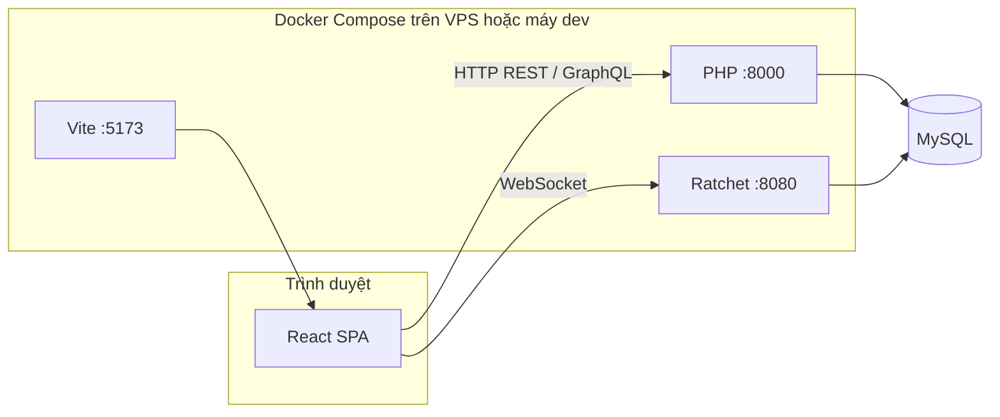

# MXH — Mạng xã hội (Social Network MVP)

## Giới thiệu tổng quan

**MXH** là một ứng dụng mạng xã hội dạng MVP, lấy cảm hứng từ các nền tảng như Facebook. Dự án gồm **frontend** (React + Vite), **backend** (PHP 8, REST + GraphQL), **MySQL** làm cơ sở dữ liệu, và **WebSocket** (Ratchet) phục vụ chat thời gian thực. Toàn bộ có thể chạy thống nhất bằng **Docker Compose**.

Người đọc README này có thể nắm được: mục tiêu sản phẩm, luồng xử lý chính, stack công nghệ (kèm phiên bản thư viện đã khóa hoặc ràng buộc), cấu trúc thư mục, và cách cài đặt — chạy — phát triển tiếp.

---

## Cập nhật gần đây

- **Sidebar trái + danh mục Trò chơi:** Thêm sidebar trái cố định (giống Facebook) hiện trên mọi trang desktop. Chứa shortcut: avatar user, Trang chủ, Bạn bè, Tin nhắn, và mục "Khám phá" với Trò chơi. Sidebar tự thu gọn (chỉ icon) ở màn hình nhỏ, ẩn hoàn toàn dưới 860px. Dark mode đầy đủ.
  - File mới: `LeftSidebar.jsx`, `GamesPage.jsx` (placeholder)
  - File sửa: `App.jsx` (layout `desktop-layout` + route `/games`), `styles.css`

- **Trang Cài đặt tài khoản (Settings):** Trang settings kiểu Facebook cũ với sidebar 2 mục: Chung (sửa username, ngày sinh, giới tính) và Mật khẩu & Bảo mật (đổi/đặt mật khẩu). User đăng nhập Google có thể đặt mật khẩu để đăng nhập bằng email. Responsive cho mobile.
  - REST endpoints mới: `GET /auth/settings`, `POST /auth/settings/password`, `POST /auth/settings/profile`
  - File backend: `AuthController.php`, `AuthService.php`, `UserRepository.php`, `index.php`
  - File frontend: `SettingsPage.jsx` (mới), `Navbar.jsx` (menu cài đặt), `App.jsx` (route `/settings`), `services/auth.js`, `styles.css`

- **Google login yêu cầu ngày sinh + giới tính:** Khi đăng nhập bằng Google lần đầu (tạo tài khoản mới), hệ thống yêu cầu nhập ngày sinh và giới tính trước khi hoàn tất đăng ký. User hiện tại hoặc email đã có thì đăng nhập bình thường.
  - File: `AuthService.php` (flow `needs_profile`), `LoginPage.jsx` (form bổ sung), `AuthContext.jsx`, `services/auth.js`

- **Đăng ký: ngày sinh + giới tính:** Form đăng ký giờ có 3 dropdown chọn ngày/tháng/năm sinh (kiểu Facebook) và radio button chọn giới tính (Nữ/Nam/Khác). Dữ liệu được lưu vào cột `birthday` (DATE) và `gender` (VARCHAR) trong bảng `users`.
  - Migration: `backend/database/migrations/014_add_birthday_gender_oauth_reset.sql`
  - File backend: `UserRepository.php`, `AuthValidator.php`, `AuthService.php`, `AuthController.php`
  - File frontend: `RegisterPage.jsx`, `services/auth.js`, `contexts/AuthContext.jsx`, `styles.css`

- **Đăng nhập bằng Google:** Tích hợp Google Sign-In (GSI) vào trang đăng nhập. Backend xác minh ID token qua Google tokeninfo API, tự động tạo tài khoản mới hoặc liên kết với tài khoản email đã có.
  - Cần cấu hình: `VITE_GOOGLE_CLIENT_ID` trong `.env` frontend + `GOOGLE_CLIENT_ID` trong `.env` backend
  - REST endpoint mới: `POST /auth/google`
  - File: `AuthService.php`, `AuthController.php`, `index.php`, `LoginPage.jsx`, `index.html` (GSI script)

- **Quên mật khẩu + Đặt lại mật khẩu:** Luồng hoàn chỉnh: nhập email → nhận token (hiển thị trực tiếp trong chế độ dev) → nhập mật khẩu mới. Token hết hạn sau 1 giờ.
  - REST endpoints mới: `POST /auth/forgot-password`, `POST /auth/reset-password`
  - Trang mới: `ForgotPasswordPage.jsx`, `ResetPasswordPage.jsx`
  - Routes mới trong `App.jsx`: `/forgot-password`, `/reset-password`

- **CSS Emoji Reactions (react-facebook-emoji):** Thay thế ký tự emoji hệ thống (phụ thuộc font OS) bằng CSS-animated emoji đồng nhất trên mọi thiết bị. Component `FacebookEmoji.jsx` đã có sẵn; CSS được nhúng vào `styles.css`. Picker, nút action, và summary row đều dùng `<FacebookEmoji>` với các size `sm`/`xs`/`xxs`.
  - File liên quan: `frontend/src/components/FacebookEmoji.jsx`, `frontend/src/components/PostCard.jsx`, `frontend/src/styles.css`

- **Tính năng xem ai đã thả reaction:** Hover vào số lượt thích → tooltip hiện avatar + tên (350ms delay). Click → popup đầy đủ với tabs lọc theo loại reaction (Tất cả / Thích / Yêu thích / ...) và danh sách avatar + tên. Reaction type giờ được lưu trong DB.
  - Migration: `backend/database/migrations/013_add_reaction_type_to_likes.sql`
  - File backend: `LikeRepository.php`, `LikeService.php`, `Types/LikerType.php`, `TypeRegistry.php`, `QueryType.php`, `MutationType.php`
  - File frontend: `ReactionDetailsPopup.jsx` (mới), `PostCard.jsx`, `services/graphql.js`, `styles.css`
  - GraphQL query mới: `postLikers(postId, limit)` → `[Liker]`
  - Mutation `likePost` giờ nhận thêm arg `reactionType: String`

- Đã **loại bỏ tính năng sticker** khỏi luồng tạo bài viết và hiển thị bài viết (frontend + backend).
  - Migration: `backend/database/migrations/012_drop_post_sticker_column.sql`

- Môi trường hiện tại đang vận hành trên **VPS Ubuntu**, thao tác qua phần mềm đồng bộ/liên kết thư mục từ **Windows**.

---

## Phân tích lỗi: Tính năng thông báo không hoạt động

> Kiểm tra toàn bộ code ngày 2026-04-03. Tính năng thông báo có hạ tầng đầy đủ (bảng DB, service, GraphQL, frontend) nhưng tồn tại nhiều lỗi khiến người dùng không thấy thông báo.

### Lỗi 1 — Thiếu thông báo khi like bài (lỗi chức năng)

**Vị trí:** `backend/src/Services/LikeService.php` — method `likePost()`

**Vấn đề:** `LikeService::likePost()` chỉ tạo bản ghi like trong bảng `likes`, **không gọi `NotificationRepository::insert()`** để tạo thông báo cho chủ bài viết. Hậu quả: người dùng không bao giờ nhận được thông báo khi ai đó like bài của mình.

Frontend `NotificationsPage.jsx` (mảng `TYPE_LABEL`) cũng không khai báo loại `like`, xác nhận đây là tính năng chưa được triển khai.

**Cách sửa:**
```php
// Trong LikeService::likePost(), sau $this->likeRepo->create($postId, $userId):
$postOwnerId = (int)$post['user_id'];
if ($postOwnerId !== $userId) {
    (new NotificationRepository())->insert($postOwnerId, 'like', $userId, $postId, null);
}
```
Đồng thời thêm vào `TYPE_LABEL` trong `NotificationsPage.jsx`:
```js
like: 'đã thích bài viết của bạn',
```

---

### Lỗi 2 — Lỗi bị nuốt im lặng, không hiển thị trạng thái lỗi (lỗi UX/debug)

**Vị trí 1:** `frontend/src/hooks/useNotificationUnread.js` — dòng 11

```js
} catch { /* ignore */ }
```

**Vị trí 2:** `frontend/src/pages/NotificationsPage.jsx` — dòng 40

```js
.catch(() => setItems([]))
```

**Vấn đề:** Mọi lỗi (token hết hạn, bảng DB chưa tồn tại, lỗi mạng, lỗi GraphQL) đều bị nuốt hoàn toàn. Người dùng chỉ thấy badge = 0 và danh sách trống, **không thể phân biệt "chưa có thông báo" với "đang lỗi"**. Đây là nguyên nhân chính khiến tính năng trông như "không hoạt động" dù lỗi thực sự có thể đến từ nhiều nguồn khác nhau.

**Cách tạm thời debug:** Mở DevTools → tab Network → lọc `/graphql` → xem request `notificationUnreadCount` và `notifications` trả về gì. Nếu thấy lỗi `Unauthorized`, token đã hết hạn hoặc không được gửi. Nếu thấy lỗi DB, migration 011 có thể chưa được áp dụng.

**Cách sửa đề xuất:** Thêm state lỗi vào `NotificationsPage.jsx` và hiển thị thông báo lỗi thay vì danh sách trống:
```jsx
const [error, setError] = useState(null);
// ...
.catch((err) => { setError(err.message); setItems([]); })
// ...
{error && <div className="apple-empty">Lỗi tải thông báo: {error}</div>}
```

---

### Lỗi 3 — Migration 011 có thể chưa được áp dụng (lỗi vận hành)

**Vị trí:** `backend/database/migrations/011_notifications_mentions_location.sql`

**Vấn đề:** Bảng `notifications` được tạo trong migration 011. Nếu lần đầu triển khai chỉ chạy migration đến 010, hoặc migration 011 bị lỗi giữa chừng (do câu `ALTER TABLE` lặp khi đã tồn tại cột), bảng `notifications` sẽ không tồn tại. Mọi query GraphQL sẽ ném exception, bị bắt im lặng ở frontend → biểu hiện giống hệt "không có thông báo nào".

**Kiểm tra:**
```bash
docker compose exec backend php database/migrate.php
# Hoặc kiểm tra trong MySQL:
# SHOW TABLES LIKE 'notifications';
# SELECT * FROM _migrations WHERE filename = '011_notifications_mentions_location.sql';
```

**Lưu ý:** Migration 011 có các câu `ALTER TABLE posts ADD COLUMN ...` và `ALTER TABLE comments ADD COLUMN ...`. Nếu chạy lại khi cột đã tồn tại, MySQL sẽ báo lỗi `Duplicate column name` → migration dừng giữa chừng và bảng `notifications` có thể không được tạo. Script `migrate.php` nên dùng `ADD COLUMN IF NOT EXISTS` (MySQL 8.0+) hoặc kiểm tra trước.

---

### Lỗi 4 — README ghi sai các loại thông báo và tab mobile (lỗi tài liệu)

**Vấn đề 1:** Mục **Chức năng chính** trong README chỉ liệt kê 3 loại thông báo:
> `comment | mention_post | mention_comment`

Nhưng thực tế `FriendshipService` còn tạo 2 loại nữa:
- `friend_request` — khi gửi lời mời kết bạn
- `friend_accept` — khi chấp nhận lời mời kết bạn

**Vấn đề 2:** Mục **Giao diện mobile** ghi:
> "5 tabs: Trang chủ, Bạn bè, Tìm kiếm, Tin nhắn (có badge), Cá nhân"

Nhưng `MobileTabBar.jsx` thực tế có:
> Trang chủ → **Thông báo (badge)** → Bạn bè → Tin nhắn (badge) → Cá nhân

Không có tab Tìm kiếm trong tab bar (icon Tìm kiếm được đặt trên MobileHeader).

---

### Tóm tắt ưu tiên sửa

| Mức độ | Lỗi | File cần sửa |
|--------|-----|--------------|
| **Cao** | Migration 011 chưa chạy / lỗi khi chạy lại | `database/migrations/011_...sql`, `database/migrate.php` |
| **Cao** | Lỗi bị nuốt im lặng — không thể debug | `useNotificationUnread.js`, `NotificationsPage.jsx` |
| **Trung bình** | Thiếu thông báo khi like | `LikeService.php`, `NotificationsPage.jsx` |
| **Thấp** | Tài liệu sai về loại thông báo và tab mobile | `README.md` (mục Chức năng chính, Giao diện mobile) |

---

## Mục tiêu và chức năng chính

### Mục tiêu

- Cung cấp **bản demo học tập / prototype** cho các tính năng cốt lõi của mạng xã hội: tài khoản, hồ sơ, bài viết, tương tác, kết nối người dùng.
- Tách rõ **API** (REST + GraphQL) và **giao diện** (SPA React) để dễ mở rộng.

### Chức năng chính (đã có trong codebase)

| Nhóm | Nội dung |
|------|----------|
| **Xác thực** | Đăng ký, đăng nhập, JWT; middleware bảo vệ route cần đăng nhập |
| **Hồ sơ** | Bio, avatar, ảnh bìa, URL tùy chỉnh (`custom_url`), thống kê (bài viết, follower, bạn bè, v.v.) |
| **Bài viết & feed** | Tạo / sửa / xóa bài, feed cá nhân hóa; **media ảnh/video** (upload + kích thước hiển thị); **vị trí** (nhãn văn bản + tọa độ GPS qua Geolocation API); **gắn thẻ @username** trong nội dung (trích bằng `MentionHelper`, lưu `post_mentions`) |
| **Tương tác** | Like / unlike; bình luận **chữ** hoặc **kèm ảnh/video** (upload riêng trong popup bình luận, cùng endpoint `/upload/media`); **gắn thẻ @username** trong bình luận (`comment_mentions`); chủ bài viết nhận thông báo khi có bình luận mới |
| **Thông báo** | Bảng `notifications` trong DB (loại: `comment` \| `mention_post` \| `mention_comment`); GraphQL query `notifications` + `notificationUnreadCount`; mutations `markNotificationRead` + `markAllNotificationsRead`; **trang `/notifications`** hiển thị danh sách, đánh dấu đã đọc; **badge số chưa đọc** trên thanh Navbar (desktop) và TabBar (mobile); refresh badge tự động mỗi 45 giây + qua sự kiện `mxh-notif-refresh` |
| **Điều hướng** | **Desktop — Navbar pill:** Trang chủ → Thông báo (badge) → Tìm bạn → Bạn bè → Tin nhắn (badge) → Hồ sơ. **Mobile — TabBar dưới:** Trang chủ → Thông báo (badge) → Bạn bè → Tin nhắn (badge) → Cá nhân; icon Tìm kiếm đặt trên Header sticky |
| **Quan hệ** | Follow, kết bạn / lời mời kết bạn (friendship) |
| **Tìm kiếm & khám phá** | Trang tìm kiếm người dùng; link `@username` trong bài/bình luận mở `/search?q=username` |
| **Stories** | Luồng story (viewer, tạo story — theo module GraphQL / UI) |
| **Chat** | REST cho hội thoại / tin nhắn; **WebSocket** cho đẩy tin nhắn theo thời gian thực |
| **Tiện ích** | Upload file (avatar, cover, media bài viết & media bình luận), **link preview** (REST) |
| **Vận hành** | Health check, migration SQL có thứ tự (migrations `001`–`011`), seed tài khoản thử |

---

## Cách thức hoạt động và luồng xử lý chính

### Kiến trúc tổng thể



*(MySQL có thể là container `mysql` — profile `local-db` — hoặc máy chủ MySQL từ xa, ví dụ tại nhà qua VPN/SSH tunnel; xem `deploy/VPS.md`.)*

- **Frontend** gọi `VITE_API_URL` (REST + GraphQL) và `VITE_WS_URL` (chat). Token JWT thường gửi kèm header cho API; WebSocket dùng cho kênh chat.
- **Backend HTTP**: PHP built-in server (`0.0.0.0:8000`), entry `public/router.php` → phục vụ file tĩnh dưới `/uploads/`, còn lại chuyển vào `public/index.php` để định tuyến REST và GraphQL.
- **GraphQL**: một endpoint `POST /graphql`, schema PHP (`App\GraphQL`), context có user sau `AuthMiddleware::optionalAuth()` (một số trường hợp bắt buộc đăng nhập trong resolver).
- **REST**: auth (`/auth/*`), upload (`/upload`, `/upload/cover`, `/upload/media`), chat (`/chat/*`), link preview (`/link-preview`), health (`/health`).
- **WebSocket**: process riêng `bin/websocket-server.php`, dùng Ratchet (`IoServer` → `HttpServer` → `WsServer` → `App\WebSocket\ChatServer`).
- **Cơ sở dữ liệu**: MySQL; có thể chạy trong Docker (profile `local-db`) hoặc **bên ngoài** (VPS kết nối tới máy nhà — xem `deploy/VPS.md`). Migration chạy bằng `database/migrate.php` (bảng `_migrations` theo dõi file đã chạy). Container `backend` / `websocket` chờ TCP tới MySQL (logic trong `docker-entrypoint.sh`, timeout `DB_WAIT_TIMEOUT`).

### Luồng request HTTP điển hình

1. CORS được xử lý trước (`CorsMiddleware`).
2. `router.php` phân nhánh: nếu URI bắt đầu bằng `/uploads/` thì trả file; không thì `require index.php`.
3. `index.php` đọc `REQUEST_URI` và `REQUEST_METHOD`, `switch` tới controller REST tương ứng hoặc `handleGraphQL()`.
4. GraphQL: đọc body JSON (`query`, `variables`, `operationName`), build schema, `GraphQL::executeQuery`, trả JSON.

### Luồng chat (tóm tắt)

- Tin nhắn và hội thoại lưu qua REST (CRUD, đánh dấu đã đọc, v.v.).
- Client mở kết nối WebSocket tới cổng **8080** để nhận / gửi realtime (theo `ChatServer`).

---

## Ngôn ngữ và định dạng trong project

| Ngôn ngữ / định dạng | Vai trò |
|---------------------|---------|
| **PHP** | Backend API, GraphQL, middleware, repository, service, WebSocket server |
| **JavaScript (JSX)** | Frontend React (`frontend/src`) |
| **SQL** | Migration và seed (`backend/database/`) |
| **CSS** | Giao diện (`frontend/src/styles.css`, `frontend/src/mobile/mobile.css`) |
| **Shell** | `start-docker.sh` — khởi chạy Docker trên Linux/macOS |
| **PowerShell** | `start-docker.ps1` — tương tự trên Windows |
| **YAML** | `docker-compose.yml` |
| **JSON** | `composer.json`, `package.json`, cấu hình Vite/env |

---

## Thư viện, framework và phiên bản

### Hạ tầng & runtime (Docker / image)

| Thành phần | Phiên bản / ghi chú |
|------------|---------------------|
| **PHP** | Image `php:8.2-cli` (Dockerfile backend) — `composer.json` yêu cầu `>=8.1` |
| **Node.js** | Image `node:20-alpine` (Dockerfile frontend) |
| **MySQL** | `mysql:8.0` — chỉ khi bật profile **`local-db`** (xem `.env.example`) |
| **Cổng host (mặc định)** | MySQL **3307** → 3306 trong container; Backend **8000**; WebSocket **8080**; Frontend **5173** — có thể đổi bằng biến trong `.env` |

### Backend — PHP (Composer)

Các gói khai báo trong `backend/composer.json` (ràng buộc semver):

| Gói | Ràng buộc trong `composer.json` |
|-----|----------------------------------|
| [webonyx/graphql-php](https://github.com/webonyx/graphql-php) | `^15.0` |
| [firebase/php-jwt](https://github.com/firebase/php-jwt) | `^6.0` |
| [vlucas/phpdotenv](https://github.com/vlucas/phpdotenv) | `^5.5` |
| [cboden/ratchet](https://github.com/ratchetphp/Ratchet) | `^0.4` |

**Phiên bản cài đặt chính xác từng gói** nằm trong file `composer.lock` sau khi chạy `composer install` trong thư mục `backend/` (file lock có thể được tạo trong môi trường dev hoặc trong container build). Để xem sau khi container đã chạy:

```bash
docker compose exec backend composer show
```

### Frontend — npm (theo `package-lock.json`)

**Dependencies (runtime):**

| Gói | Phiên bản đã khóa (`package-lock.json`) |
|-----|----------------------------------------|
| react | 18.3.1 |
| react-dom | 18.3.1 |
| react-router-dom | 6.30.3 |
| react-router (phụ thuộc) | 6.30.3 |
| @remix-run/router (phụ thuộc của react-router) | 1.23.2 |

**DevDependencies:**

| Gói | Phiên bản đã khóa |
|-----|-------------------|
| vite | 5.4.21 |
| @vitejs/plugin-react | 4.7.0 |
| @types/react | 18.3.28 |

Các gói transitive (Babel, PostCSS, Rollup, v.v.) được npm quản lý tự động; chi tiết đầy đủ nằm trong `frontend/package-lock.json`.

---

## Cấu trúc thư mục

```
mxh/
├── backend/
│   ├── bin/
│   │   └── websocket-server.php      # Entry WebSocket (Ratchet)
│   ├── public/
│   │   ├── index.php                 # Định tuyến REST + GraphQL
│   │   └── router.php                # Static /uploads + delegate index
│   ├── src/
│   │   ├── Config/
│   │   ├── Controllers/              # REST: Auth, Upload, Chat, LinkPreview, ...
│   │   ├── GraphQL/                  # Schema, Query, Mutation, Types
│   │   ├── Helpers/
│   │   ├── Middleware/               # CORS, Auth
│   │   ├── Repositories/
│   │   ├── Services/
│   │   ├── Validators/
│   │   └── WebSocket/                # ChatServer (Ratchet)
│   ├── database/
│   │   ├── migrations/               # 001 … 009 — SQL theo thứ tự
│   │   ├── migrate.php
│   │   └── seed.php
│   ├── uploads/                      # File user upload (avatar, media, …)
│   ├── composer.json
│   └── Dockerfile
├── frontend/
│   ├── src/
│   │   ├── components/               # PostCard, Navbar, VideoPlayer, chat/, stories/, …
│   │   ├── contexts/                 # Auth, Chat
│   │   ├── hooks/
│   │   ├── mobile/                   # Giao diện mobile-first (xem mục "Giao diện mobile")
│   │   │   ├── MobileLayout.jsx      # Layout wrapper cho mobile
│   │   │   ├── mobile.css            # CSS dành riêng cho mobile
│   │   │   ├── components/
│   │   │   │   ├── MobileHeader.jsx  # Header sticky (logo + đăng xuất)
│   │   │   │   └── MobileTabBar.jsx  # Bottom tab bar 5 tabs (kiểu Facebook)
│   │   │   └── hooks/
│   │   │       └── useIsMobile.js    # Phát hiện thiết bị mobile (matchMedia + UA)
│   │   ├── pages/                    # Home, Profile, Chat, Search, Friends, …
│   │   ├── services/                 # api.js, graphql.js, auth.js, chat.js, websocket.js
│   │   ├── config.js
│   │   ├── App.jsx                   # Routing + AppShell (tự chọn desktop/mobile layout)
│   │   └── main.jsx
│   ├── index.html                    # Meta viewport, apple-mobile-web-app-capable
│   ├── package.json
│   ├── package-lock.json
│   └── Dockerfile
├── docker-compose.yml
├── .env.example                      # Mẫu đầy đủ: MXH_PUBLIC_HOST, DB, profile local-db
├── deploy/
│   ├── VPS.md                        # Triển khai VPS + MySQL tại nhà, HTTPS, an toàn
│   └── nginx-mxh.example.conf        # Mẫu reverse proxy Nginx
├── start-docker.ps1
└── start-docker.sh
```

---

## Cài đặt và chạy project

### Điều kiện cần

- **Docker Desktop** (hoặc Docker Engine + Compose plugin) đang chạy.

### Cách 1 — Script tạo `.env` rồi Compose (khuyến nghị)

Script hỏi **MySQL trong Docker** (profile `local-db`) hay **MySQL bên ngoài** (máy nhà / máy khác), ghi `.env` rồi `docker compose up -d --build`.

- Chọn **MySQL trong Docker**: script đặt `COMPOSE_PROFILES=local-db` và `DB_HOST=mysql` (giống môi trường dev cũ).
- Chọn **MySQL bên ngoài**: không đặt profile — container MySQL **không** chạy; bạn phải đặt `DB_HOST` (và user/mật khẩu) trỏ tới máy chủ MySQL thật (xem `deploy/VPS.md`).

- **Windows (PowerShell):** từ thư mục gốc project:

```powershell
.\start-docker.ps1
```

- **Linux / macOS:**

```bash
chmod +x start-docker.sh
./start-docker.sh
```

**Gợi ý xử lý lỗi thường gặp (Linux):**

- `Permission denied`: `chmod +x start-docker.sh` hoặc `bash start-docker.sh`
- `/bin/bash^M: bad interpreter` (CRLF): `sed -i 's/\r$//' start-docker.sh` rồi chạy lại

### Cách 2 — Chỉ dùng Docker Compose

1. Sao chép `.env.example` thành `.env` và chỉnh các biến (đặc biệt `MXH_PUBLIC_HOST`, `DB_*`, và `COMPOSE_PROFILES=local-db` nếu cần MySQL trong Docker).
2. Từ thư mục gốc `mxh`:

```bash
docker compose up -d --build
```

**Ghi chú:** Để chạy thêm container MySQL cục bộ: đặt `COMPOSE_PROFILES=local-db` trong `.env` **hoặc** `docker compose --profile local-db up -d --build`.

**Nâng cấp từ phiên bản cũ (chỉ có `MXH_PUBLIC_HOST` trong `.env`):** thêm dòng `COMPOSE_PROFILES=local-db` nếu bạn vẫn muốn dùng container MySQL như trước. Nếu không thêm, Compose sẽ **không** khởi động MySQL — phù hợp khi DB đã chuyển ra máy khác (xem `deploy/VPS.md`).

3. **Lần đầu** sau khi container lên, chạy migration và seed:

```bash
docker compose exec backend php database/migrate.php
docker compose exec backend php database/seed.php
```

### Truy cập dịch vụ

| Dịch vụ | URL |
|---------|-----|
| Frontend (Vite) | http://localhost:5173 |
| Backend API | http://localhost:8000 |
| GraphQL | http://localhost:8000/graphql |
| Health | http://localhost:8000/health |
| WebSocket (chat) | ws://localhost:8080 |

Nếu dùng IP/domain khác (VPS), thay `localhost` bằng giá trị `MXH_PUBLIC_HOST` trong `.env`.

### Triển khai VPS và MySQL tại máy nhà

- **Mục tiêu:** chạy Docker (frontend + backend + WebSocket) trên **VPS**, còn **MySQL chỉ trên máy nhà** để tiết kiệm RAM/chi phí.
- **Cách làm:** không bật profile `local-db` (không đặt `COMPOSE_PROFILES=local-db` trong `.env`); đặt `DB_HOST` / `DB_USER` / `DB_PASS` trỏ tới MySQL tại nhà (hoặc **Tailscale** / **SSH tunnel** — khuyến nghị thay vì mở port 3306 ra Internet).
- **HTTPS & domain:** sau khi có Nginx/Caddy + chứng chỉ, ghi đè `APP_URL`, `FRONTEND_URL`, `VITE_API_URL`, `VITE_GRAPHQL_URL`, `VITE_WS_URL` (xem `.env.example`). **CORS** cần `FRONTEND_URL` đúng origin người dùng truy cập.
- **Tài liệu đầy đủ:** [`deploy/VPS.md`](deploy/VPS.md) — mẫu Nginx: [`deploy/nginx-mxh.example.conf`](deploy/nginx-mxh.example.conf).

### Dọn dữ liệu media cũ định kỳ

Project có script dọn media:

- Xóa bản ghi **story hết hạn** trong DB.
- Quét `backend/uploads/*` và xóa file không còn được DB tham chiếu (avatar, cover, media post/comment/story/chat, avatar nhóm chat).

Lệnh chạy thủ công:

```bash
docker compose exec backend php bin/cleanup-media.php
```

Chạy thử không xóa thật:

```bash
docker compose exec backend php bin/cleanup-media.php --dry-run
```

Cài cron chạy mỗi đêm (mặc định 03:15):

```bash
chmod +x deploy/install-media-cleanup-cron.sh
./deploy/install-media-cleanup-cron.sh
```

Xem cron hiện tại:

```bash
crontab -l
```

### Tài khoản thử (sau khi seed)

| Username | Email | Password |
|----------|-------|----------|
| alice | alice@example.com | password123 |
| bob | bob@example.com | password123 |
| charlie | charlie@example.com | password123 |
| diana | diana@example.com | password123 |
| eve | eve@example.com | password123 |

### Dừng project

```bash
docker compose down
```

Xóa luôn volume database (mất dữ liệu local):

```bash
docker compose down -v
```

### Phát triển không Docker (tùy chọn)

- **Backend:** cài PHP ≥ 8.1, Composer, MySQL; copy biến môi trường; `composer install` trong `backend/`; chạy `php -S localhost:8000 -t public public/router.php` (hoặc script `composer serve` nếu chỉnh cho đúng router).
- **Frontend:** Node 20+; `cd frontend && npm ci && npm run dev`.
- **WebSocket:** `php bin/websocket-server.php` với biến `WS_PORT` và DB trùng backend.

Chi tiết biến môi trường tham chiếu `docker-compose.yml` (`DB_*`, `JWT_*`, `APP_URL`, `FRONTEND_URL`, `VITE_*`).

---

## API tham khảo (tóm tắt)

### REST

| Method | Endpoint (ví dụ) | Auth | Mô tả |
|--------|------------------|------|--------|
| GET | `/health` | Không | Kiểm tra server |
| POST | `/auth/register`, `/auth/login` | Không | Đăng ký / đăng nhập |
| POST | `/auth/logout` | Có | Đăng xuất |
| GET | `/auth/me` | Có | User hiện tại |
| POST | `/upload`, `/upload/cover`, `/upload/media` | Có | Upload file |
| GET/POST | `/chat/...` | Có | Hội thoại, tin nhắn, đọc, sửa, xóa, … |
| GET | `/link-preview` | Theo controller | Preview URL |

### GraphQL

- **Queries:** ví dụ `me`, `user`, `profile`, `posts`, `feed`, `comments`, `userPosts`, tìm kiếm, story, friendship — xem `backend/src/GraphQL/Queries/QueryType.php`.
- **Mutations:** tạo/xóa bài, like, comment, cập nhật profile, follow, story, friendship — xem `backend/src/GraphQL/Mutations/MutationType.php`.

---

## Tính năng đã có & hướng mở rộng

### Đã triển khai (tổng quan)

- [x] Đăng ký / đăng nhập JWT, middleware
- [x] Hồ sơ, media bài viết, feed, like, comment
- [x] Follow, kết bạn / lời mời
- [x] Tìm kiếm, stories (module tương ứng)
- [x] Chat REST + WebSocket
- [x] Link preview, upload đa loại
- [x] Migration / seed, Docker hóa đa service

### Có thể mở rộng sau

- [ ] Thông báo đẩy (push) / notification center đầy đủ
- [ ] Real-time toàn phần (feed, typing, …) ngoài chat
- [ ] Panel quản trị, giới hạn tốc độ (rate limit), cache (Redis)
- [ ] Test tự động (unit / integration), CI
- [ ] Tối ưu UI responsive và accessibility
- [x] Giao diện mobile-first (bottom tab bar, MobileLayout) — xem mục bên dưới

---

## Giao diện mobile (Safari & Chrome)

Dự án có hỗ trợ riêng cho màn hình di động (`≤ 768px`), tách biệt hoàn toàn với layout desktop để dễ quản lý.

### Cách hoạt động

`App.jsx` dùng component `AppShell` tự động chọn layout theo màn hình:

- **Desktop (> 768px):** navbar pill glass cũ giữ nguyên.
- **Mobile (≤ 768px hoặc UA mobile):** chuyển sang `MobileLayout` — header sticky trên cùng + bottom tab bar cố định phía dưới, ẩn hoàn toàn navbar desktop.

Class `is-mobile` được gắn vào `<body>` khi ở chế độ mobile, cho phép CSS override theo ngữ cảnh (`body.is-mobile .post-card { ... }`).

### Thư mục `frontend/src/mobile/`

| File | Vai trò |
|------|---------|
| `MobileLayout.jsx` | Wrapper bao gồm Header + Content + TabBar |
| `mobile.css` | Toàn bộ style mobile: tab bar, header, override post/stories/chat/popup |
| `components/MobileHeader.jsx` | Header sticky: logo "iPock" xanh Facebook + nút đăng xuất |
| `components/MobileTabBar.jsx` | 5 tabs: Trang chủ, Bạn bè, Tìm kiếm, Tin nhắn (có badge), Cá nhân |
| `hooks/useIsMobile.js` | `matchMedia('(max-width: 768px)')` + userAgent fallback |

### Video trên mobile (Safari / Chrome)

`VideoPlayer.jsx` đã được tối ưu cho touch:

- `playsInline` + `webkit-playsinline` — ngăn Safari iOS tự bật fullscreen khi play.
- Bắt đầu ở trạng thái `muted` — cho phép autoplay theo chính sách trình duyệt; người dùng bật tiếng bằng nút loa.
- Touch events (`touchstart` / `touchmove` / `touchend`) cho thanh seek — kéo được trên mobile.
- Fallback play: nếu `play()` bị chặn, tự mute rồi thử lại.
- Webkit fullscreen API (`webkitRequestFullscreen`, `webkitEnterFullscreen`).
- Trên mobile, ẩn slider âm lượng (giữ nút mute) — thao tác slider trên touch screen không tiện.

### Safe area (iPhone X+ / notch)

CSS dùng `env(safe-area-inset-bottom)` và `env(safe-area-inset-top)` để tab bar và header không bị che bởi notch / home indicator. `index.html` khai báo `viewport-fit=cover` và `apple-mobile-web-app-capable=yes`.

---

---

## Kiến trúc chi tiết tính năng Chat / WebSocket

> Phần này dành cho developer và AI model đọc code — mô tả đầy đủ luồng dữ liệu, protocol, và các điểm dễ phát sinh lỗi.

### Database schema (chat)

| Bảng | Mô tả |
|------|-------|
| `conversations` | Hội thoại (type: private/group, created_by, timestamps) |
| `conversation_participants` | Người tham gia (user_id, role, last_read_msg_id, last_read_at, hidden_at) |
| `messages` | Tin nhắn (conversation_id, sender_id, msg_id, seq_no, content, content_type, media_url, reply_to_msg_id, is_edited, is_deleted, is_unsent) |
| `message_hidden` | Ẩn tin nhắn theo từng user (message_id, user_id) — KHÔNG xóa DB |
| `user_presence` | Trạng thái online/offline (user_id, is_online, last_seen) |

> **Migration quan trọng:** `006_create_chat_tables.sql` tạo schema cơ bản. `007_add_last_read_at.sql` thêm `last_read_at`. `009_add_unsend_and_hidden.sql` thêm `is_unsent` và bảng `message_hidden`. `010_add_conv_participant_hidden.sql` thêm `hidden_at`. Phải chạy **đủ** tất cả migration mới dùng được đầy đủ tính năng.

### Protocol WebSocket (MTProto-inspired)

**Frame client → server:**
```json
{ "type": "messages.send", "msg_id": 1712058000123456, "data": { ... } }
```

**Frame server → client (ACK):**
```json
{ "type": "ack", "msg_id": 9999, "reply_to": 1712058000123456, "data": { ...message... } }
```

**Frame server → client (broadcast):**
```json
{ "type": "updateNewMessage", "msg_id": 9999, "data": { ...message... } }
```

**Frame server → client (lỗi):**
```json
{ "type": "error", "msg_id": 9999, "reply_to": 1712058000123456, "data": { "code": 401, "message": "..." } }
```

Client dùng `reply_to` để match ACK/error với pending request (Map `pendingAcks` trong `websocket.js`).

### Các method WebSocket

| Direction | Method | Mô tả |
|-----------|--------|-------|
| C→S | `auth.login` | Xác thực JWT (phải gửi đầu tiên) |
| C→S | `messages.send` | Gửi tin nhắn |
| C→S | `messages.edit` | Sửa nội dung |
| C→S | `messages.delete` | Soft-delete |
| C→S | `messages.unsend` | Unsend (xóa nội dung + media) |
| C→S | `messages.hide` | Ẩn tin nhắn phía mình |
| C→S | `messages.readHistory` | Đánh dấu đã đọc đến message_id |
| C→S | `messages.setTyping` | Thông báo đang nhập |
| C→S | `messages.getHistory` | Lấy lịch sử qua WS |
| C→S | `ping` | Keepalive |
| S→C | `ack` | Xác nhận tin nhắn đã lưu |
| S→C | `updateNewMessage` | Tin nhắn mới từ người kia |
| S→C | `updateEditMessage` | Tin nhắn bị sửa |
| S→C | `updateDeleteMessage` | Tin nhắn bị xóa |
| S→C | `updateUnsendMessage` | Tin nhắn bị unsend |
| S→C | `updateReadHistory` | Người kia đã đọc đến ID nào |
| S→C | `updateUserTyping` | Người kia đang nhập |
| S→C | `updateUserStatus` | Online/offline |
| S→C | `auth.success` | Xác thực thành công |
| S→C | `error` | Lỗi (kèm `reply_to` nếu là response) |

### Luồng gửi tin nhắn đầy đủ

```
[handleSend - ChatWindow.jsx]
  ├─ Tạo localMsg (_local: true, client_msg_id)
  ├─ Thêm vào messages state (optimistic UI)
  ├─ isWsConnected()?
  │   ├─ YES → sendMessage() [websocket.js]
  │   │          ├─ send('messages.send', data, resolve, reject)
  │   │          │     → đăng ký {resolve, reject, timeoutId} vào pendingAcks[msgId]
  │   │          │     → gửi frame qua ws.send()
  │   │          └─ Server xử lý:
  │   │                ├─ ChatService::sendMessage() → lưu DB
  │   │                ├─ Gửi ACK về sender: {type:'ack', reply_to:msgId, data:message}
  │   │                └─ Broadcast updateNewMessage → các participants khác
  │   │          ← handleFrame() nhận ACK:
  │   │                ├─ pendingAcks[reply_to].resolve(data) → Promise resolved
  │   │                └─ emit('ack', data) → on('ack', ...) listener
  │   │                      → filter bỏ localMsg, thêm serverMsg vào state
  │   └─ NO → sendMessageRest() [chat.js]
  │              → POST /chat/messages/send
  │              → setMessages: replace localMsg với serverMsg
  └─ catch(e) → remove localMsg from state (send failed)
     finally  → setSending(false)
```

### Điểm dễ gây lỗi và cách xử lý

| Vấn đề | Biểu hiện | Nguyên nhân | Cách check |
|--------|-----------|-------------|------------|
| **WS không kết nối** | Console: `[WS] Error` hoặc không thấy `[WS] Connected` | `VITE_WS_URL` sai hoặc server WS down | `docker logs mxh_websocket` |
| **Auth WS thất bại** | Mọi send đều bị reject sau 30s | JWT_SECRET không khớp giữa backend và websocket service | Check `.env` → cả hai service đều dùng `JWT_SECRET` từ `.env` |
| **Migration chưa chạy** | SQL error khi unsend/hide | Thiếu cột `is_unsent` (migration 009) hoặc `hidden_at` (migration 010) | `docker exec mxh_backend php database/migrate.php` |
| **CORS lỗi** | REST API trả 403/CORS error | `FRONTEND_URL` trong `.env` không khớp với origin browser | Check header `Access-Control-Allow-Origin` trong response |
| **Promise hanging** | Button gửi bị disabled mãi | (đã fix) WS ACK không về, timeout không reject promise | Đã sửa trong `websocket.js` |

### Cấu trúc file chat (frontend)

| File | Vai trò |
|------|---------|
| `src/services/websocket.js` | WebSocket client: connect, send, event listeners, pendingAcks, offline queue, reconnect |
| `src/services/chat.js` | REST fallback: getConversations, sendMessageRest, markAsRead, v.v. |
| `src/contexts/ChatContext.jsx` | Global state: conversations, wsConnected, onlineUsers, typingUsers; mount WS connection |
| `src/pages/ChatPage.jsx` | Layout: ConversationList (sidebar) + ChatWindow |
| `src/components/chat/ChatWindow.jsx` | Hiển thị messages, input, gửi tin, ACK handling, read receipts, typing indicator |
| `src/components/chat/ConversationList.jsx` | Danh sách hội thoại, unread count, online dot, context menu |
| `src/components/chat/MessageBubble.jsx` | Render từng tin nhắn (text, media, link preview, read receipt, context menu) |

### Cấu trúc file chat (backend)

| File | Vai trò |
|------|---------|
| `src/WebSocket/ChatServer.php` | `MessageComponentInterface` - xử lý các method WS, lưu `userConnections[]` in-memory |
| `src/WebSocket/ChatProtocol.php` | Hằng số method/update, parse/createResponse/createUpdate/createError |
| `src/Services/ChatService.php` | Business logic: sendMessage, getMessages, markAsRead, editMessage, unsendMessage, v.v. |
| `src/Repositories/MessageRepository.php` | CRUD messages, getMessages (với filter hidden), findById |
| `src/Repositories/ConversationRepository.php` | Conversations, participants, isParticipant, getUserConversations, getOtherParticipant |
| `src/Repositories/PresenceRepository.php` | setOnline, setOffline, getPresence |
| `src/Controllers/ChatController.php` | REST endpoints cho chat (12 methods) |

---

## Ghi chú dành cho AI model đọc code này

### Những thứ đã được fix (tránh đề xuất lại)

1. **`websocket.js` — Promise hanging (đã fix 2025-04):** `sendMessage`, `unsendMessage`, `hideMessage` đã dùng pattern `send(type, data, resolve, reject)` thay vì callback. `handleFrame` gọi `resolve(data)` hoặc `reject(error)` tùy `frame.type`. Có timeout 30s tự reject.
2. **`websocket.js` — Error detection (đã fix 2025-04):** `handleFrame` từng truyền chỉ `data` vào callback, khiến `unsendMessage`/`hideMessage` không phát hiện được lỗi. Đã sửa bằng cách tách `resolve`/`reject` rõ ràng và check `frame.type === 'error'` trong `handleFrame`.

### Lưu ý về `flex-direction: column-reverse`

`div.chat-messages` trong `ChatWindow.jsx` dùng `flex-direction: column-reverse` (xem `styles.css`). Điều này ảnh hưởng đến `scrollTop`:
- Một số trình duyệt dùng scrollTop âm khi scroll lên (về tin cũ)
- Công thức `el.scrollHeight + el.scrollTop - el.clientHeight < 10` dùng để phát hiện "user đang ở đầu (tin cũ nhất)" — hoạt động với scrollTop âm
- `el.scrollTop -= diff` để duy trì vị trí scroll khi prepend tin cũ — hoạt động với scrollTop âm

### Luồng dữ liệu tổng quát để debug

1. **Tin nhắn không gửi được:** Check console browser → `[WS] Connected`? → thử REST thủ công (`curl POST /chat/messages/send`) → check `docker logs mxh_websocket`
2. **Tin nhắn gửi được nhưng người kia không nhận:** Người kia có kết nối WS không? → `userConnections` là in-memory, server restart = mất tracking → người kia phải reload trang
3. **Unsend/Hide không hoạt động:** Check DB migration 009 có cột `is_unsent` chưa
4. **Conversation list trống:** Check migration 010 (`hidden_at`) — `ConversationRepository` tự detect cột, fallback nếu thiếu nhưng tính năng hide conversation sẽ không hoạt động

---

*Tài liệu này phản ánh cấu trúc và công cụ trong repo tại thời điểm cập nhật; nếu thêm gói Composer hoặc npm, hãy đồng bộ lại bảng phiên bản và chạy migration khi schema thay đổi.*
