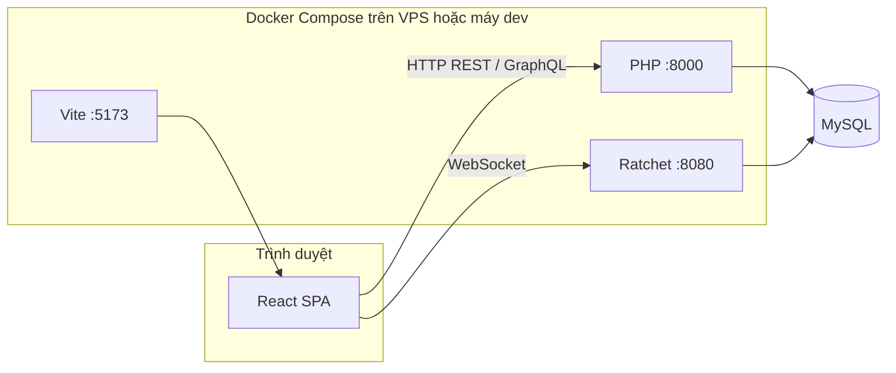

# MXH — Mạng xã hội (Social Network MVP)

## Giới thiệu tổng quan

**MXH** là một ứng dụng mạng xã hội dạng MVP, lấy cảm hứng từ các nền tảng như Facebook. Dự án gồm **frontend** (React + Vite), **backend** (PHP 8, REST + GraphQL), **MySQL** làm cơ sở dữ liệu, và **WebSocket** (Ratchet) phục vụ chat thời gian thực. Toàn bộ có thể chạy thống nhất bằng **Docker Compose**.

Người đọc README này có thể nắm được: mục tiêu sản phẩm, luồng xử lý chính, stack công nghệ (kèm phiên bản thư viện đã khóa hoặc ràng buộc), cấu trúc thư mục, và cách cài đặt — chạy — phát triển tiếp.

---

## Cập nhật gần đây

- **Tỉu Xài — Polish font chữ widget: Be Vietnam Pro cho dấu Việt sắc nét, canh cỡ/letter-spacing/weight lại cho đẹp và rõ:** User phản hồi `chỉnh lại font chữ nhìn cho rõ và đẹp` sau khi đổi label phe thành `TỈU`/`XÀI`. Nguyên do: (1) side title đang dùng `Impact, Arial Black` — 2 font này render dấu Việt (`Ỉ`, `À`) kém, các glyph có dấu bị rộng/nông so với chữ cái chính; (2) widget chưa có `font-family` scope riêng nên inherit font toàn app → không nhất quán trên các browser; (3) nhiều chỗ dùng font-size quá nhỏ (0.66–0.78rem) khiến con số/text khó đọc trên widget 440px.
  - **Import font** `styles.css` đầu file: thêm `Be Vietnam Pro` (weights 400, 500, 600, 700, 800, 900) vào `@import` Google Fonts song song với `Plus Jakarta Sans` sẵn có. Be Vietnam Pro là Google Font thiết kế riêng cho tiếng Việt, glyphs dấu rõ và cân đối.
  - **Scope font cho widget** — `.tx-casino-body` và `.tx-mini-bar` set `font-family: 'Be Vietnam Pro', 'Plus Jakarta Sans', -apple-system, BlinkMacSystemFont, 'Segoe UI', system-ui, sans-serif` + bật `-webkit-font-smoothing: antialiased; -moz-osx-font-smoothing: grayscale; text-rendering: optimizeLegibility; font-feature-settings: "tnum", "kern"`. Toàn bộ chữ trong widget từ nay render sắc nét, cân đối, kerning chuẩn.
  - **Side title TỈU / XÀI** — gộp 2 rule thành shared block, đổi `font-family` từ `Impact, Arial Black` → `'Be Vietnam Pro', 'Archivo Black', 'Oswald', 'Segoe UI Black', Impact, sans-serif` (ưu tiên Be Vietnam Pro 900 để dấu đẹp; các fallback đều là heavy display font). Giảm `font-size` từ 2.8rem → 2.6rem (tránh bị cắt dấu ở top), đổi `letter-spacing: -1px` → `+1px` (font mới chữ hẹp hơn Impact nên cần spacing dương). Gradient fire đỏ cam TỈU giữ cùng hue nhưng thêm stop giữa sáng hơn (`#ff5a1a` ở 30%); gradient XÀI thêm stop `#e4e4f0` ở 35% cho chuyển màu mượt hơn.
  - **Round code pill (`#2001550`)** — tăng `font-size` 0.78rem → 0.82rem, padding 2/10 → 3/11, color từ mờ `rgba(.78)` → `#f5c842` full, thêm `text-shadow: 0 1px 2px rgba(0,0,0,0.6)` để nổi bật trên nền top-bar gỗ. Background opacity 0.28 → 0.4, border 0.22 → 0.3 để contrast tốt hơn.
  - **Result flash** (header khi có kết quả) — size 0.88rem → 0.92rem, `<strong>` size 1.1rem → 1.18rem / weight 900 (trước 700), letter-spacing 1px → 1.5px + `text-shadow` để chữ "XÀI · Tổng 10" nổi và đọc rõ hơn. `.tx-win-badge`/`.tx-lose-badge` tăng weight + letter-spacing 0.5px.
  - **Side amount (tiền cược bên)** — 1.05rem → 1.08rem, color `#f5c842` → `#ffd85c` (sáng hơn), `text-shadow` đổi từ glow đơn (`0 0 8px`) sang dual-shadow (`0 1px 2px rgba(0,0,0,0.5)` cho depth + `0 0 10px rgba(245,200,66,0.35)` glow mềm hơn). Tabular-nums giữ nguyên.
  - **Players (👤 0)** — size 0.75rem → 0.8rem, thêm `font-weight: 600`, color 0.75 → 0.8 opacity, letter-spacing 0 → 0.2px. Icon 👤 từ 0.85rem → 0.9rem. Số đọc rõ hơn hẳn khi có nhiều người chơi.
  - **Nút CƯỢC** — 0.88rem → 0.92rem, letter-spacing 2px → 2.5px, thêm `text-shadow` cho depth và `-webkit-font-smoothing: antialiased` cục bộ. Giữ gradient đỏ fire.
  - **Bet pill (khi đã chọn)** — color `#f5c842` → `#ffd85c` + `text-shadow` để số tiền cược nổi trên background nâu đen.
  - **Total num 4rem + badge** — font-family đổi `Impact, Arial Black` → `'Be Vietnam Pro' 900, Archivo Black, Segoe UI Black, Impact` để con số trung tâm có chất đẹp hơn. Badge dưới xúc xắc: 0.82rem → 0.86rem, padding 2/10 → 3/11, border 0.55 → 0.6 opacity, thêm `text-shadow` + `font-variant-numeric: tabular-nums`.
  - **Countdown / rolling / result-label** (hàng thời gian giữa xúc xắc) — 0.82rem → 0.86rem, letter-spacing 0 → 0.4px, countdown color mờ → `#f5c842` full, result-label mờ → `#ffd85c` + weight 800, thêm `text-shadow` cho cả 3 biến thể. Min-height 18 → 20px tương ứng.
  - **Bet-placed "Đã đặt Tỉu — 50.000"** — 0.82rem → 0.84rem + weight 600, strong color `#f5c842` → `#ffd85c` + weight 900 + letter-spacing 0.5px, padding 6/10 → 7/12 cho air rộng hơn.
  - **Stake chips** — 0.72rem → 0.75rem, padding 4/10 → 5/11, thêm `font-variant-numeric: tabular-nums` + `letter-spacing: 0.2px`.
  - **Error msg** — 0.75rem → 0.78rem, padding 6/10 → 7/12, letter-spacing 0.2px.
  - **Footer wallet "Ví 51K"** — `.tx-wallet-label` size 0.72rem → 0.78rem, `strong` (số) 0.74rem → 0.82rem + `text-shadow` để nổi bật. Row height 22 → 24px cho aerated.
  - **Nút COPY MD5** — size 0.66rem → 0.7rem, letter-spacing 0.06em → 0.08em, gap 4 → 5px, padding 0/10 → 0/11, height 22 → 24px, thêm `text-shadow`.
  - **MD5 line (hash 32 ký tự)** — prefix pill `MD5` size 0.58rem → 0.62rem + height 16 → 18px + flex-basis 42 → 46px + letter-spacing 0.12 → 0.15em + `text-shadow`. Hash value 0.66rem → 0.7rem + letter-spacing 0.4 → 0.5px + `font-variant-numeric: tabular-nums`. Container padding 5/8 → 6/9, min-height 24 → 26px, gap 8 → 9px, background 0.45 → 0.5 opacity, border 0.22 → 0.28.
  - **Mini-bar (collapsed)** — set font-family Be Vietnam Pro (giống body). Label `TỈU XÀI` 0.8rem → 0.82rem + letter-spacing 0.5 → 1px + line-height 1.15 (trước không set → 1.2 inherited). Count `tabular-nums` + line-height 1.2. Mini-result weight 700 → 800 + letter-spacing 0.6px.
  - **File sửa**: `mxh/frontend/src/styles.css` (20 khối rule liên quan widget Tỉu Xài). Không đổi JSX — chỉ CSS polish.
  - **Triển khai VPS**: chỉ cần rebuild frontend (`docker compose build frontend && docker compose up -d frontend`). Font Be Vietnam Pro load từ Google Fonts CDN — lần đầu render có thể chớp font system trong ~200ms (swap behavior), sau đó cache browser.

- **Rebrand lần 3: revert về "Tỉu Xài" đồng thời đổi label 2 phe cược TÀI/XỈU → TỈU/XÀI cho nhất quán vần:** Rebrand lần 2 chỉ đổi tên cụm ("Xỉu Tài") nhưng 2 phe cược trong play-area vẫn là "TÀI" / "XỈU" → user phản hồi "ở đây vẫn là chữ tài xỉu hãy đổi lại tỉu xài". Lần này đi tới cùng: đảo vần triệt để mọi chỗ hiển thị user-facing (`Tài`→`Tỉu`, `Xỉu`→`Xài`) — kéo theo tên game cụm cũng trở lại "Tỉu Xài" cho đồng bộ.
  - **Frontend `TaiXiuFloatingWidget.jsx`** — đổi 8 chỗ text hiển thị:
    - Mini-label collapsed: `XỈU TÀI` → `TỈU XÀI`.
    - Side title cột trái: `TÀI` → `TỈU` (class `tx-title-tai` giữ nguyên → gradient đỏ không đổi).
    - Side title cột phải: `XỈU` → `XÀI` (class `tx-title-xiu` giữ nguyên → gradient trắng bạc không đổi).
    - Menu tab "Cách chơi": `<strong>TÀI</strong>` → `<strong>TỈU</strong>`, `<strong>XỈU</strong>` → `<strong>XÀI</strong>`.
    - Menu tab "Lịch sử phiên" — stat card: `TÀI`/`XỈU` → `TỈU`/`XÀI`. Và dòng `Nổ Tài`/`Nổ Xỉu` → `Nổ Tỉu`/`Nổ Xài`.
    - Menu tab "Jackpot" — header `NỔ TÀI`/`NỔ XỈU` → `NỔ TỈU`/`NỔ XÀI`, và badge trong từng row jackpot.
    - Dòng "Đã đặt" phía dưới play-area: `Tài`/`Xỉu` → `Tỉu`/`Xài`.
  - **Backend `TaiXiuService.php`** — hàm `labelForSide`: `'xiu' → 'Xỉu'` → `'xiu' → 'Xài'`, fallback `'Tài'` → `'Tỉu'`. Đây là single-source-of-truth cho `result_label`, `bet_label` gửi xuống frontend — nên đổi 1 chỗ này khiến toàn bộ `tx-hdot` tooltip, flash `<strong>{result_label}</strong> · Tổng N` (top-bar khi có kết quả), history dots, bet history… đều tự động hiển thị `TỈU`/`XÀI`. Cũng đổi text mô tả giao dịch (`buildTxnDesc`): `'Xỉu Tài #' . $roundCode` → `'Tỉu Xài #' . $roundCode`.
  - **CSS comments** `styles.css`: 3 dòng comment `TÀI`/`XỈU` → `TỈU`/`XÀI` cho khỏi đọc code bị lệch về semantics.
  - **Tên game cụm** — revert về "Tỉu Xài":
    - `frontend/src/pages/GamesPage.jsx` — card game: `Xỉu Tài` → `Tỉu Xài`.
    - `frontend/src/services/graphql.js` — comment section: `=== Xỉu Tài ===` → `=== Tỉu Xài ===`.
    - `backend/database/migrations/018_server_tai_xiu_rounds.sql` — comment header.
  - **Tài liệu**: rename `mxh/docs/XIU-TAI-MD5.md` → `mxh/docs/TIU-XAI-MD5.md` (quay về tên ban đầu). Nội dung đổi "Xỉu Tài" → "Tỉu Xài", bổ sung FAQ `Tại sao tên game là "Tỉu Xài" mà DB/code vẫn dùng tai_xiu?` nói rõ 2 phe hiển thị là TỈU (tổng 11-18) và XÀI (tổng 3-10) nhưng mapping backend vẫn là enum `'tai'`/`'xiu'`.
  - **Giữ nguyên (0 động vào)**: class name (`TaiXiuService`, `TaiXiuRepository`, `TaiXiuFloatingWidget`, `TaiXiuCurrentRoundType`…), bảng DB (`tai_xiu_rounds`, `tai_xiu_bets`), GraphQL field (`taiXiuCurrentRound`, `taiXiuPlaceBet`, `taiXiuMyHistory`…), `window.openTaiXiu`, event `mxh-open-taixiu`, CSS class (`tx-*`, `tx-title-tai`, `tx-title-xiu`, `tx-menu-round-result--tai`…), và **enum value `'tai'` / `'xiu'` trong state React + GraphQL arg + DB column `bet_side`/`result_key`**. Lý do: đổi enum value sẽ phá toàn bộ history đã lưu trong DB (`tai_xiu_rounds.result_key = 'tai'/'xiu'`), migration, bet lịch sử của user, state client trong localStorage, round đang mở dở. Chỉ mapping tại lớp presentation (JSX text + `labelForSide`).
  - **File sửa (7)**: `mxh/frontend/src/components/TaiXiuFloatingWidget.jsx`, `mxh/frontend/src/pages/GamesPage.jsx`, `mxh/frontend/src/services/graphql.js`, `mxh/frontend/src/styles.css`, `mxh/backend/src/Services/TaiXiuService.php`, `mxh/backend/database/migrations/018_server_tai_xiu_rounds.sql`, `mxh/docs/TIU-XAI-MD5.md` (rename + viết lại từ `XIU-TAI-MD5.md`).
  - **Triển khai VPS**: rebuild frontend (`docker compose build frontend && docker compose up -d frontend`) — backend PHP đã bind-mount nên `labelForSide` đổi là hiệu lực ngay, không cần restart.

- **Xỉu Tài — Căn chỉnh bố cục widget cho chỉn chu, các nút hết lệch:** Các thành phần top-bar, play-area, bottom-bar đang dùng `flex + space-between` nên khi nội dung có chiều rộng khác nhau (ví dụ `#2001488` dài hơn `#100`) sẽ bị đẩy lệch trung tâm. Các nút `CƯỢC`, `tx-bet-pill`, `tx-round-btn`, `tx-ctrl-btn` không có `line-height: 1` + `display: inline-flex` nên chữ có dấu (`Ợ`, `Ạ`) bị dời vertical. Lần này refactor CSS toàn bộ cho widget:
  - **Top-bar**: chuyển từ `flex + space-between` sang `grid-template-columns: auto 1fr auto` → `tx-round-code` nằm chính giữa tuyệt đối, không bị lệch khi các nút hai bên đổi width. Round-code được wrap thành pill nhỏ (bg tối + border vàng 10px radius) với font monospace tabular-nums để đọc mã phiên 7 chữ số đều đẹp.
  - **Nút ctrl** (`≡ ▁ ✕`): đồng bộ kích thước 28×28 (trước có nút 30), `display: inline-flex` + `line-height: 1` + `padding: 0` → emoji/ký tự không bị dời, `transform: scale(0.92)` khi active cho feel tactile.
  - **Play-area** (3 cột TÀI | dice | XỈU): từ `flex: 1` 2 cột bên chuyển sang `grid-template-columns: 1fr auto 1fr` → 2 cột bên luôn bằng nhau tuyệt đối dù nội dung dài ngắn khác nhau. `.tx-side-col` set `min-height: 168px` + `justify-content: center` để 3 items (title + players + amount + CƯỢC) align dọc giữa cùng tâm với dice circle 155px.
  - **Nút CƯỢC** + **tx-bet-pill**: cùng kích thước cố định `min-width: 96px; height: 38px; padding: 0 22px` với `display: inline-flex; align-items: center; justify-content: center; line-height: 1` → chữ "CƯỢC" và số tiền không bị nhảy dòng/dời dọc khi toggle giữa chế độ chưa chọn và đã chọn. `font-variant-numeric: tabular-nums` cho số tiền không nhảy width.
  - **Players row** (`👤 0`): `inline-flex` + gap 4px + icon size riêng 0.85rem, line-height 1.1 — dấu số căn đều với emoji.
  - **Bottom-bar** (`⟳ [dots] ★`): `justify-content: space-between` + `.tx-history` `flex: 1 1 auto` + `min-height: 14px` → dù chưa có history dot nào (overview rỗng) vẫn giữ chiều cao bar, ⟳/★ không bị dồn sát nhau.
  - **Phase text** (`.tx-countdown-text`, `.tx-rolling-text`, `.tx-result-label`): gộp shared style `min-height: 18px` + `display: flex; align-items: center; justify-content: center` → giữa 3 trạng thái phase (betting/rolling/result), vị trí chữ không bị nhảy lên xuống.
  - **Error & bet-placed**: bọc thành pill có border-radius 10px, padding đều, word-break để không phá layout khi message dài. `.tx-waiting` nhỏ hơn một chút để không át text chính.
  - File sửa: `mxh/frontend/src/styles.css` (khối `.tx-top-bar`, `.tx-play-area`, `.tx-side-col`, `.tx-cuoc-btn`, `.tx-bet-pill`, `.tx-bottom-bar`, `.tx-round-btn`, `.tx-ctrl-btn`, `.tx-countdown-text` + 2 biến thể, `.tx-error-msg`, `.tx-bet-placed`, `.tx-players`, `.tx-side-amount`, `.tx-round-code`). JSX không đổi — chỉ CSS refactor.

- **Rebrand "Tài Xỉu" → "Tỉu Xài" (chỉ đổi text UI) + tạo tài liệu chi tiết về MD5:** User yêu cầu đổi tên hiển thị game và tài liệu hoá tác dụng của MD5 trong widget.
  - **Đổi text UI** (giữ nguyên code/DB/class/variable để không breaking):
    - `frontend/src/pages/GamesPage.jsx` — `<strong>Tài Xỉu</strong>` → `<strong>Tỉu Xài</strong>` (card trang Games).
    - `frontend/src/components/TaiXiuFloatingWidget.jsx` — label mini bar `TÀI XỈU` → `TỈU XÀI`.
    - `frontend/src/services/graphql.js` — comment `// === Tài Xỉu (server-round) ===` → `// === Tỉu Xài (server-round) ===` cho nhất quán.
  - **Giữ nguyên**:
    - Class name (`TaiXiuService`, `TaiXiuRepository`, `TaiXiuFloatingWidget`, `TaiXiuCurrentRoundType`…), table DB (`tai_xiu_rounds`, `tai_xiu_bets`), GraphQL field (`taiXiuCurrentRound`, `taiXiuPlaceBet`…) — đổi hết sẽ phá migration + state frontend đã lưu.
    - Text "Tài" / "Xỉu" riêng lẻ (tên 2 phe đặt cược) — vẫn là Tài/Xỉu, không phải Tỉu/Xài, vì đây là thuật ngữ luật chơi.
  - **Tài liệu mới** `mxh/docs/XIU-TAI-MD5.md` (đã đổi tên từ `TIU-XAI-MD5.md` ở lần rebrand sau) — giải thích chi tiết:
    - MD5 là gì, đặc điểm (one-way, collision, 128 bit, deterministic).
    - 3 tác dụng của MD5 trong Tỉu Xài: định danh phiên duy nhất (2^128 keyspace), chống giả mạo kết quả nhẹ, placeholder cho provably-fair tương lai.
    - Formula sinh MD5: `md5(round_code:microtime:bin2hex(random_bytes(16)))`.
    - Tham chiếu code (file + hàm) cho 7 vị trí quan trọng.
    - Câu hỏi thường gặp (FAQ) về verify, SHA-256, tranh chấp admin.

- **Tài Xỉu — Sinh MD5 NGAY khi tạo phiên (không đợi kết quả), luôn hiển thị từ giây đầu tiên:** Trước đây `md5_hash` chỉ được sinh tại `resolveRound` (sau khi xác định dice) nên toàn bộ phase betting + rolling đều có `md5_hash = ''` → footer hiện `Đang cam kết…` suốt. Nay đã chuyển logic về earliest point — ngay khi `getOrCreateCurrentRound` INSERT row mới:
  - **`backend/src/Repositories/TaiXiuRepository.php`**:
    - `getOrCreateCurrentRound`: trước khi INSERT, compute `$md5 = md5(round_code . ':' . microtime(true) . ':' . bin2hex(random_bytes(16)))` → chuỗi hex 32 ký tự luôn unique, độc lập với dice (không lộ kết quả, không có ý nghĩa provably-fair). INSERT set thẳng `md5_hash = ?` thay vì `''`.
    - `resolveRound`: GỠ `md5_hash = ?` khỏi SQL UPDATE và bỏ binding tương ứng → md5 đã set lúc tạo phiên được GIỮ NGUYÊN xuyên suốt, không bị overwrite. Signature giữ param `$md5Hash = ''` optional để tương thích ngược với caller cũ (không breaking).
  - **`backend/src/Services/TaiXiuService.php`**: trong `resolveExpiredRound`, gỡ đoạn compute `$md5Hash = md5(...)` và bỏ đối số cuối khi gọi `$this->repo->resolveRound(...)` — dọn code dư.
  - **Frontend**: đổi placeholder fallback từ `Đang cam kết…` sang `—` (ngắn, chỉ hiển thị khi phiên legacy có `md5_hash = ''`). Tooltip MD5 cũng viết lại gọn, không dùng từ "cam kết" nữa: "Hash 32 ký tự định danh duy nhất cho phiên, công bố ngay khi phiên mở."
  - **Kết quả**: ngay từ giây 20 của phase betting, footer đã hiện đầy đủ 32 hex như `a1b2c3d4e5f6...`. Nút COPY MD5 hoạt động ngay, tooltip giải thích rõ ràng không gây hiểu nhầm provably-fair.

- **Tài Xỉu — Footer hiển thị MD5 phiên ĐẦY ĐỦ 32 ký tự thay vì round_code cắt cụt:** Trước đây footer widget hiển thị `MD5 2001460...` — thực ra đang in `round_code.slice(0, 20) + '...'` (mã phiên 7 chữ số) chứ không phải md5 thật → user không thể verify, và còn gây nhầm tưởng hệ thống có provably-fair. Nay đã sửa lại đúng:
  - **Backend**:
    - `backend/src/GraphQL/Types/TaiXiuCurrentRoundType.php` — thêm field `md5_hash: String!` vào `TaiXiuCurrentRound` type.
    - `backend/src/Services/TaiXiuService.php` — `buildCurrentRoundPayload` trả thêm key `md5_hash` (lấy từ `$round['md5_hash']` đã có sẵn trong DB; khi null thì empty string). Payload fallback (khi không có round) cũng có `md5_hash => ''`.
  - **Frontend**:
    - `frontend/src/services/graphql.js` — `CURRENT_ROUND_FIELDS` bổ sung `md5_hash`.
    - `frontend/src/components/TaiXiuFloatingWidget.jsx` — footer được tách thành card 2 dòng: dòng 1 gồm `💰 Ví <balance>` + nút `📋 COPY MD5`; dòng 2 là pill `MD5` + `<code>` hiển thị full 32 ký tự hex với font monospace hệ thống (`ui-monospace, SF Mono, Segoe UI Mono, Menlo, Consolas`), `word-break: break-all` để vỡ dòng đẹp trong khung hẹp, `user-select: all` để click chọn nhanh copy. Placeholder `Đang cam kết…` italic mờ khi md5_hash rỗng. Nút COPY copy đúng `round.md5_hash` thay vì `round.round_code`.
    - `frontend/src/styles.css` — refactor `.tx-footer` thành flex-column, thêm `.tx-footer-row`, `.tx-md5-line`, `.tx-md5-prefix` (pill vàng 42×16px), `.tx-md5-value`, `.tx-md5-placeholder`. Prefix `MD5` fixed width để text value luôn align trái cùng mốc; font-variant-numeric tabular-nums cho balance để số tiền không nhảy khi thay đổi. Copy button height 22px cố định khớp row 1.
  - **Provably-fair (tương lai)**: md5_hash hiện tại được backend sinh tại `resolveRound` (SAU khi xác định dice) theo formula legacy — chưa commit-reveal chuẩn. Lần refactor tiếp theo sẽ chuyển sang commit-reveal (md5 công bố TRƯỚC khi phase betting mở).

- **Tài Xỉu — Thay thế `roll-a-die` bằng xúc xắc 3D cube tự viết (pure CSS):** Trên VPS thư viện `roll-a-die@2.0.1` không render animation được ổn định (ref bị null tại lúc mount, style override conflict, callback fire ngay khi tạo phần tử). Đã gỡ hoàn toàn import `rollADie` và tự build xúc xắc 3D dựa trên cùng ý tưởng (CSS3 transform + keyframes) như repo gốc [chukwumaijem/roll-a-die](https://github.com/chukwumaijem/roll-a-die):
  - **Cấu trúc DOM**: `.mxh-die` (perspective 520px) > `.mxh-die-cube` (preserve-3d, là object xoay) > 6 `.mxh-die-face` mỗi mặt render 1 component SVG chấm đỏ casino. Face mapping 1=front (+Z), 2=right (+X), 3=top (+Y), 4=bottom (−Y), 5=left (−X), 6=back (−Z) → đối diện cộng đúng bằng 7 như xúc xắc thật.
  - **Animation lăn**: keyframe `mxhDieSpin` 3s cubic-bezier(0.18, 0.65, 0.1, 1) quay `rotateX(1440deg + final_rx) rotateY(1080deg + final_ry)` – 4 vòng X + 3 vòng Y rồi dừng đúng rotation đích (vì 1440 và 1080 đều chia hết 360 nên final chính xác bằng `{rx, ry}` của mặt cần hiện). 3 viên có stagger delay `0s / 0.18s / 0.36s` để tam giác lăn so le tự nhiên; tổng hoàn tất ≤ 3.4s, nằm gọn trong 6s rolling phase, phần thời gian còn lại xúc xắc đứng yên tại mặt kết quả.
  - **Trạng thái tĩnh**: cube `transition: transform 0.4s` về đúng `rotateX(final_rx) rotateY(final_ry)` dựa trên CSS variable `--mxh-final-rx/ry` → betting/idle/result đều hiện 3 viên đúng giá trị, idle thêm animation `txDieFloat` 2.6s trên `.tx-die-slot` ngoài cube.
  - **Component mới**: `DieFaceSVG` (SVG 100×100 gradient đỏ + chấm trắng có shadow), `AnimatedDie` (wrapper cube), `TriangleDice` được viết lại gọn chỉ còn 3 `AnimatedDie`. Xoá `StaticDie`, `.tx-die-canvas`, các override `.dice-outer !important`. CSS mới `.mxh-die-*` khoảng 60 dòng thuần, không phụ thuộc thư viện ngoài.
  - File sửa:
    - `frontend/src/components/TaiXiuFloatingWidget.jsx` – gỡ `import rollADie`, thay thế `StaticDie` + `TriangleDice` cũ.
    - `frontend/src/styles.css` – xoá block `.tx-die-cell`, `.tx-die-canvas`, `.tx-die-canvas .dice-outer` override, `.tx-static-die`; thêm block `.mxh-die / .mxh-die-cube / .mxh-die-face / @keyframes mxhDieSpin`. Responsive `@media max-width 480px` scale cube xuống 42×42 (translateZ 21px).
  - `package.json` vẫn giữ `roll-a-die` để không phá lockfile, nhưng code app không còn import nữa.

- **Tài Xỉu — Chỉ hiện X2 / ĐẶT CƯỢC / HỦY khi đã bấm CƯỢC:** Tách gate của `.tx-below-oval` thành 2 lớp:
  - `showStakes = isBetting && !alreadyBet` → thanh stakes chips (10K/100K/500K/1M/5M/10M) hiện xuyên suốt phase betting để user chọn mức tiền trước.
  - `showActions = showStakes && !!selectedSide` → riêng thanh `.tx-actions-row` chứa **X2 / ĐẶT CƯỢC / HỦY** chỉ hiện sau khi user bấm nút **CƯỢC** ở cột Tài hoặc Xỉu. Bấm **HỦY** reset `selectedSide` về `null` → thanh hành động đóng lại, stakes chips vẫn ở lại cho lần chọn kế.
  - File sửa: `frontend/src/components/TaiXiuFloatingWidget.jsx` (thay `showActions` duy nhất bằng cặp `showStakes`/`showActions`; JSX gate 2 tầng).

- **Tài Xỉu — 3 phase 20s / 6s / 5s + fix animation lăn xúc xắc:** Chu kỳ mỗi phiên giờ gồm 3 giai đoạn rõ ràng, được tính ở backend và trả xuống client qua 2 field mới `phase` và `phase_seconds_left`:
  - **betting (20s)** – mở cược, countdown hiện ở khung countdown vàng, xúc xắc hiển thị dạng *idle* (giá trị phiên trước hoặc `1-4-6`) với animation float nhẹ.
  - **rolling (6s)** – đã khóa cược, 3 viên roll-a-die bắt đầu animation 3D CSS đồng thời; animation mặc định 3s của thư viện được override thành 6s qua `animation-duration: 6s !important` để khớp phase. Khung tròn có hiệu ứng `txGlowPulse` + text `Đang lắc... Ns`.
  - **result (5s)** – tắt animation, hiện 3 xúc xắc tĩnh với kết quả thật + badge tổng điểm + flash Tài/Xỉu.
  - **Fix bug animation không thấy lăn**: thư viện `roll-a-die` gọi `callback` **ngay sau khi tạo dice element** (không phải sau khi animation kết thúc); lifecycle cũ dựa vào callback → `setRolling(false)` fire ngay → xúc xắc biến mất tức thì. Lifecycle mới do phase điều khiển (bỏ `onRollEnd`). Ngoài ra CSS cũ có `transform: ... !important` trên `.dice-outer` đã chặn keyframe `dice-movement` — đã xoá, chỉ giữ `margin:0 !important` và dịch `.dice` qua `top:-16px; left:-16px` để tâm xúc xắc trùng tâm ô `.tx-die-cell` (54×54).
  - File sửa backend:
    - `backend/src/Services/TaiXiuService.php` – hằng `BET_WINDOW=20`, `ROLLING_WINDOW=6`, `RESULT_WINDOW=5`, `REVEAL_WINDOW=11`; `buildCurrentRoundPayload` tính `phase` dựa trên `now - betting_deadline`; `placeBet` throw `Phiên đã khóa cược` nếu deadline qua dù status=betting.
    - `backend/src/Repositories/TaiXiuRepository.php` – `getOrCreateCurrentRound($bet, $revealWindow, $forUpdate)` giữ phiên finished trong `$revealWindow` giây sau deadline (phase rolling + result), chỉ tạo phiên mới khi quá 11s.
    - `backend/src/GraphQL/Types/TaiXiuCurrentRoundType.php` – thêm 2 field non-null `phase`, `phase_seconds_left`.
  - File sửa frontend:
    - `frontend/src/services/graphql.js` – thêm `phase phase_seconds_left` vào `CURRENT_ROUND_FIELDS`.
    - `frontend/src/components/TaiXiuFloatingWidget.jsx` – state machine mới: `applyRound` dùng `phase` + `prevPhase` ref thay cho `prevStatus`; `TriangleDice` bỏ prop `onRollEnd`, dùng `startedRef` để gọi `rollADie` đúng 1 lần mỗi phase rolling, delay `6500ms` để thư viện không auto-remove DOM; `secsLeft` = `phase_seconds_left`; thêm chế độ `isRolling` và `isResult` cho UI; countdown trên `tx-mini-bar` phân biệt rolling (`🎲 Ns`) vs betting.
    - `frontend/src/styles.css` – xoá transform `!important` chặn animation, thêm `animation-duration: 6s !important`, class `.tx-rolling-text` với keyframe `txRollingPulse`.

- **Tài Xỉu — Xúc xắc tam giác trong khung tròn (roll-a-die):** Widget Tài Xỉu **luôn hiển thị 3 viên xúc xắc dạng tam giác** (1 trên, 2 dưới) nằm gọn trong khung tròn 155×155 ở giữa, thay vì chỉ hiện số `0` trong lúc đặt cược. Dùng thư viện `roll-a-die@^2.0.1` cho animation, SVG tự vẽ cho trạng thái tĩnh.
  - File: `frontend/src/components/TaiXiuFloatingWidget.jsx` (component `TriangleDice`, `StaticDie`), `frontend/src/styles.css` (classes `.tx-triangle-dice`, `.tx-die-cell`, `.tx-die-canvas`, `.tx-total-badge`, `.tx-static-die--idle`, keyframes `txDieFloat`; responsive cell 46×46 trên mobile).

- **Trang quản lý Admin:** Dashboard admin tại `/admin` với sidebar layout (Tổng quan / Người dùng / Bài viết / Giao dịch). Bảo mật: backend kiểm tra `role = 'admin'` qua `AdminMiddleware` trước mọi API `/admin/*`. User thường truy cập `/admin` sẽ bị redirect về `/`. Để set admin: `UPDATE users SET role='admin' WHERE id=1`.
  - **Tổng quan:** Thống kê user, bài viết, doanh thu nạp tiền + biểu đồ user mới 7 ngày
  - **Người dùng:** Danh sách, tìm kiếm, lọc, khóa/mở tài khoản, đổi role, xóa (soft delete)
  - **Bài viết:** Danh sách, tìm kiếm, xóa bài vi phạm
  - **Giao dịch:** Lịch sử toàn bộ giao dịch ví tiền (nạp/rút/cược/thắng)
  - File mới: `backend/src/Middleware/AdminMiddleware.php`, `backend/src/Controllers/AdminController.php`, `frontend/src/pages/admin/` (AdminRoute, AdminLayout, AdminDashboard, AdminUsers, AdminPosts, AdminTransactions), `frontend/src/admin.css`
  - File sửa: `backend/public/index.php` (thêm `/admin/*` routes), `frontend/src/App.jsx` (thêm nested admin routes ngoài AppShell)
  - Migration: `019_add_role_to_users.sql` — thêm cột `role ENUM('user','admin')` và `is_blocked` vào bảng `users`

- **Gọi thoại (Voice Call) — WebRTC P2P:** Thêm tính năng gọi điện 1-1 kiểu Facebook Messenger. Âm thanh truyền trực tiếp peer-to-peer qua WebRTC (không đi qua server — phù hợp VPS 1GB RAM). Signaling dùng lại WebSocket Ratchet hiện có. STUN miễn phí của Google. Timeout 30 giây tự động nếu không bắt máy.
  - **Luồng:** Bấm nút gọi (FCW header) → `call.offer` → WebSocket relay → bên kia nhận toast → bấm bắt máy → trao đổi SDP + ICE → kết nối P2P
  - **Trạng thái cuộc gọi:** `idle → calling_out / ringing_in → connected → idle`
  - **UI:** Popup toast góc dưới trái khi có cuộc gọi đến (hiện ở mọi trang), cửa sổ nổi góc dưới phải khi đang gọi (avatar, bộ đếm thời gian, nút tắt mic, nút cúp)
  - File mới: `frontend/src/contexts/CallContext.jsx`, `frontend/src/components/IncomingCallToast.jsx`, `frontend/src/components/CallWindow.jsx`, `docs/superpowers/specs/2026-04-17-voice-call-design.md`
  - File sửa: `backend/src/WebSocket/ChatProtocol.php` (thêm 5 call message types), `backend/src/WebSocket/ChatServer.php` (thêm `handleCallSignal` relay), `frontend/src/App.jsx` (bọc `CallProvider`, mount `IncomingCallToast` + `CallWindow`), `frontend/src/components/FloatingChatWindow.jsx` (nút gọi được nối vào `startCall`), `frontend/src/styles.css` (classes `.incoming-call-toast`, `.ict-*`, `.call-window`, `.cw-*`)
  - **Lưu ý:** Cần file `/public/ringtone.mp3` trong frontend để chuông hoạt động. Có thể để trống nếu chưa có.

- **Widget thời tiết trên Navbar:** Hiển thị thời tiết hiện tại (icon + nhiệt độ + tên thành phố) tại góc trái navbar, cùng cột với left sidebar. Dùng Open-Meteo API (miễn phí, không cần API key) + Nominatim geocoding ngược sang tiếng Việt. Tự động xin quyền vị trí GPS, ẩn nếu người dùng từ chối. Widget được đặt `position: absolute; left: 16px` ngoài vùng centered `apple-nav-inner`.
  - File mới: `frontend/src/hooks/useWeather.js`
  - File sửa: `frontend/src/components/Navbar.jsx`, `frontend/src/styles.css`

- **FCW header kiểu Facebook:** Redesign header cửa sổ chat nổi giống Facebook — avatar lớn hơn (36px), tên + trạng thái, thêm nút gọi điện thoại và video call (visual), nút thu nhỏ dùng icon `─` (dash), nút đóng `×`. Hiển thị "Ngoại tuyến" khi user offline.
  - File sửa: `frontend/src/components/FloatingChatWindow.jsx`, `frontend/src/styles.css` (`.fcw-avatar`, `.fcw-status--offline`)

- **Gửi ảnh/video trong chat:** Thêm nút đính kèm ảnh/video vào ô nhập tin nhắn trong ChatWindow. Hỗ trợ xem trước ảnh/video trước khi gửi (có nút xóa), upload lên server, rồi gửi tin nhắn với `content_type: 'image'/'video'`. Tin nhắn được hiển thị tạm (local) ngay khi gửi, thay bằng tin thật sau khi upload xong. Tính năng hoạt động trên cả ChatPage và floating chat window.
  - File sửa: `frontend/src/components/chat/ChatWindow.jsx` (thêm media state, `handleMediaSelect`, `handleMediaRemove`, media preview, file input), `frontend/src/styles.css` (classes `.chat-media-btn`, `.chat-media-preview`, `.chat-media-preview-*`)

- **Chọn vị trí bằng bản đồ (Leaflet + OpenStreetMap):** Thay thế GPS tọa độ thô bằng modal bản đồ tương tác. Người dùng nhấn "Vị trí" trong form tạo bài → mở bản đồ OpenStreetMap, tự động định vị GPS, có thể kéo ghim hoặc nhấn chọn vị trí. Địa chỉ được dịch ngược sang tiếng Việt qua Nominatim API (miễn phí). Hiển thị địa chỉ đầy đủ với nút ✕ để xóa. Không cần API key.
  - Thư viện: `leaflet` (cài trong Docker container)
  - File mới: `frontend/src/components/LocationPicker.jsx`
  - File sửa: `frontend/src/components/CreatePostForm.jsx` (thêm modal picker + hiển thị địa chỉ), `frontend/src/styles.css` (classes `.loc-picker-*`)

- **Floating chat windows (Facebook-style):** Nhấn vào bất kỳ liên hệ nào trong sidebar phải → mở cửa sổ chat nổi ở góc phải màn hình (giống Facebook). Hỗ trợ mở nhiều cửa sổ cùng lúc, thu gọn/đóng riêng từng cửa sổ.
  - File mới: `frontend/src/components/FloatingChatWindow.jsx`
  - File sửa: `frontend/src/contexts/ChatContext.jsx` (state `openChats`), `App.jsx` (thêm `FloatingChatManager`), `styles.css` (classes `.fcw-*`)

- **Sidebar phải — Người liên hệ:** Sidebar phải hiển thị danh sách bạn bè và các cuộc trò chuyện, ưu tiên người đang online. Hiển thị cả với user chưa có cuộc hội thoại nào (lấy từ danh sách bạn bè).
  - File sửa: `frontend/src/components/RightSidebar.jsx`, `App.jsx`, `styles.css`

- **Sửa real-time preview chat cho người gửi:** Danh sách cuộc trò chuyện ở sidebar phải không cập nhật khi người dùng tự gửi tin nhắn (chỉ cập nhật sau reload). Đã fix bằng cách lắng nghe sự kiện `ack` trong ChatContext để cập nhật preview cho người gửi.
  - File sửa: `frontend/src/contexts/ChatContext.jsx`

- **Tài Xỉu Floating Widget:** Widget Tài Xỉu nay là một widget nổi cố định có thể kéo tự do, thu gọn thành thanh nhỏ, hoặc đóng lại thành nút bong bóng — cho phép chơi trong khi lướt feed, nhắn tin, v.v. Widget tồn tại xuyên suốt các trang (không mất trạng thái khi điều hướng). Trang `/games` chỉ cần bấm nút để mở widget qua custom event `mxh-open-taixiu`.
  - File mới: `frontend/src/components/TaiXiuFloatingWidget.jsx`
  - File sửa: `App.jsx` (thêm `<TaiXiuFloatingWidget />`), `GamesPage.jsx` (dispatch event thay vì inline modal), `styles.css` (classes `.tx-bubble`, `.tx-mini-bar`, `.tx-widget--floating`, `.tx-header--drag`, v.v.)

- **Tài Xỉu Server-Round:** Mô hình chơi server-driven — mỗi phiên 30 giây nhận cược, server lăn 3 xúc xắc một lần cho tất cả người chơi cùng lúc. Không còn mỗi người tự roll riêng. Có jackpot pool (bên thắng chia theo tỉ lệ cược), lịch sử phiên, animation xúc xắc, countdown ring.
  - Migration: `backend/database/migrations/017_create_tai_xiu_tables.sql`, `018_server_tai_xiu_rounds.sql`
  - File backend mới: `TaiXiuRepository.php`, `TaiXiuService.php`, `Types/TaiXiuCurrentRoundType.php`, `Types/TaiXiuPlaceBetResultType.php`
  - File backend sửa: `TypeRegistry.php`, `QueryType.php`, `MutationType.php`
  - File frontend sửa: `graphql.js` (hàm `getTaiXiuOverview`, `getTaiXiuCurrentRound`, `taiXiuPlaceBet`)

- **Xoá bình luận + Phân quyền:** Chủ bài viết có thể xoá mọi bình luận trên bài của mình; tác giả bình luận có thể xoá bình luận của chính mình. Nút "Xoá" xuất hiện cạnh nút "Trả lời" trong cả CommentPopup lẫn CommentList.
  - Migration: `backend/database/migrations/016_add_comment_parent_id.sql` (thêm cột `parent_id`)
  - File backend mới/sửa: `CommentRepository.php` (thêm `delete()`), `CommentService.php` (thêm `deleteComment()`), `CommentType.php` (field `parent_id`), `MutationType.php` (mutation `deleteComment`, arg `parent_id` cho `createComment`)
  - File frontend mới/sửa: `graphql.js` (hàm `deleteComment`, cập nhật `createComment`), `CommentPopup.jsx`, `CommentList.jsx`

- **Trả lời bình luận (threaded comments):** Bình luận hiển thị theo dạng nhánh Facebook — reply được thụt vào bên dưới bình luận gốc với đường kẻ dọc. Người dùng bấm "Trả lời" để mở form inline trả lời. Hệ thống tự flatten chuỗi reply sâu về 2 cấp.
  - Migration: `016_add_comment_parent_id.sql`
  - File: `CommentPopup.jsx`, `CommentList.jsx`, `CommentService.php`, `graphql.js`

- **Tag/Mention bạn bè (@username):** Gõ `@` trong ô bình luận hoặc ô tạo bài viết để xổ dropdown tìm kiếm user. Khi chọn, `@username` được chèn vào nội dung. Mention được highlight màu xanh khi hiển thị trên feed và trong bình luận.
  - File: `hooks/useMentionInput.js` (hook tái sử dụng), `CreatePostForm.jsx`, `PostCard.jsx`, `CommentPopup.jsx`, `CommentList.jsx`, `styles.css`

- **Nạp tiền qua VNPay:** Tích hợp cổng thanh toán VNPay (sandbox) cho phép user nạp tiền vào ví. Flow: chọn mệnh giá → redirect VNPay → thanh toán → callback IPN cập nhật số dư. Giao diện "Ví tiền" trong Settings hiển thị số dư, preset mệnh giá, lịch sử giao dịch. Sidebar trái hiện số dư realtime.
  - Migration: `backend/database/migrations/015_add_balance_and_transactions.sql`
  - File backend mới: `PaymentController.php`, `PaymentService.php`, `TransactionRepository.php`
  - REST endpoints: `POST /payment/create`, `GET /payment/ipn`, `GET /payment/verify`, `GET /payment/balance`, `GET /payment/transactions`
  - File frontend mới: `PaymentResultPage.jsx`
  - File sửa: `SettingsPage.jsx` (tab Ví tiền), `LeftSidebar.jsx` (hiện số dư), `App.jsx` (route), `auth.js` (API), `.env`, `docker-compose.yml`
  - Cấu hình: `VNP_TMN_CODE`, `VNP_HASH_SECRET`, `VNP_URL` trong `.env`

- **Sidebar trái + danh mục Trò chơi:** Thêm sidebar trái cố định (giống Facebook) hiện trên mọi trang desktop. Chứa shortcut: avatar user, Trang chủ, Bạn bè, Tin nhắn, và mục "Khám phá" với Trò chơi. Sidebar tự thu gọn (chỉ icon) ở màn hình nhỏ, ẩn hoàn toàn dưới 860px. Dark mode đầy đủ.
  - File mới: `LeftSidebar.jsx`, `GamesPage.jsx` (placeholder)
  - File sửa: `App.jsx` (layout `desktop-layout` + route `/games`), `styles.css`

- **Trang Cài đặt tài khoản (Settings):** Trang settings kiểu Facebook cũ với sidebar 2 mục: Chung (sửa username, ngày sinh, giới tính) và Mật khẩu & Bảo mật (đổi/đặt mật khẩu). User đăng nhập Google có thể đặt mật khẩu để đăng nhập bằng email. Responsive cho mobile.
  - REST endpoints mới: `GET /auth/settings`, `POST /auth/settings/password`, `POST /auth/settings/profile`
  - File backend: `AuthController.php`, `AuthService.php`, `UserRepository.php`, `index.php`
  - File frontend: `SettingsPage.jsx` (mới), `Navbar.jsx` (menu cài đặt), `App.jsx` (route `/settings`), `services/auth.js`, `styles.css`

- **Google login yêu cầu ngày sinh + giới tính:** Khi đăng nhập bằng Google lần đầu (tạo tài khoản mới), hệ thống yêu cầu nhập ngày sinh và giới tính trước khi hoàn tất đăng ký. User hiện tại hoặc email đã có thì đăng nhập bình thường.
  - File: `AuthService.php` (flow `needs_profile`), `LoginPage.jsx` (form bổ sung), `AuthContext.jsx`, `services/auth.js`

- **Đăng ký: ngày sinh + giới tính:** Form đăng ký giờ có 3 dropdown chọn ngày/tháng/năm sinh (kiểu Facebook) và radio button chọn giới tính (Nữ/Nam/Khác). Dữ liệu được lưu vào cột `birthday` (DATE) và `gender` (VARCHAR) trong bảng `users`.
  - Migration: `backend/database/migrations/014_add_birthday_gender_oauth_reset.sql`
  - File backend: `UserRepository.php`, `AuthValidator.php`, `AuthService.php`, `AuthController.php`
  - File frontend: `RegisterPage.jsx`, `services/auth.js`, `contexts/AuthContext.jsx`, `styles.css`

- **Đăng nhập bằng Google:** Tích hợp Google Sign-In (GSI) vào trang đăng nhập. Backend xác minh ID token qua Google tokeninfo API, tự động tạo tài khoản mới hoặc liên kết với tài khoản email đã có.
  - Cần cấu hình: `VITE_GOOGLE_CLIENT_ID` trong `.env` frontend + `GOOGLE_CLIENT_ID` trong `.env` backend
  - REST endpoint mới: `POST /auth/google`
  - File: `AuthService.php`, `AuthController.php`, `index.php`, `LoginPage.jsx`, `index.html` (GSI script)

- **Quên mật khẩu + Đặt lại mật khẩu:** Luồng hoàn chỉnh: nhập email → nhận token (hiển thị trực tiếp trong chế độ dev) → nhập mật khẩu mới. Token hết hạn sau 1 giờ.
  - REST endpoints mới: `POST /auth/forgot-password`, `POST /auth/reset-password`
  - Trang mới: `ForgotPasswordPage.jsx`, `ResetPasswordPage.jsx`
  - Routes mới trong `App.jsx`: `/forgot-password`, `/reset-password`

- **CSS Emoji Reactions (react-facebook-emoji):** Thay thế ký tự emoji hệ thống (phụ thuộc font OS) bằng CSS-animated emoji đồng nhất trên mọi thiết bị. Component `FacebookEmoji.jsx` đã có sẵn; CSS được nhúng vào `styles.css`. Picker, nút action, và summary row đều dùng `<FacebookEmoji>` với các size `sm`/`xs`/`xxs`.
  - File liên quan: `frontend/src/components/FacebookEmoji.jsx`, `frontend/src/components/PostCard.jsx`, `frontend/src/styles.css`

- **Tính năng xem ai đã thả reaction:** Hover vào số lượt thích → tooltip hiện avatar + tên (350ms delay). Click → popup đầy đủ với tabs lọc theo loại reaction (Tất cả / Thích / Yêu thích / ...) và danh sách avatar + tên. Reaction type giờ được lưu trong DB.
  - Migration: `backend/database/migrations/013_add_reaction_type_to_likes.sql`
  - File backend: `LikeRepository.php`, `LikeService.php`, `Types/LikerType.php`, `TypeRegistry.php`, `QueryType.php`, `MutationType.php`
  - File frontend: `ReactionDetailsPopup.jsx` (mới), `PostCard.jsx`, `services/graphql.js`, `styles.css`
  - GraphQL query mới: `postLikers(postId, limit)` → `[Liker]`
  - Mutation `likePost` giờ nhận thêm arg `reactionType: String`

- Đã **loại bỏ tính năng sticker** khỏi luồng tạo bài viết và hiển thị bài viết (frontend + backend).
  - Migration: `backend/database/migrations/012_drop_post_sticker_column.sql`

- Môi trường hiện tại đang vận hành trên **VPS Ubuntu**, thao tác qua phần mềm đồng bộ/liên kết thư mục từ **Windows**.

---

## Kiểm tra chức năng (2026-04-14)

> Kiểm tra tĩnh toàn bộ code. Danh sách lỗi và vấn đề tồn đọng xem tại [`BUGS.md`](BUGS.md).

### Kết quả kiểm tra từng chức năng

#### Xác thực (Auth)

| Chức năng | File chính | Trạng thái | Ghi chú |
|-----------|-----------|------------|---------|
| Đăng ký (username, email, mật khẩu, ngày sinh, giới tính) | `RegisterPage.jsx`, `AuthController.php` | ✅ OK | Validation đầy đủ cả frontend + backend |
| Đăng nhập email/mật khẩu | `LoginPage.jsx`, `AuthController.php` | ✅ OK | JWT trả về, lưu vào `AuthContext` |
| Đăng nhập Google OAuth | `LoginPage.jsx`, `AuthController.php::googleLogin()` | ✅ OK | Cần `VITE_GOOGLE_CLIENT_ID` + `GOOGLE_CLIENT_ID` trong `.env` |
| Đăng xuất | `Navbar.jsx`, `AuthController.php::logout()` | ✅ OK | |
| Quên mật khẩu | `ForgotPasswordPage.jsx`, `AuthController.php::forgotPassword()` | ✅ OK | Token hiện trong response (dev mode) |
| Đặt lại mật khẩu | `ResetPasswordPage.jsx`, `AuthController.php::resetPassword()` | ✅ OK | Token hết hạn sau 1 giờ |
| Cài đặt tài khoản (username, ngày sinh, giới tính) | `SettingsPage.jsx`, `AuthController.php::updateProfile()` | ✅ OK | |
| Đổi mật khẩu | `SettingsPage.jsx`, `AuthController.php::changePassword()` | ✅ OK | User Google lần đầu đổi mật khẩu để login bằng email |

#### Bài viết & Feed

| Chức năng | File chính | Trạng thái | Ghi chú |
|-----------|-----------|------------|---------|
| Tạo bài viết (text + ảnh/video + vị trí + @mention) | `CreatePostForm.jsx`, `MutationType.php::createPost` | ✅ OK | Hỗ trợ đầy đủ media, tọa độ GPS, mention |
| Sửa bài viết | `PostCard.jsx`, `MutationType.php::editPost` | ✅ OK | Chỉ sửa nội dung text |
| Xóa bài viết | `PostCard.jsx`, `MutationType.php::deletePost` | ✅ OK | |
| Feed cá nhân hóa (bạn bè + following) | `HomePage.jsx`, `QueryType.php::feed` | ✅ OK | Phân trang |
| Xem bài viết chi tiết | `PostDetailPage.jsx` | ✅ OK | Route `/post/:postId` |
| Chia sẻ bài viết (copy link) | `SharePopup.jsx` | ✅ OK | Copy URL vào clipboard |
| Chọn vị trí bản đồ (Leaflet + OSM) | `LocationPicker.jsx` | ✅ OK | |

#### Tương tác bài viết

| Chức năng | File chính | Trạng thái | Ghi chú |
|-----------|-----------|------------|---------|
| Reaction (6 loại: Thích, Yêu thích, Haha, Wow, Buồn, Phẫn nộ) | `PostCard.jsx`, `FacebookEmoji.jsx` | ✅ OK | CSS emoji đồng nhất mọi thiết bị |
| Xem ai đã thả reaction (tooltip + popup chi tiết) | `ReactionDetailsPopup.jsx`, `QueryType.php::postLikers` | ✅ OK | Lọc theo loại reaction |
| Bình luận (text + ảnh/video) | `CommentPopup.jsx`, `CommentList.jsx` | ✅ OK | |
| Bình luận dạng thread (trả lời nested 2 cấp) | `CommentPopup.jsx`, `CommentList.jsx` | ✅ OK | Flatten chuỗi sâu về 2 cấp |
| Xóa bình luận (chủ bài + tác giả bình luận) | `CommentList.jsx`, `MutationType.php::deleteComment` | ✅ OK | |
| @mention trong bài viết và bình luận | `useMentionInput.js`, `MentionHelper.php` | ✅ OK | Dropdown tìm kiếm, highlight màu xanh |
| Xem ảnh lightbox | `PostImageLightbox.jsx` | ✅ OK | |
| Phát video (VideoPlayer) | `VideoPlayer.jsx` | ✅ OK | Touch-friendly, Safari inline, mute/unmute |

#### Hồ sơ người dùng

| Chức năng | File chính | Trạng thái | Ghi chú |
|-----------|-----------|------------|---------|
| Xem hồ sơ (bài viết, thống kê, bạn bè, following) | `ProfilePage.jsx`, `ProfileInfo.jsx` | ✅ OK | Hỗ trợ `profile_id=X` và `custom_url` |
| Cập nhật bio, avatar, ảnh bìa | `ProfileInfo.jsx`, `UploadController.php` | ✅ OK | Upload lên `/upload`, `/upload/cover` |
| Đặt URL tùy chỉnh (custom_url) | `ProfileInfo.jsx`, `MutationType.php::updateCustomUrl` | ✅ OK | |
| Stories (tạo, xem, xóa) | `CreateStoryModal.jsx`, `StoryViewer.jsx` | ✅ OK | Hỗ trợ ảnh + video, hết hạn 24h |

#### Kết nối người dùng

| Chức năng | File chính | Trạng thái | Ghi chú |
|-----------|-----------|------------|---------|
| Kết bạn / lời mời kết bạn | `FriendsPage.jsx`, `FriendshipRepository.php` | ✅ OK | Gửi / chấp nhận / từ chối / hủy |
| Danh sách bạn bè | `FriendsPage.jsx`, `QueryType.php::myFriends` | ✅ OK | |
| Follow / Unfollow | `ProfileInfo.jsx`, `FollowRepository.php` | ✅ OK | |
| Tìm kiếm người dùng | `SearchPage.jsx`, `QueryType.php::searchUsers` | ✅ OK | |
| Thêm bạn từ trang tìm kiếm | `SearchPage.jsx` | ✅ OK | |

#### Thông báo

| Chức năng | File chính | Trạng thái | Ghi chú |
|-----------|-----------|------------|---------|
| Trang thông báo | `NotificationsPage.jsx` | ✅ OK | Các loại: `comment`, `mention_post`, `mention_comment`, `friend_request`, `friend_accept` |
| Badge chưa đọc trên navbar / tab bar | `useNotificationUnread.js`, `Navbar.jsx` | ✅ OK | Refresh mỗi 45 giây |
| Đánh dấu đã đọc (từng / tất cả) | `NotificationsPage.jsx`, `MutationType.php` | ✅ OK | |
| Xóa thông báo (từng / tất cả) | `NotificationsPage.jsx`, `MutationType.php` | ✅ OK | |
| Thông báo khi like | `LikeService.php` | — | Chưa triển khai, xem [BUGS.md](BUGS.md#bug-001) |

#### Chat & Tin nhắn

| Chức năng | File chính | Trạng thái | Ghi chú |
|-----------|-----------|------------|---------|
| Danh sách hội thoại | `ConversationList.jsx`, `ChatController.php` | ✅ OK | Sorted theo tin nhắn mới nhất |
| Gửi tin nhắn (text + ảnh/video) | `ChatWindow.jsx`, WebSocket | ✅ OK | Preview local ngay khi gửi |
| Realtime nhận tin nhắn | `ChatContext.jsx`, `websocket.js` | ✅ OK | WebSocket + ACK |
| Sửa / xóa / unsend / ẩn tin nhắn | `MessageBubble.jsx`, `ChatController.php` | ✅ OK | |
| Floating chat window (Facebook-style) | `FloatingChatWindow.jsx` | ✅ OK | Nhiều cửa sổ, thu gọn / mở |
| Read receipt (đã đọc đến tin nào) | `ChatController.php::getReadReceipt()` | ✅ OK | |
| Tìm kiếm tin nhắn | `ChatController.php::searchMessages()` | ✅ OK | |
| Typing indicator | WebSocket `messages.setTyping` | ✅ OK | |
| Badge tổng tin nhắn chưa đọc | `ChatContext.jsx`, `Navbar.jsx` | ✅ OK | |

#### Trò chơi & Ví tiền

| Chức năng | File chính | Trạng thái | Ghi chú |
|-----------|-----------|------------|---------|
| Tỉu Xài server-round (30s/phiên) | `TaiXiuFloatingWidget.jsx`, `TaiXiuService.php` | ✅ OK | Jackpot pool, animation xúc xắc, countdown ring |
| Nạp tiền VNPay | `PaymentController.php`, `SettingsPage.jsx` | ✅ OK | Sandbox; cần `VNP_TMN_CODE` + `VNP_HASH_SECRET` trong `.env` |
| Lịch sử giao dịch | `SettingsPage.jsx`, `PaymentController.php::getTransactions()` | ✅ OK | |
| Hiển thị số dư trong sidebar | `LeftSidebar.jsx` | ✅ OK | Cập nhật realtime qua event `mxh-wallet-refresh` |

#### Tính năng khác

| Chức năng | File chính | Trạng thái | Ghi chú |
|-----------|-----------|------------|---------|
| AI Chat (Gemini) | `AIFloatingChat.jsx`, `AIController.php` | ✅ OK | Cần `GEMINI_API_KEY` trong `.env` |
| Link Preview | `LinkPreviewController.php` | ✅ OK | |
| Widget thời tiết trên Navbar | `useWeather.js`, `Navbar.jsx` | ✅ OK | Absolute-positioned góc trái navbar (ngoài vùng centered); Open-Meteo + Nominatim, không cần API key |
| Dark mode / Light mode | `App.jsx`, `Navbar.jsx`, `styles.css` | ✅ OK | Lưu vào localStorage |
| Giao diện mobile (TabBar, MobileLayout) | `MobileLayout.jsx`, `MobileTabBar.jsx` | ✅ OK | Tabs: Trang chủ → Thông báo → Bạn bè → Tin nhắn → Cá nhân |
| Sidebar trái (desktop) | `LeftSidebar.jsx` | ✅ OK | |
| Sidebar phải — danh bạ online (desktop) | `RightSidebar.jsx` | ✅ OK | |

---

## Mục tiêu và chức năng chính

### Mục tiêu

- Cung cấp **bản demo học tập / prototype** cho các tính năng cốt lõi của mạng xã hội: tài khoản, hồ sơ, bài viết, tương tác, kết nối người dùng.
- Tách rõ **API** (REST + GraphQL) và **giao diện** (SPA React) để dễ mở rộng.

### Chức năng chính (đã có trong codebase)

| Nhóm | Nội dung |
|------|----------|
| **Xác thực** | Đăng ký, đăng nhập, JWT; middleware bảo vệ route cần đăng nhập |
| **Hồ sơ** | Bio, avatar, ảnh bìa, URL tùy chỉnh (`custom_url`), thống kê (bài viết, follower, bạn bè, v.v.) |
| **Bài viết & feed** | Tạo / sửa / xóa bài, feed cá nhân hóa; **media ảnh/video** (upload + kích thước hiển thị); **vị trí** (nhãn văn bản + tọa độ GPS qua Geolocation API); **gắn thẻ @username** trong nội dung (trích bằng `MentionHelper`, lưu `post_mentions`) |
| **Tương tác** | Like / unlike; bình luận **chữ** hoặc **kèm ảnh/video** (upload riêng trong popup bình luận, cùng endpoint `/upload/media`); **gắn thẻ @username** trong bình luận (`comment_mentions`); chủ bài viết nhận thông báo khi có bình luận mới |
| **Thông báo** | Bảng `notifications` trong DB (loại: `comment` \| `mention_post` \| `mention_comment` \| `friend_request` \| `friend_accept`); GraphQL query `notifications` + `notificationUnreadCount`; mutations `markNotificationRead` + `markAllNotificationsRead` + `deleteNotification` + `deleteAllNotifications`; **trang `/notifications`** hiển thị danh sách, đánh dấu đã đọc; **badge số chưa đọc** trên Navbar (desktop) và TabBar (mobile); refresh badge tự động mỗi 45 giây |
| **Điều hướng** | **Desktop — Navbar pill:** Trang chủ → Thông báo (badge) → Tìm bạn (icon) → Bạn bè (badge lời mời) → Tin nhắn (badge) → Hồ sơ → Cài đặt. **Mobile — TabBar dưới:** Trang chủ → Thông báo (badge) → Bạn bè → Tin nhắn (badge) → Cá nhân; icon Tìm kiếm đặt trên MobileHeader sticky |
| **Quan hệ** | Follow, kết bạn / lời mời kết bạn (friendship) |
| **Tìm kiếm & khám phá** | Trang tìm kiếm người dùng; link `@username` trong bài/bình luận mở `/search?q=username` |
| **Stories** | Luồng story (viewer, tạo story — theo module GraphQL / UI) |
| **Chat** | REST cho hội thoại / tin nhắn; **WebSocket** cho đẩy tin nhắn theo thời gian thực |
| **Tiện ích** | Upload file (avatar, cover, media bài viết & media bình luận), **link preview** (REST) |
| **Vận hành** | Health check, migration SQL có thứ tự (migrations `001`–`011`), seed tài khoản thử |

---

## Cách thức hoạt động và luồng xử lý chính

### Kiến trúc tổng thể



*(MySQL có thể là container `mysql` — profile `local-db` — hoặc máy chủ MySQL từ xa, ví dụ tại nhà qua VPN/SSH tunnel; xem `deploy/VPS.md`.)*

- **Frontend** gọi `VITE_API_URL` (REST + GraphQL) và `VITE_WS_URL` (chat). Token JWT thường gửi kèm header cho API; WebSocket dùng cho kênh chat.
- **Backend HTTP**: PHP built-in server (`0.0.0.0:8000`), entry `public/router.php` → phục vụ file tĩnh dưới `/uploads/`, còn lại chuyển vào `public/index.php` để định tuyến REST và GraphQL.
- **GraphQL**: một endpoint `POST /graphql`, schema PHP (`App\GraphQL`), context có user sau `AuthMiddleware::optionalAuth()` (một số trường hợp bắt buộc đăng nhập trong resolver).
- **REST**: auth (`/auth/*`), upload (`/upload`, `/upload/cover`, `/upload/media`), chat (`/chat/*`), link preview (`/link-preview`), health (`/health`).
- **WebSocket**: process riêng `bin/websocket-server.php`, dùng Ratchet (`IoServer` → `HttpServer` → `WsServer` → `App\WebSocket\ChatServer`).
- **Cơ sở dữ liệu**: MySQL; có thể chạy trong Docker (profile `local-db`) hoặc **bên ngoài** (VPS kết nối tới máy nhà — xem `deploy/VPS.md`). Migration chạy bằng `database/migrate.php` (bảng `_migrations` theo dõi file đã chạy). Container `backend` / `websocket` chờ TCP tới MySQL (logic trong `docker-entrypoint.sh`, timeout `DB_WAIT_TIMEOUT`).

### Luồng request HTTP điển hình

1. CORS được xử lý trước (`CorsMiddleware`).
2. `router.php` phân nhánh: nếu URI bắt đầu bằng `/uploads/` thì trả file; không thì `require index.php`.
3. `index.php` đọc `REQUEST_URI` và `REQUEST_METHOD`, `switch` tới controller REST tương ứng hoặc `handleGraphQL()`.
4. GraphQL: đọc body JSON (`query`, `variables`, `operationName`), build schema, `GraphQL::executeQuery`, trả JSON.

### Luồng chat (tóm tắt)

- Tin nhắn và hội thoại lưu qua REST (CRUD, đánh dấu đã đọc, v.v.).
- Client mở kết nối WebSocket tới cổng **8080** để nhận / gửi realtime (theo `ChatServer`).

---

## Ngôn ngữ và định dạng trong project

| Ngôn ngữ / định dạng | Vai trò |
|---------------------|---------|
| **PHP** | Backend API, GraphQL, middleware, repository, service, WebSocket server |
| **JavaScript (JSX)** | Frontend React (`frontend/src`) |
| **SQL** | Migration và seed (`backend/database/`) |
| **CSS** | Giao diện (`frontend/src/styles.css`, `frontend/src/mobile/mobile.css`) |
| **Shell** | `start-docker.sh` — khởi chạy Docker trên Linux/macOS |
| **PowerShell** | `start-docker.ps1` — tương tự trên Windows |
| **YAML** | `docker-compose.yml` |
| **JSON** | `composer.json`, `package.json`, cấu hình Vite/env |

---

## Thư viện, framework và phiên bản

### Hạ tầng & runtime (Docker / image)

| Thành phần | Phiên bản / ghi chú |
|------------|---------------------|
| **PHP** | Image `php:8.2-cli` (Dockerfile backend) — `composer.json` yêu cầu `>=8.1` |
| **Node.js** | Image `node:20-alpine` (Dockerfile frontend) |
| **MySQL** | `mysql:8.0` — chỉ khi bật profile **`local-db`** (xem `.env.example`) |
| **Cổng host (mặc định)** | MySQL **3307** → 3306 trong container; Backend **8000**; WebSocket **8080**; Frontend **5173** — có thể đổi bằng biến trong `.env` |

### Backend — PHP (Composer)

Các gói khai báo trong `backend/composer.json` (ràng buộc semver):

| Gói | Ràng buộc trong `composer.json` |
|-----|----------------------------------|
| [webonyx/graphql-php](https://github.com/webonyx/graphql-php) | `^15.0` |
| [firebase/php-jwt](https://github.com/firebase/php-jwt) | `^6.0` |
| [vlucas/phpdotenv](https://github.com/vlucas/phpdotenv) | `^5.5` |
| [cboden/ratchet](https://github.com/ratchetphp/Ratchet) | `^0.4` |

**Phiên bản cài đặt chính xác từng gói** nằm trong file `composer.lock` sau khi chạy `composer install` trong thư mục `backend/` (file lock có thể được tạo trong môi trường dev hoặc trong container build). Để xem sau khi container đã chạy:

```bash
docker compose exec backend composer show
```

### Frontend — npm (theo `package-lock.json`)

**Dependencies (runtime):**

| Gói | Phiên bản khai báo | Ghi chú |
|-----|-------------------|---------|
| react | ^18.2.0 (lock: 18.3.1) | |
| react-dom | ^18.2.0 (lock: 18.3.1) | |
| react-router-dom | ^6.20.0 (lock: 6.30.3) | |
| leaflet | ^1.9.4 | Bản đồ OpenStreetMap cho LocationPicker — **mới thêm** |
| roll-a-die | ^2.0.1 | Animation xúc xắc cho Tỉu Xài (đã thay bằng 3D cube pure-CSS, không còn dùng trực tiếp) |

**DevDependencies:**

| Gói | Phiên bản đã khóa |
|-----|-------------------|
| vite | 5.4.21 |
| @vitejs/plugin-react | 4.7.0 |
| @types/react | 18.3.28 |

Các gói transitive (Babel, PostCSS, Rollup, v.v.) được npm quản lý tự động; chi tiết đầy đủ nằm trong `frontend/package-lock.json`.

---

## Cấu trúc thư mục

```
mxh/
├── backend/
│   ├── bin/
│   │   └── websocket-server.php      # Entry WebSocket (Ratchet)
│   ├── public/
│   │   ├── index.php                 # Định tuyến REST + GraphQL
│   │   └── router.php                # Static /uploads + delegate index
│   ├── src/
│   │   ├── Config/
│   │   ├── Controllers/              # REST: Auth, Upload, Chat, LinkPreview, ...
│   │   ├── GraphQL/                  # Schema, Query, Mutation, Types
│   │   ├── Helpers/
│   │   ├── Middleware/               # CORS, Auth
│   │   ├── Repositories/
│   │   ├── Services/
│   │   ├── Validators/
│   │   └── WebSocket/                # ChatServer (Ratchet)
│   ├── database/
│   │   ├── migrations/               # 001 … 009 — SQL theo thứ tự
│   │   ├── migrate.php
│   │   └── seed.php
│   ├── uploads/                      # File user upload (avatar, media, …)
│   ├── composer.json
│   └── Dockerfile
├── frontend/
│   ├── src/
│   │   ├── components/               # PostCard, Navbar, VideoPlayer, chat/, stories/, …
│   │   ├── contexts/                 # Auth, Chat
│   │   ├── hooks/
│   │   ├── mobile/                   # Giao diện mobile-first (xem mục "Giao diện mobile")
│   │   │   ├── MobileLayout.jsx      # Layout wrapper cho mobile
│   │   │   ├── mobile.css            # CSS dành riêng cho mobile
│   │   │   ├── components/
│   │   │   │   ├── MobileHeader.jsx  # Header sticky (logo + đăng xuất)
│   │   │   │   └── MobileTabBar.jsx  # Bottom tab bar 5 tabs (kiểu Facebook)
│   │   │   └── hooks/
│   │   │       └── useIsMobile.js    # Phát hiện thiết bị mobile (matchMedia + UA)
│   │   ├── pages/                    # Home, Profile, Chat, Search, Friends, …
│   │   ├── services/                 # api.js, graphql.js, auth.js, chat.js, websocket.js
│   │   ├── config.js
│   │   ├── App.jsx                   # Routing + AppShell (tự chọn desktop/mobile layout)
│   │   └── main.jsx
│   ├── index.html                    # Meta viewport, apple-mobile-web-app-capable
│   ├── package.json
│   ├── package-lock.json
│   └── Dockerfile
├── docker-compose.yml
├── .env.example                      # Mẫu đầy đủ: MXH_PUBLIC_HOST, DB, profile local-db
├── deploy/
│   ├── VPS.md                        # Triển khai VPS + MySQL tại nhà, HTTPS, an toàn
│   └── nginx-mxh.example.conf        # Mẫu reverse proxy Nginx
├── start-docker.ps1
└── start-docker.sh
```

---

## Cài đặt và chạy project

### Điều kiện cần

- **Docker Desktop** (hoặc Docker Engine + Compose plugin) đang chạy.

### Cách 1 — Script tạo `.env` rồi Compose (khuyến nghị)

Script hỏi **MySQL trong Docker** (profile `local-db`) hay **MySQL bên ngoài** (máy nhà / máy khác), ghi `.env` rồi `docker compose up -d --build`.

- Chọn **MySQL trong Docker**: script đặt `COMPOSE_PROFILES=local-db` và `DB_HOST=mysql` (giống môi trường dev cũ).
- Chọn **MySQL bên ngoài**: không đặt profile — container MySQL **không** chạy; bạn phải đặt `DB_HOST` (và user/mật khẩu) trỏ tới máy chủ MySQL thật (xem `deploy/VPS.md`).

- **Windows (PowerShell):** từ thư mục gốc project:

```powershell
.\start-docker.ps1
```

- **Linux / macOS:**

```bash
chmod +x start-docker.sh
./start-docker.sh
```

**Gợi ý xử lý lỗi thường gặp (Linux):**

- `Permission denied`: `chmod +x start-docker.sh` hoặc `bash start-docker.sh`
- `/bin/bash^M: bad interpreter` (CRLF): `sed -i 's/\r$//' start-docker.sh` rồi chạy lại

### Cách 2 — Chỉ dùng Docker Compose

1. Sao chép `.env.example` thành `.env` và chỉnh các biến (đặc biệt `MXH_PUBLIC_HOST`, `DB_*`, và `COMPOSE_PROFILES=local-db` nếu cần MySQL trong Docker).
2. Từ thư mục gốc `mxh`:

```bash
docker compose up -d --build
```

**Ghi chú:** Để chạy thêm container MySQL cục bộ: đặt `COMPOSE_PROFILES=local-db` trong `.env` **hoặc** `docker compose --profile local-db up -d --build`.

**Nâng cấp từ phiên bản cũ (chỉ có `MXH_PUBLIC_HOST` trong `.env`):** thêm dòng `COMPOSE_PROFILES=local-db` nếu bạn vẫn muốn dùng container MySQL như trước. Nếu không thêm, Compose sẽ **không** khởi động MySQL — phù hợp khi DB đã chuyển ra máy khác (xem `deploy/VPS.md`).

3. **Lần đầu** sau khi container lên, chạy migration và seed:

```bash
docker compose exec backend php database/migrate.php
docker compose exec backend php database/seed.php
```

### Truy cập dịch vụ

| Dịch vụ | URL |
|---------|-----|
| Frontend (Vite) | http://localhost:5173 |
| Backend API | http://localhost:8000 |
| GraphQL | http://localhost:8000/graphql |
| Health | http://localhost:8000/health |
| WebSocket (chat) | ws://localhost:8080 |

Nếu dùng IP/domain khác (VPS), thay `localhost` bằng giá trị `MXH_PUBLIC_HOST` trong `.env`.

### Triển khai VPS và MySQL tại máy nhà

- **Mục tiêu:** chạy Docker (frontend + backend + WebSocket) trên **VPS**, còn **MySQL chỉ trên máy nhà** để tiết kiệm RAM/chi phí.
- **Cách làm:** không bật profile `local-db` (không đặt `COMPOSE_PROFILES=local-db` trong `.env`); đặt `DB_HOST` / `DB_USER` / `DB_PASS` trỏ tới MySQL tại nhà (hoặc **Tailscale** / **SSH tunnel** — khuyến nghị thay vì mở port 3306 ra Internet).
- **HTTPS & domain:** sau khi có Nginx/Caddy + chứng chỉ, ghi đè `APP_URL`, `FRONTEND_URL`, `VITE_API_URL`, `VITE_GRAPHQL_URL`, `VITE_WS_URL` (xem `.env.example`). **CORS** cần `FRONTEND_URL` đúng origin người dùng truy cập.
- **Tài liệu đầy đủ:** [`deploy/VPS.md`](deploy/VPS.md) — mẫu Nginx: [`deploy/nginx-mxh.example.conf`](deploy/nginx-mxh.example.conf).

### Dọn dữ liệu media cũ định kỳ

Project có script dọn media:

- Xóa bản ghi **story hết hạn** trong DB.
- Quét `backend/uploads/*` và xóa file không còn được DB tham chiếu (avatar, cover, media post/comment/story/chat, avatar nhóm chat).

Lệnh chạy thủ công:

```bash
docker compose exec backend php bin/cleanup-media.php
```

Chạy thử không xóa thật:

```bash
docker compose exec backend php bin/cleanup-media.php --dry-run
```

Cài cron chạy mỗi đêm (mặc định 03:15):

```bash
chmod +x deploy/install-media-cleanup-cron.sh
./deploy/install-media-cleanup-cron.sh
```

Xem cron hiện tại:

```bash
crontab -l
```

### Tài khoản thử (sau khi seed)

| Username | Email | Password |
|----------|-------|----------|
| alice | alice@example.com | password123 |
| bob | bob@example.com | password123 |
| charlie | charlie@example.com | password123 |
| diana | diana@example.com | password123 |
| eve | eve@example.com | password123 |

### Dừng project

```bash
docker compose down
```

Xóa luôn volume database (mất dữ liệu local):

```bash
docker compose down -v
```

### Phát triển không Docker (tùy chọn)

- **Backend:** cài PHP ≥ 8.1, Composer, MySQL; copy biến môi trường; `composer install` trong `backend/`; chạy `php -S localhost:8000 -t public public/router.php` (hoặc script `composer serve` nếu chỉnh cho đúng router).
- **Frontend:** Node 20+; `cd frontend && npm ci && npm run dev`.
- **WebSocket:** `php bin/websocket-server.php` với biến `WS_PORT` và DB trùng backend.

Chi tiết biến môi trường tham chiếu `docker-compose.yml` (`DB_*`, `JWT_*`, `APP_URL`, `FRONTEND_URL`, `VITE_*`).

---

## API tham khảo (tóm tắt)

### REST

| Method | Endpoint (ví dụ) | Auth | Mô tả |
|--------|------------------|------|--------|
| GET | `/health` | Không | Kiểm tra server |
| POST | `/auth/register`, `/auth/login` | Không | Đăng ký / đăng nhập |
| POST | `/auth/logout` | Có | Đăng xuất |
| GET | `/auth/me` | Có | User hiện tại |
| POST | `/upload`, `/upload/cover`, `/upload/media` | Có | Upload file |
| GET/POST | `/chat/...` | Có | Hội thoại, tin nhắn, đọc, sửa, xóa, … |
| GET | `/link-preview` | Theo controller | Preview URL |

### GraphQL

- **Queries:** ví dụ `me`, `user`, `profile`, `posts`, `feed`, `comments`, `userPosts`, tìm kiếm, story, friendship — xem `backend/src/GraphQL/Queries/QueryType.php`.
- **Mutations:** tạo/xóa bài, like, comment, cập nhật profile, follow, story, friendship — xem `backend/src/GraphQL/Mutations/MutationType.php`.

---

## Tính năng đã có & hướng mở rộng

### Đã triển khai (tổng quan)

- [x] Đăng ký / đăng nhập JWT, Google OAuth, quên / đặt lại mật khẩu
- [x] Hồ sơ (bio, avatar, ảnh bìa, custom URL), media bài viết (ảnh/video), feed cá nhân hóa
- [x] Reaction 6 loại, xem ai đã reaction, bình luận dạng thread + media, @mention
- [x] Follow, kết bạn / lời mời kết bạn (Gửi / Chấp nhận / Từ chối / Hủy)
- [x] Tìm kiếm người dùng, Stories (ảnh/video, 24h)
- [x] Chat realtime (REST + WebSocket): gửi/sửa/xóa/unsend/ẩn tin nhắn, media, typing, read receipt
- [x] Floating chat windows (Facebook-style), floating Tỉu Xài widget
- [x] Thông báo: bình luận, mention, kết bạn — badge + trang danh sách
- [x] Nạp tiền VNPay, ví tiền, lịch sử giao dịch
- [x] Tỉu Xài server-round (jackpot pool, animation, countdown)
- [x] AI Chat (Gemini proxy), Link preview
- [x] Widget thời tiết trên Navbar (Open-Meteo + Nominatim)
- [x] Chọn vị trí bản đồ (Leaflet + OpenStreetMap)
- [x] Dark mode / Light mode (lưu localStorage)
- [x] Giao diện mobile-first (MobileLayout, bottom tab bar)
- [x] Migration / seed, Docker hóa đa service (backend + websocket + frontend + MySQL)
- [x] Script dọn media định kỳ (`bin/cleanup-media.php`)

### Có thể mở rộng sau

- [ ] Thông báo khi like bài (backend `LikeService` chưa gọi `NotificationRepository`)
- [ ] Thông báo đẩy (push notification / FCM)
- [ ] Real-time feed (hiện tại chỉ chat là realtime)
- [ ] Panel quản trị, rate limit, cache (Redis)
- [ ] Test tự động (unit / integration), CI/CD
- [ ] Tối ưu accessibility (aria, keyboard navigation)

---

## Giao diện mobile (Safari & Chrome)

Dự án có hỗ trợ riêng cho màn hình di động (`≤ 768px`), tách biệt hoàn toàn với layout desktop để dễ quản lý.

### Cách hoạt động

`App.jsx` dùng component `AppShell` tự động chọn layout theo màn hình:

- **Desktop (> 768px):** navbar pill glass cũ giữ nguyên.
- **Mobile (≤ 768px hoặc UA mobile):** chuyển sang `MobileLayout` — header sticky trên cùng + bottom tab bar cố định phía dưới, ẩn hoàn toàn navbar desktop.

Class `is-mobile` được gắn vào `<body>` khi ở chế độ mobile, cho phép CSS override theo ngữ cảnh (`body.is-mobile .post-card { ... }`).

### Thư mục `frontend/src/mobile/`

| File | Vai trò |
|------|---------|
| `MobileLayout.jsx` | Wrapper bao gồm Header + Content + TabBar |
| `mobile.css` | Toàn bộ style mobile: tab bar, header, override post/stories/chat/popup |
| `components/MobileHeader.jsx` | Header sticky: logo "iPock" xanh Facebook + nút đăng xuất |
| `components/MobileTabBar.jsx` | 5 tabs: Trang chủ, Thông báo (badge), Bạn bè, Tin nhắn (badge), Cá nhân |
| `hooks/useIsMobile.js` | `matchMedia('(max-width: 768px)')` + userAgent fallback |

### Video trên mobile (Safari / Chrome)

`VideoPlayer.jsx` đã được tối ưu cho touch:

- `playsInline` + `webkit-playsinline` — ngăn Safari iOS tự bật fullscreen khi play.
- Bắt đầu ở trạng thái `muted` — cho phép autoplay theo chính sách trình duyệt; người dùng bật tiếng bằng nút loa.
- Touch events (`touchstart` / `touchmove` / `touchend`) cho thanh seek — kéo được trên mobile.
- Fallback play: nếu `play()` bị chặn, tự mute rồi thử lại.
- Webkit fullscreen API (`webkitRequestFullscreen`, `webkitEnterFullscreen`).
- Trên mobile, ẩn slider âm lượng (giữ nút mute) — thao tác slider trên touch screen không tiện.

### Safe area (iPhone X+ / notch)

CSS dùng `env(safe-area-inset-bottom)` và `env(safe-area-inset-top)` để tab bar và header không bị che bởi notch / home indicator. `index.html` khai báo `viewport-fit=cover` và `apple-mobile-web-app-capable=yes`.

---

---

## Kiến trúc chi tiết tính năng Chat / WebSocket

> Phần này dành cho developer và AI model đọc code — mô tả đầy đủ luồng dữ liệu, protocol, và các điểm dễ phát sinh lỗi.

### Database schema (chat)

| Bảng | Mô tả |
|------|-------|
| `conversations` | Hội thoại (type: private/group, created_by, timestamps) |
| `conversation_participants` | Người tham gia (user_id, role, last_read_msg_id, last_read_at, hidden_at) |
| `messages` | Tin nhắn (conversation_id, sender_id, msg_id, seq_no, content, content_type, media_url, reply_to_msg_id, is_edited, is_deleted, is_unsent) |
| `message_hidden` | Ẩn tin nhắn theo từng user (message_id, user_id) — KHÔNG xóa DB |
| `user_presence` | Trạng thái online/offline (user_id, is_online, last_seen) |

> **Migration quan trọng:** `006_create_chat_tables.sql` tạo schema cơ bản. `007_add_last_read_at.sql` thêm `last_read_at`. `009_add_unsend_and_hidden.sql` thêm `is_unsent` và bảng `message_hidden`. `010_add_conv_participant_hidden.sql` thêm `hidden_at`. Phải chạy **đủ** tất cả migration mới dùng được đầy đủ tính năng.

### Protocol WebSocket (MTProto-inspired)

**Frame client → server:**
```json
{ "type": "messages.send", "msg_id": 1712058000123456, "data": { ... } }
```

**Frame server → client (ACK):**
```json
{ "type": "ack", "msg_id": 9999, "reply_to": 1712058000123456, "data": { ...message... } }
```

**Frame server → client (broadcast):**
```json
{ "type": "updateNewMessage", "msg_id": 9999, "data": { ...message... } }
```

**Frame server → client (lỗi):**
```json
{ "type": "error", "msg_id": 9999, "reply_to": 1712058000123456, "data": { "code": 401, "message": "..." } }
```

Client dùng `reply_to` để match ACK/error với pending request (Map `pendingAcks` trong `websocket.js`).

### Các method WebSocket

| Direction | Method | Mô tả |
|-----------|--------|-------|
| C→S | `auth.login` | Xác thực JWT (phải gửi đầu tiên) |
| C→S | `messages.send` | Gửi tin nhắn |
| C→S | `messages.edit` | Sửa nội dung |
| C→S | `messages.delete` | Soft-delete |
| C→S | `messages.unsend` | Unsend (xóa nội dung + media) |
| C→S | `messages.hide` | Ẩn tin nhắn phía mình |
| C→S | `messages.readHistory` | Đánh dấu đã đọc đến message_id |
| C→S | `messages.setTyping` | Thông báo đang nhập |
| C→S | `messages.getHistory` | Lấy lịch sử qua WS |
| C→S | `ping` | Keepalive |
| S→C | `ack` | Xác nhận tin nhắn đã lưu |
| S→C | `updateNewMessage` | Tin nhắn mới từ người kia |
| S→C | `updateEditMessage` | Tin nhắn bị sửa |
| S→C | `updateDeleteMessage` | Tin nhắn bị xóa |
| S→C | `updateUnsendMessage` | Tin nhắn bị unsend |
| S→C | `updateReadHistory` | Người kia đã đọc đến ID nào |
| S→C | `updateUserTyping` | Người kia đang nhập |
| S→C | `updateUserStatus` | Online/offline |
| S→C | `auth.success` | Xác thực thành công |
| S→C | `error` | Lỗi (kèm `reply_to` nếu là response) |

### Luồng gửi tin nhắn đầy đủ

```
[handleSend - ChatWindow.jsx]
  ├─ Tạo localMsg (_local: true, client_msg_id)
  ├─ Thêm vào messages state (optimistic UI)
  ├─ isWsConnected()?
  │   ├─ YES → sendMessage() [websocket.js]
  │   │          ├─ send('messages.send', data, resolve, reject)
  │   │          │     → đăng ký {resolve, reject, timeoutId} vào pendingAcks[msgId]
  │   │          │     → gửi frame qua ws.send()
  │   │          └─ Server xử lý:
  │   │                ├─ ChatService::sendMessage() → lưu DB
  │   │                ├─ Gửi ACK về sender: {type:'ack', reply_to:msgId, data:message}
  │   │                └─ Broadcast updateNewMessage → các participants khác
  │   │          ← handleFrame() nhận ACK:
  │   │                ├─ pendingAcks[reply_to].resolve(data) → Promise resolved
  │   │                └─ emit('ack', data) → on('ack', ...) listener
  │   │                      → filter bỏ localMsg, thêm serverMsg vào state
  │   └─ NO → sendMessageRest() [chat.js]
  │              → POST /chat/messages/send
  │              → setMessages: replace localMsg với serverMsg
  └─ catch(e) → remove localMsg from state (send failed)
     finally  → setSending(false)
```

### Điểm dễ gây lỗi và cách xử lý

| Vấn đề | Biểu hiện | Nguyên nhân | Cách check |
|--------|-----------|-------------|------------|
| **WS không kết nối** | Console: `[WS] Error` hoặc không thấy `[WS] Connected` | `VITE_WS_URL` sai hoặc server WS down | `docker logs mxh_websocket` |
| **Auth WS thất bại** | Mọi send đều bị reject sau 30s | JWT_SECRET không khớp giữa backend và websocket service | Check `.env` → cả hai service đều dùng `JWT_SECRET` từ `.env` |
| **Migration chưa chạy** | SQL error khi unsend/hide | Thiếu cột `is_unsent` (migration 009) hoặc `hidden_at` (migration 010) | `docker exec mxh_backend php database/migrate.php` |
| **CORS lỗi** | REST API trả 403/CORS error | `FRONTEND_URL` trong `.env` không khớp với origin browser | Check header `Access-Control-Allow-Origin` trong response |
| **Promise hanging** | Button gửi bị disabled mãi | (đã fix) WS ACK không về, timeout không reject promise | Đã sửa trong `websocket.js` |

### Cấu trúc file chat (frontend)

| File | Vai trò |
|------|---------|
| `src/services/websocket.js` | WebSocket client: connect, send, event listeners, pendingAcks, offline queue, reconnect |
| `src/services/chat.js` | REST fallback: getConversations, sendMessageRest, markAsRead, v.v. |
| `src/contexts/ChatContext.jsx` | Global state: conversations, wsConnected, onlineUsers, typingUsers; mount WS connection |
| `src/pages/ChatPage.jsx` | Layout: ConversationList (sidebar) + ChatWindow |
| `src/components/chat/ChatWindow.jsx` | Hiển thị messages, input, gửi tin, ACK handling, read receipts, typing indicator |
| `src/components/chat/ConversationList.jsx` | Danh sách hội thoại, unread count, online dot, context menu |
| `src/components/chat/MessageBubble.jsx` | Render từng tin nhắn (text, media, link preview, read receipt, context menu) |

### Cấu trúc file chat (backend)

| File | Vai trò |
|------|---------|
| `src/WebSocket/ChatServer.php` | `MessageComponentInterface` - xử lý các method WS, lưu `userConnections[]` in-memory |
| `src/WebSocket/ChatProtocol.php` | Hằng số method/update, parse/createResponse/createUpdate/createError |
| `src/Services/ChatService.php` | Business logic: sendMessage, getMessages, markAsRead, editMessage, unsendMessage, v.v. |
| `src/Repositories/MessageRepository.php` | CRUD messages, getMessages (với filter hidden), findById |
| `src/Repositories/ConversationRepository.php` | Conversations, participants, isParticipant, getUserConversations, getOtherParticipant |
| `src/Repositories/PresenceRepository.php` | setOnline, setOffline, getPresence |
| `src/Controllers/ChatController.php` | REST endpoints cho chat (12 methods) |

---

## Ghi chú dành cho AI model đọc code này

### Những thứ đã được fix (tránh đề xuất lại)

1. **`websocket.js` — Promise hanging (đã fix 2025-04):** `sendMessage`, `unsendMessage`, `hideMessage` đã dùng pattern `send(type, data, resolve, reject)` thay vì callback. `handleFrame` gọi `resolve(data)` hoặc `reject(error)` tùy `frame.type`. Có timeout 30s tự reject.
2. **`websocket.js` — Error detection (đã fix 2025-04):** `handleFrame` từng truyền chỉ `data` vào callback, khiến `unsendMessage`/`hideMessage` không phát hiện được lỗi. Đã sửa bằng cách tách `resolve`/`reject` rõ ràng và check `frame.type === 'error'` trong `handleFrame`.

### Lưu ý về `flex-direction: column-reverse`

`div.chat-messages` trong `ChatWindow.jsx` dùng `flex-direction: column-reverse` (xem `styles.css`). Điều này ảnh hưởng đến `scrollTop`:
- Một số trình duyệt dùng scrollTop âm khi scroll lên (về tin cũ)
- Công thức `el.scrollHeight + el.scrollTop - el.clientHeight < 10` dùng để phát hiện "user đang ở đầu (tin cũ nhất)" — hoạt động với scrollTop âm
- `el.scrollTop -= diff` để duy trì vị trí scroll khi prepend tin cũ — hoạt động với scrollTop âm

### Luồng dữ liệu tổng quát để debug

1. **Tin nhắn không gửi được:** Check console browser → `[WS] Connected`? → thử REST thủ công (`curl POST /chat/messages/send`) → check `docker logs mxh_websocket`
2. **Tin nhắn gửi được nhưng người kia không nhận:** Người kia có kết nối WS không? → `userConnections` là in-memory, server restart = mất tracking → người kia phải reload trang
3. **Unsend/Hide không hoạt động:** Check DB migration 009 có cột `is_unsent` chưa
4. **Conversation list trống:** Check migration 010 (`hidden_at`) — `ConversationRepository` tự detect cột, fallback nếu thiếu nhưng tính năng hide conversation sẽ không hoạt động

---

*Tài liệu này phản ánh cấu trúc và công cụ trong repo tại thời điểm cập nhật; nếu thêm gói Composer hoặc npm, hãy đồng bộ lại bảng phiên bản và chạy migration khi schema thay đổi.*
