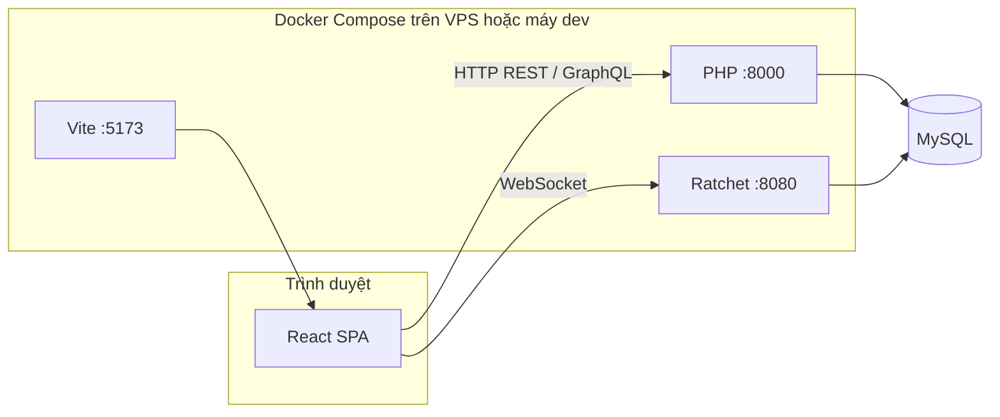

# MXH — Mạng xã hội (Social Network MVP)

## Giới thiệu tổng quan

**MXH** là một ứng dụng mạng xã hội dạng MVP, lấy cảm hứng từ các nền tảng như Facebook. Dự án gồm **frontend** (React + Vite), **backend** (PHP 8, REST + GraphQL), **MySQL** làm cơ sở dữ liệu, và **WebSocket** (Ratchet) phục vụ chat thời gian thực. Toàn bộ có thể chạy thống nhất bằng **Docker Compose**.

Người đọc README này có thể nắm được: mục tiêu sản phẩm, luồng xử lý chính, stack công nghệ (kèm phiên bản thư viện đã khóa hoặc ràng buộc), cấu trúc thư mục, và cách cài đặt — chạy — phát triển tiếp.

---

## Cập nhật gần đây

- **Shop — Dark mode cho tab đơn hàng, nút giỏ hàng, và thẻ đăng ký bán:** (1) Tab "Hoàn thành" (và các tab khác trong `.shop-orders-tabs button.is-on`) dùng `var(--slg-accent)` — trong dark mode override biến này là gần-trắng → chữ trắng trên nền trắng. Fix: thêm `body.theme-dark .shop-lg-scope .shop-orders-tabs button.is-on { background: #0a84ff; }`. (2) Nút "Quay lại Shop" trong giỏ hàng trống (`.shop-lg-go-shop-btn`) cùng vấn đề → override sang `#0a84ff` trong dark mode. (3) Thẻ đăng ký bán (`.shop-register-card`) dark mode từ `#1a1d24` → `hsl(0 0% 7%)` (= shop glass dark) để khớp tông. File: `frontend/src/styles.css`.

- **Admin — Cộng/trừ tiền tài khoản người dùng (Admin Balance Adjust):** Trang `/admin/transactions` thêm nút "Điều chỉnh số dư" mở modal chọn người dùng (autocomplete), chọn Cộng/Trừ, nhập số tiền và lý do. Backend `AdminController::adjustBalance()` validate + `UPDATE users SET balance = balance + ?` + ghi vào `transactions` với `provider='admin'`. Trừ vượt số dư → lỗi "Số dư không đủ". Thêm cột "Nguồn" (VNPay/MoMo/Admin) + tô màu số tiền (đỏ âm / xanh dương dương từ admin). File: `frontend/src/pages/admin/AdminTransactions.jsx`, `frontend/src/admin.css`, `backend/src/Controllers/AdminController.php`, `backend/public/index.php`.

- **WalletPage — Hiện dòng mô tả giao dịch:** Giao dịch từ admin hiện dòng ghi chú (mô tả admin đã nhập, màu xanh, icon loa). Giao dịch nạp tiền VNPay/MoMo hiện "Nạp tiền tài khoản iPock". Dùng hàm `getTxnNote(txn)` + badge nhà cung cấp có màu (xanh cho Admin). File: `frontend/src/pages/WalletPage.jsx`, `frontend/src/styles.css`.

- **UI/UX — Nhiều sửa nhỏ:** (1) Giỏ hàng shop: icon cart tròn (`.shop-lg-icon-btn` `border-radius:50%`). (2) Admin Users: text confirm xóa rút gọn + ẩn tài khoản soft-deleted (`email LIKE 'deleted_%'`). (3) ShopOrdersPage: nút quay lại giỏ hàng đổi thành icon SVG cart. (4) BannedPage flow: thông báo bị khóa hiện trực tiếp trên trang đăng nhập qua query param `?reason=banned` (không mất khi bấm "Quay lại"). (5) Giỏ hàng trống: thêm nút styled "Quay lại Shop để mua sắm" (`.shop-lg-go-shop-btn`). (6) Trang đăng nhập: chặn banner lỗi trùng khi `isBanned=true`. (7) CommentMediaViewer: ẩn panel khi comment không có text (không hiện "không có nội dung văn bản"). File: `frontend/src/styles.css`, `frontend/src/pages/admin/AdminUsers.jsx`, `frontend/src/pages/ShopOrdersPage.jsx`, `frontend/src/pages/ShopCartPage.jsx`, `frontend/src/pages/LoginPage.jsx`, `frontend/src/services/api.js`, `frontend/src/pages/BannedPage.jsx`, `frontend/src/components/CommentMediaViewer.jsx`, `backend/src/Controllers/AdminController.php`.

- **Games — Thêm dark mode cho thẻ trò chơi (`.game-card`):** Thẻ game (Tài Xỉu, Cờ Caro) trước đây hardcode `background:#fff` + chữ màu sáng nên ở dark mode bị chói/lệch tông. Thêm override `body.theme-dark`/`body[data-theme='dark']`: nền `#242526`, viền `rgba(255,255,255,0.08)`, bóng tối hơn, chữ tiêu đề `#e4e6eb` + phụ `#b0b3b8`. File: `frontend/src/styles.css`.

- **RightSidebar — Tinh chỉnh nền "Liquid Glass" kiểu Apple + sửa dark mode:** Nâng cấp `.right-sidebar` thành vật liệu kính lỏng chuẩn hơn: nền **2 lớp** (radial sheen sáng ở mép trên + linear tint translucent), `backdrop-filter: blur(30px) saturate(190%) brightness(1.06)`, bo góc 26px, viền sáng quang học (`inset` highlight + 1px luminous), đổ bóng nổi nhiều tầng. **Sửa lỗi dark mode**: trước đây có rule `body.theme-dark .right-sidebar { background: transparent }` xoá sạch lớp kính → nay thay bằng **nền kính lỏng tối** (radial sheen mờ + linear `rgba(44,46,51,…)`). Đồng thời đổi icon tìm kiếm/đóng trong sidebar từ SVG inline sang **Bootstrap Icons** (`bi bi-search`, `bi bi-x-lg`) cho đồng bộ toàn app (thêm `font-size` vào `.rsb-icon-btn`/`.rsb-search-icon`). File: `frontend/src/styles.css`, `frontend/src/components/RightSidebar.jsx`.

- **RightSidebar — Hiệu ứng glow loang theo chuột (mouse spotlight):** Thêm vệt sáng radial (xanh→tím) bám theo con trỏ khi rê chuột trong sidebar, hiện dần khi hover. Tách cấu trúc: `.right-sidebar` thành **frame kính KHÔNG scroll** (`overflow:hidden`, giữ bo góc + glass) chứa lớp `.rsb-glow` (overlay radial-gradient, `pointer-events:none`) + lớp `.rsb-scroll` (overflow-y:auto, chứa nội dung) → glow bám đúng panel, không bị cuộn theo. Toạ độ con trỏ ghi vào CSS var `--rsb-gx/--rsb-gy` qua `onMouseMove`. Có bản dark mode. File: `frontend/src/components/RightSidebar.jsx`, `frontend/src/styles.css`.

- **Settings — Bỏ hiệu ứng spotlight hover trên FeatureChip ví tiền:** Thêm prop `spotlight` (mặc định `true`) cho `MagicCard`; khi `spotlight={false}` thì **giữ nguyên cấu trúc DOM** (`class` + `.relative`) nhưng bỏ 2 lớp overlay gradient theo chuột + handler `onMouseMove/Leave` → không còn glow "làm sáng" khi rê chuột. Áp `spotlight={false}` cho 3 `FeatureChip` (Nạp tiền / Lịch sử / Bảo mật) trong tab Ví tiền; các `MagicCard` khác (Bạn bè empty, Login) giữ nguyên hiệu ứng. Hover nhấc nhẹ + đổ bóng của `.settings-feature-chip` (CSS) vẫn giữ. File: `frontend/src/components/ui/magic-card.jsx`, `frontend/src/pages/SettingsPage.jsx`.

- **Navbar — Widget thời tiết luôn hiển thị (fallback Hà Nội + placeholder):** Nguyên nhân thời tiết "biến mất": code cũ gọi `Promise.all([open-meteo.json(), nominatim.json()])` — dịch vụ **nominatim** giờ chặn và trả về chữ *"Access denied"* (không phải JSON) khiến `.json()` ném lỗi, kéo sập cả phần thời tiết dù nhiệt độ lấy được. Sửa: (1) `useWeather` tách riêng reverse-geocode (`try/catch` + `.catch(()=>null)`) nên nominatim lỗi không làm mất thời tiết; (2) thêm **vị trí mặc định Hà Nội** (21.0278, 105.8342) khi geolocation từ chối/hết giờ (8s)/không hỗ trợ, và thử lại fallback nếu open-meteo lỗi; (3) Navbar **luôn render ô `.nav-weather`** với placeholder "🌡️ Đang tải…" khi chưa có dữ liệu → góc trái không bao giờ trống. File: `frontend/src/hooks/useWeather.js`, `frontend/src/components/Navbar.jsx`.

- **Navbar — Widget thông tin đổi được (đồng hồ thế giới / tỷ giá / giá vàng):** Thêm `NavInfoWidget` ở **góc phải cùng của navbar** (`position:absolute; right:16px`, render trực tiếp trong `.apple-nav` — đối xứng với widget thời tiết ở góc trái `left:16px`, nằm trong phần lề trống ngoài khối `.apple-nav-inner` rộng 980px). Bấm vào widget mở popover để **đổi chế độ** và lưu lựa chọn trong `localStorage`:
  - **Đồng hồ thế giới**: chọn thành phố/múi giờ (Hà Nội, Tokyo, New York…), cập nhật mỗi giây bằng `Intl.DateTimeFormat` — hoàn toàn client-side.
  - **Tỷ giá tiền tệ**: cặp về VND (USD/EUR/JPY/GBP/CNY/KRW) lấy từ `open.er-api.com` (miễn phí, CORS `*`), tự làm mới mỗi 10 phút.
  - **Giá vàng**: XAU theo USD/ounce từ `api.gold-api.com` (miễn phí, CORS `*`), tự làm mới mỗi 5 phút.
  - Có chỉ báo **▲/▼** so với lần lấy dữ liệu trước (lưu giá trị cũ trong `localStorage`). Có bản dark mode.
  - Kiểu hiển thị: **bỏ khung** (không nền/viền/padding), bố cục 1 hàng ngang (icon + giá trị + nhãn), cỡ chữ/icon **bằng widget thời tiết** (13px / 16px) để hai góc cân đối.
  - File: `frontend/src/components/NavInfoWidget.jsx` (NEW), `frontend/src/components/Navbar.jsx`, `frontend/src/styles.css`. (Chỉ desktop — navbar không hiển thị ở mobile.)

- **UI — Trang Bạn bè: làm dịu màu accent tối:** Theo phản hồi "màu tối không hợp với nền", hệ accent đơn sắc đen-xám của `.friends-page--v2` được **làm dịu một bậc** — đổi `#0f172a` (gần đen) → `#475569` (slate-600) và màu phụ `#374151` → `#64748b`. Áp cho: `--fr-accent`, hộp icon hero, gradient tiêu đề hero, chip thống kê đang chọn, nút "Xem trang" mỗi thẻ, hộp icon empty-state; và phần `EmptyState` (MagicCard spotlight, `ShimmerButton`, `BorderBeam`) cùng tông slate. Vẫn giữ hướng "tối nhưng dịu hơn", không đụng tới accent đen-xám của `SettingsPage`. File: `frontend/src/styles.css`, `frontend/src/pages/FriendsPage.jsx`.

- **UI — Wallet header + RightSidebar liquid glass:** (1) `WalletPage`: nút **"Về Cài đặt"** chuyển lên **trên tiêu đề "Ví tiền"**, canh thẳng lề trái (bù 24px padding của `.settings-btn` bằng `margin-left:-24px`). (2) `RightSidebar`: thêm **khung kính mờ kiểu Apple "liquid glass"** — nền `var(--glass)` + `backdrop-filter: blur(22px) saturate(180%)`, bo góc 22px, viền sáng + đổ bóng nổi, float khỏi mép phải; có override viền/bóng cho dark mode. File: `frontend/src/pages/WalletPage.jsx`, `frontend/src/styles.css`.

- **Chat nổi — Hiện "đã offline bao lâu" (last seen):** Header cửa sổ chat nổi với người **ngoại tuyến** giờ hiện **"Hoạt động {timeAgo(last_seen)}"** (vd "Hoạt động 2 giờ trước") thay vì chỉ "Ngoại tuyến". Dùng `live.last_seen` (backend `ChatService` đã trả sẵn cho chat 1-1) + util `timeAgo` — đồng bộ y hệt header của `ChatWindow`. File: `frontend/src/components/FloatingChatWindow.jsx`.

- **Chat — Bấm ảnh tin nhắn mở lightbox (kiểu Facebook) + phóng to:** Ảnh trong tin nhắn (`.msg-media img`) bấm vào mở `ChatImageLightbox` — popup phủ tối toàn màn hình, ảnh ở giữa, đóng bằng **✕ / bấm nền / Esc**, khoá scroll body, render qua `createPortal` (z-index 100000) nên nổi trên cả chat nổi. **Phóng to/thu nhỏ**: nút +/− (1×–4×), lăn chuột, double-click bật/tắt zoom, và **kéo để di chuyển** ảnh khi đã phóng to. File: `frontend/src/components/chat/ChatImageLightbox.jsx` (NEW), `frontend/src/components/chat/MessageBubble.jsx`, `frontend/src/styles.css`.

- **Chat nổi — Sửa ảnh tin nhắn tràn ra ngoài:** Ảnh `.msg-media img` đặt `max-width: 320px` (cho chat thường) nên trong cửa sổ chat nổi rộng 320px (vùng nội dung hẹp hơn) bị tràn khung. Thêm override `.fcw-body .msg-media img` (+ video không phải `vp-video`) `max-width: 100%` để ảnh co vừa khung chat nổi. File: `frontend/src/styles.css`.

- **Trang chủ — Vòng story theo từng story + resume chỗ chưa xem:** Trước: bấm vào story là đánh dấu **cả người đó** đã xem ngay (vòng xám) dù mới xem 1 cái, và luôn mở lại từ đầu. Giờ theo dõi **từng story theo id** (localStorage `viewedStoryIds`): vòng ring chỉ chuyển **xám (đã xem)** khi **MỌI story** của người đó đã xem, chưa hết thì vẫn **xanh**; bấm vào mở từ **story chưa xem đầu tiên** (resume) và chạy theo thứ tự. Tận dụng callback `onStoryViewed` sẵn có của `StoryViewer` + prop mới `initialStoryIndex`. File: `frontend/src/pages/HomePage.jsx`, `frontend/src/components/stories/StoryViewer.jsx`.

- **Chat nổi — Nhóm: bấm header để xem thành viên:** Trong cửa sổ chat nổi, hội thoại **nhóm** (`type === 'group'`) trước có header là link hồ sơ → bấm vào ra URL hỏng kiểu `/<tên nhóm>` (404). Giờ header nhóm là nút mở **`GroupInfoDrawer`** (xem/quản lý thành viên — tái dùng đúng drawer của `ChatWindow`); rời/giải tán nhóm thì đóng luôn cửa sổ chat. Chat 1-1 vẫn link tới trang cá nhân như cũ. File: `frontend/src/components/FloatingChatWindow.jsx`, `frontend/src/styles.css`.

- **Trang cá nhân — Đồng bộ nút trong danh sách (followers/following/bạn bè):** Các nút trong modal danh sách trước dùng class riêng `.profile-list-btn` (xám, lệch tông). Đổi sang dùng đúng hệ nút chung `apple-btn`: **Nhắn tin** → `apple-btn-primary`, **Hủy kết bạn** → `apple-btn-danger` (đều `apple-btn-sm`), đồng bộ với nút **Xem** (`apple-btn-outline`). Xoá CSS `.profile-list-btn` không còn dùng. File: `frontend/src/components/ProfileInfo.jsx`, `frontend/src/styles.css`.

- **Trang cá nhân — Modal "Chỉnh sửa hồ sơ" (tên + tiểu sử + link):** Nút **"Chỉnh sửa hồ sơ"** trước chỉ cuộn xuống (không sửa gì), giờ mở modal `ProfileEditModal` (kiểu X) sửa **tên hiển thị + tiểu sử + link trang cá nhân** trong 1 popup, 1 nút Lưu. **Bỏ nút "Sửa" inline ở bio** và phần "Đổi/Tạo link" inline — gom hết vào modal. Email chỉ hiển thị, chưa cho sửa (là định danh đăng nhập). Modal có dark mode.
  - **Backend:** mutation `updateProfile` thêm arg `username` (sửa `users.username`); cột UNIQUE nên `ProfileService::updateProfile` check trùng (`findByUsername`, loại trừ chính mình) → lỗi *"Tên này đã có người dùng"*; `ProfileValidator` chặn tên rỗng / > 50 ký tự. File: `backend/src/GraphQL/Mutations/MutationType.php`, `backend/src/Validators/ProfileValidator.php`, `backend/src/Services/ProfileService.php`.
  - **Frontend:** `services/graphql.js` → `updateProfile(bio, username)` (validate link `[a-zA-Z0-9._]{3,30}`). File: `frontend/src/components/ProfileEditModal.jsx` (NEW), `frontend/src/components/ProfileInfo.jsx`, `frontend/src/styles.css`.

- **Dark mode — Sửa chữ/nền tàng hình:** Một số chỗ hardcode màu sáng/đen không có override cho nền tối. (1) Nút **"Tạo nhóm chat"** (`/chat` ConversationList): hover ra nền trắng `#f5f6f7` dưới chữ trắng → thêm `body.theme-dark .conv-create-row:hover` nền `#3a3b3c` (+ viền dưới tối). (2) **Trang cá nhân** (`ProfileInfo`): số thống kê `.profile-stat-number` (`#1d1d1f`/`#0f1419`) và tên `.profile-list-name` (`#1d1d1f`) đen → tàng hình; hover `.profile-list-item` ra nền trắng `#fafafa`. Thêm override dark: chữ `#f5f7fb` + hover phủ sáng mờ `rgba(255,255,255,0.06)`. (3) **Modal Tạo nhóm chat** (`.create-group-modal`) trước nền trắng hoàn toàn → thêm dark theme (nền `#242526`, input/list/chip/nút ghost tối, chữ sáng), **scope theo `.create-group-modal`** để không phá các modal khác chưa hỗ trợ dark. (4) **Nút đóng (×)** trong modal dark (Sửa nhóm `EditGroupInfoModal`, Chỉnh sửa hồ sơ): trước icon được đổi sáng nhưng nền nút vẫn `#f2f2f7` → icon sáng chìm vào nền sáng; thêm nền tối `#3a3b3c` (hover `#4e4f50`). File: `frontend/src/styles.css`.

- **Tài Xỉu — Đổi 4 icon menu rail sang SVG tuỳ chỉnh:** Vector hoá (potrace) 4 ảnh PNG do người dùng cung cấp thành SVG ở `frontend/public/icons/tx-rail-*.svg`, gán theo thứ tự trên→dưới: `guide`=person, `bets`=refresh, `rounds`=network, `jackpot`=jackpot. Render bằng **CSS mask** + `background-color: currentColor` (ở `.tx-menu-rail-icon`) để icon ăn theo màu rail (kem khi thường → trắng khi active), kích thước vuông đồng đều. File: `frontend/src/components/TaiXiuFloatingWidget.jsx` (MENU_TABS + render rail), `frontend/src/styles.css`, `frontend/public/icons/`.

- **Tài Xỉu — Đổi icon người chơi sang Bootstrap Icons:** Thay emoji `👤` ở `.tx-players` (cả 2 bên TÀI/XỈU) bằng `<i className="bi bi-person-fill">` — icon kế thừa màu vàng + cỡ chữ của widget, hợp tông casino hơn emoji. File: `frontend/src/components/TaiXiuFloatingWidget.jsx`.

- **Tài Xỉu — Bỏ viền (border) nút CƯỢC:** Xoá `border` 4 màu kiểu bevel (`#ff5533 #660000 #440000 #ff5533`) ở `.tx-cuoc-btn` → `border: none`. Viền này sáng cạnh trên/trái, tối cạnh dưới/phải nên trông "chỗ dày chỗ mỏng" không đều — đó là phần người dùng muốn bỏ (không phải nét chữ). Giữ gradient nền + box-shadow. Bỏ `text-shadow` của chữ cho chữ **phẳng** (trước đó bóng đổ làm chữ trông như nổi/"nảy"), và giảm `font-weight: 900 → 700` để **nét chữ đều hơn** (weight 900 + cỡ nhỏ ~15px làm nét chỗ ốm chỗ bự). File: `frontend/src/styles.css`.

- **Tài Xỉu — Đồng bộ toàn bộ font widget sang font tiếng Việt:** Đổi tất cả `font-family` của text trong widget Tài Xỉu sang `var(--app-font)` (Be Vietnam Pro): `.tx-casino-body` (root), `.tx-mini-bar`, `.tx-jackpot-label` (trước dùng `Impact` — không có dấu VN), `.tx-total-num` (trước có fallback `Archivo Black/Impact`). Giữ `monospace` cho 3 chỗ là mã số/hash (không phải chữ tiếng Việt): `.tx-round-code`, số dư `.tx-wallet-label strong`, và `.tx-md5-value` (chuỗi MD5 provably-fair cần monospace). File: `frontend/src/styles.css`.

- **Tài Xỉu — Bỏ nút phân trang ở tab Hướng dẫn:** Xoá `<MenuPager>` ("◀ 1/4 ▶") khỏi tab Hướng dẫn của widget Tài Xỉu — pager này chỉ điều hướng giữa 4 tab (trùng với rail bên trái), nội dung hướng dẫn vốn hiển thị đủ trên 1 trang. Các tab bets/rounds/jackpot vẫn giữ pager (phân trang nội dung thật). File: `frontend/src/components/TaiXiuFloatingWidget.jsx`.

- **Tài Xỉu — Tiêu đề bên (TÀI/XỈU) dùng font tiếng Việt + không cắt dấu:** `.tx-title-tai`/`.tx-title-xiu` đổi `font-family` sang `var(--app-font)` (Be Vietnam Pro, đã nạp weight 900) thay cho stack `Archivo Black/Oswald/Impact` — các font này không có dấu tiếng Việt nên khi fallback làm vỡ dấu (Ỉ, À). Đồng thời tăng `line-height: 1.3` + `padding-top: 8px` để dấu chữ hoa (Ỉ, À) không bị cắt phần trên — do `background-clip:text` cần đủ vùng vẽ gradient phía trên glyph (trước đây `line-height:1` + `padding-top:2px` quá sát). File: `frontend/src/styles.css`.

- **Trò chơi — Bỏ thẻ "Slot (Sắp ra mắt)":** Xoá game card placeholder Slot khỏi `/games` (chỉ còn Tài Xỉu + Cờ Caro), dọn luôn CSS orphan `.game-card--soon` / `.game-card-play--soon`.
  - File: `frontend/src/pages/GamesPage.jsx`, `frontend/src/styles.css`.

- **Chat — Tinh chỉnh cửa sổ chat nổi:** Ẩn nút **"Gọi video"** (placeholder chưa dùng) khỏi header chat nổi. Sửa hộp chat nổi (320px) **bị cuộn ngang trái–phải**: (1) link preview (`.lp-card`) thêm `max-width:100%` + `overflow-wrap:anywhere` cho tiêu đề/mô tả/domain để chữ tự xuống dòng; (2) chặn cuộn ngang ở khung tin nhắn `.fcw-body .chat-messages` bằng `overflow-x:hidden` (chat chỉ cuộn dọc — tránh các phần tử tràn vài px như nút "..." hover ở `-34px` hay %-width sát mép).
  - File: `frontend/src/components/FloatingChatWindow.jsx`, `frontend/src/styles.css`.

- **Shop — Tra cứu lộ trình đơn hàng qua GHN (Giao Hàng Nhanh):**
  - Người mua (`/shop/orders`) và người bán (`/shop/sales`) có nút **"📍 Xem lộ trình"** trên đơn đang giao/đã giao/hoàn thành (có đơn vị VC). Mở modal timeline hiển thị các mốc vận chuyển realtime, mốc mới nhất trên cùng.
  - Backend gọi **GHN API thật**: `POST {GHN_API_BASE}/v2/shipping-order/detail` (header `Token` + `ShopId`, body `{order_code}`), parse `data.log[]` thành các bước, map mã trạng thái GHN → nhãn tiếng Việt. Query `orderTracking(orderId)` chỉ cho buyer/seller/admin của đơn; lỗi (chưa cấu hình / token sai / không tìm thấy) trả message tiếng Việt sạch.
  - Đơn vị vận chuyển khi giao đơn giờ là **dropdown: Giao Hàng Nhanh (GHN) | J&T Express** (mặc định GHN — hỗ trợ tra cứu realtime). J&T sẽ bổ sung tra cứu sau khi có credentials merchant.
  - **Cấu hình:** đặt `GHN_TOKEN` + `GHN_SHOP_ID` trong `.env` (lấy ở dashboard GHN). Chưa cấu hình thì nút tra cứu báo "Chưa cấu hình GHN API". Endpoint mặc định là production; dev dùng `https://dev-online-gateway.ghn.vn/shiip/public-api`.
  - File: `backend/src/Services/GhnTrackingService.php` (NEW), `backend/src/GraphQL/Types/TrackingStepType.php` (NEW), `backend/src/GraphQL/TypeRegistry.php`, `backend/src/GraphQL/Queries/QueryType.php` (+`orderTracking`), `frontend/src/components/OrderTrackingModal.jsx` (NEW), `frontend/src/services/shop.js` (+`getOrderTracking`), `frontend/src/pages/ShopSalesPage.jsx`, `frontend/src/pages/ShopOrdersPage.jsx`, `docker-compose.yml` + `.env` (env GHN).

- **Shop — Đơn vị vận chuyển J&T Express + bắt buộc mã vận đơn (sản phẩm vật lý):**
  - Thêm cột `shop_orders.shipping_carrier` (migration `030_add_shipping_carrier.sql`). Khi seller giao đơn vật lý: modal hiển thị **Đơn vị vận chuyển: J&T Express** (cố định) và **bắt buộc nhập mã vận đơn** (trước đây để trống được). Mã vận đơn + đơn vị VC hiển thị trên thẻ đơn cả seller (`/shop/sales`) lẫn buyer (`/shop/orders`).
  - Sản phẩm số (MMO/khoá học) auto-deliver khi xác nhận → không qua bước giao → không có ô mã vận đơn (vốn đã đúng).
  - Backend: `ShopOrderService::shipOrder` (+param `$shippingCarrier`, validate tracking bắt buộc, default 'J&T Express'), `ShopOrderRepository::update` (+whitelist `shipping_carrier` — thiếu thì bị nuốt âm thầm), `MutationType::shipShopOrder` (+arg, bọc `clientSafe`), `ShopOrderType` (+field `shippingCarrier`). Frontend: `shop.js` (ship gửi carrier + field selection), `ShopSalesPage.jsx`, `ShopOrdersPage.jsx`.
  - **Đang chờ:** kiểm tra mã vận đơn hợp lệ + hiển thị lộ trình realtime từ **J&T OpenAPI thật** — cần credentials merchant J&T (customer code + private key) đặt trong `.env`. Chưa cấu hình thì chưa lấy được dữ liệu thật.
  - File: `backend/database/migrations/030_add_shipping_carrier.sql`, `backend/src/Services/ShopOrderService.php`, `backend/src/Repositories/ShopOrderRepository.php`, `backend/src/GraphQL/Mutations/MutationType.php`, `backend/src/GraphQL/Types/ShopOrderType.php`, `frontend/src/services/shop.js`, `frontend/src/pages/ShopSalesPage.jsx`, `frontend/src/pages/ShopOrdersPage.jsx`

- **Shop — Sửa ảnh vỡ ở Dashboard + khoá sửa review quá 7 ngày + ẩn lỗi hệ thống:**
  - **Ảnh vỡ:** `ShopDashboardPage.jsx` render ảnh sản phẩm/phân loại bằng đường dẫn tương đối (`/uploads/...`) → trình duyệt xin ở origin frontend (5173) và nhận index.html. Đã thêm helper `mediaUrl()` (prefix `API_ORIGIN`, bỏ qua `blob:`/`data:` của preview lúc upload) cho thumbnail list + preview ảnh chính + preview ảnh phân loại. Các trang shop khác vốn đã đúng.
  - **Khoá review quá 7 ngày:** `ShopOrdersPage.jsx` ReviewModal khi sửa review đã quá 7 ngày (theo `createdAt`) sẽ khoá toàn bộ input (sao, nội dung, ảnh, nút gửi) + hiện thông báo, thay vì cho nhập rồi mới báo lỗi lúc submit.
  - **Ẩn lỗi hệ thống:** review resolvers để `Exception` thường bubble → graphql-php bọc thành `"Internal server error"` + nhét message vào `debugMessage`, frontend ghép lại hiện *"Internal server error: ..."* cho user. Thêm helper `MutationType::clientSafe()` biến Exception code 4xx → `GraphQL\Error\Error` (ClientAware) để message hiện sạch; lỗi hệ thống thật (5xx/PDO) vẫn ẩn. Verify: `updateShopReview(id không tồn tại)` → "Review not found".
  - **Bỏ tab "Đang chuẩn bị"** (status `confirmed`) khỏi `STATUS_TABS` trang Đơn mua cho gọn — đơn `confirmed` vẫn xem được ở tab "Tất cả" và vẫn hiện badge "Đang chuẩn bị" (giữ `STATUS_LABEL`).
  - File sửa: `frontend/src/pages/ShopDashboardPage.jsx`, `frontend/src/pages/ShopOrdersPage.jsx`, `backend/src/GraphQL/Mutations/MutationType.php`

- **Trang đăng nhập — Gấu hoạt hình:** Thêm khuôn mặt gấu SVG ngay trên thẻ đăng nhập: con ngươi **dõi theo con trỏ chuột**, và khi focus ô mật khẩu thì **hai tay đưa lên che mắt** (state `passwordFocused`). Hiện/ẩn mật khẩu dùng **nút mặc định của trình duyệt** (Edge `::-ms-reveal`) — không thêm nút riêng. Bỏ hiệu ứng sao rơi (`Meteors`) trên thẻ login. Tôn trọng `prefers-reduced-motion`. Thuần frontend.
  - File: component mới [AnimatedLoginFace.jsx](mxh/frontend/src/components/AnimatedLoginFace.jsx), tích hợp trong [LoginPage.jsx](mxh/frontend/src/pages/LoginPage.jsx), CSS `.auth-face*` trong [styles.css](mxh/frontend/src/styles.css). Cũng đã bỏ dòng footnote "Tạo Trang…" + căn lại khoảng cách trên (`.auth-shell` flex-start, đẩy cột chữ thẳng khung đăng nhập).

- **Trang đăng nhập — Video intro logo iPock (splash):** Mở `/login` lần đầu trong phiên sẽ phát video intro logo iPock toàn màn hình, chạy xong tự mờ dần để lộ form đăng nhập. Tắt tiếng (autoplay muted + `playsInline` cho iOS), có nút **Bỏ qua** và phím **ESC**, hiện **1 lần/phiên** (`sessionStorage`), và tôn trọng `prefers-reduced-motion` (bỏ qua hẳn). Thuần frontend — không backend/migration.
  - File liên quan: video [mxh/frontend/public/ipock-intro.mp4](mxh/frontend/public/ipock-intro.mp4), component mới [AuthIntroSplash.jsx](mxh/frontend/src/components/AuthIntroSplash.jsx), tích hợp trong [LoginPage.jsx](mxh/frontend/src/pages/LoginPage.jsx), CSS trong [styles.css](mxh/frontend/src/styles.css) (`.auth-intro-splash`).

- **Shop — Phân loại sản phẩm (variant) kiểu Shopee (full-stack):** Một sản phẩm có thể có nhiều "phân loại" (vd: PB100S Đen, PB200N Cam…), mỗi phân loại có **giá / tồn kho / ảnh riêng**. Tùy chọn — sản phẩm không có phân loại vẫn chạy như cũ.
  - **DB:** migration `029_create_shop_product_variants.sql` — bảng `shop_product_variants` (product_id, name, price, stock_quantity, image, display_order) + cột `variant_id`/`variant_name` cho `shop_orders` (snapshot). Khi SP có phân loại: `shop_products.price` = giá thấp nhất, `stock_quantity` = tổng tồn (service tự đồng bộ).
  - **Backend:** `ShopProductVariantRepository`; `ShopProductService` nhận `variants` khi tạo/sửa, validate (≤20, tên+giá>0), đính kèm variants khi đọc; `ShopOrderService::createOrder` nhận `variantId` → dùng giá variant làm `unit_price` (server-side, không tin client), trừ tồn variant + tồn tổng, snapshot tên phân loại; `cancelOrder` hoàn tồn variant. GraphQL: `ShopProductVariantType` + input `ShopProductVariantInput` (đăng ký TypeRegistry), field `variants` trên `ShopProduct`, `variantId/variantName` trên `ShopOrder`, arg `variants` cho create/updateShopProduct, arg `variantId` cho createShopOrder.
  - **Frontend:** Trang chi tiết ([ShopProductDetailPage.jsx](mxh/frontend/src/pages/ShopProductDetailPage.jsx)) — lưới chọn "Phân loại" (mờ/khóa khi hết hàng), giá hiện dạng "từ X – Y" khi chưa chọn, đổi ảnh chính + tồn theo phân loại, khóa thêm giỏ/mua đến khi chọn. Form người bán ([ShopDashboardPage.jsx](mxh/frontend/src/pages/ShopDashboardPage.jsx)) — toggle "Sản phẩm có nhiều phân loại" + editor lặp lại (ảnh/tên/giá/tồn/xóa). Giỏ hàng ([useShopCart.js](mxh/frontend/src/hooks/useShopCart.js)/[ShopCartPage.jsx](mxh/frontend/src/pages/ShopCartPage.jsx)) — key dòng theo `productId:variantId` (mỗi phân loại 1 dòng), hiển thị "Phân loại: …", checkout truyền `variantId`.
  - **Verify:** test HTTP end-to-end — tạo variant → giá/tồn tự suy ra (min/sum); đặt đơn variant dùng đúng giá + trừ tồn variant & tồn tổng + ghi variant vào đơn; huỷ đơn hoàn tồn; chặn đặt khi chưa chọn phân loại. Đã dọn sạch dữ liệu test.
  - Lưu ý: backend chạy từ image → cần **Rebuild (bước 2)** để bake file PHP mới + migration 029 vào image (migration tự chạy qua `do_migrate`); bản đang chạy đã `docker compose cp` để test.

- **Shop — Người bán sửa được sản phẩm + nâng cấp thao tác Đơn bán:**
  - **Sửa sản phẩm (dashboard):** Mỗi dòng sản phẩm trong Quản lý cửa hàng giờ có nút **"Sửa"** (trước chỉ có "Xóa"). `CreateProductModal` gộp thành `ProductModal` dùng chung tạo + sửa: tiền điền dữ liệu, giữ ảnh cũ nếu không chọn ảnh mới, không cho đổi loại sản phẩm sau khi đăng.
  - **Fix bug ẩn `updateShopProduct`:** resolver trước đây truyền `$args` camelCase thẳng vào repo (chỉ nhận snake_case) → sửa **danh mục/tồn kho/file số bị bỏ qua âm thầm**. Đã map camelCase→snake_case như `createShopProduct` ([MutationType.php](mxh/backend/src/GraphQL/Mutations/MutationType.php)).
  - **Nới luật sửa:** `ShopProductService::updateProduct` bỏ chặn "không sửa sản phẩm đã duyệt" (SP tạo ra là `approved` luôn → trước đây không sửa được gì); giữ nguyên status, chỉ chặn SP đã lưu trữ. Verify HTTP `/graphql`: update SP `approved` id=2 đổi category 1→3 + tồn 14→20 thành công rồi revert.
  - **Đơn bán (/shop/sales):** thay `window.prompt`/`window.confirm` thô bằng `OrderActionModal` gọn (xác nhận / nhập mã vận đơn khi giao / nhập lý do huỷ).
  - File sửa: `frontend/src/pages/ShopDashboardPage.jsx`, `frontend/src/pages/ShopSalesPage.jsx`, `frontend/src/services/shop.js`, `frontend/src/styles.css` (`.shop-form-hint`), `backend/src/GraphQL/Mutations/MutationType.php`, `backend/src/Services/ShopProductService.php`
  - Lưu ý: 2 file backend đã `docker compose cp` vào container đang chạy; lần build image kế tiếp tự bao gồm (không cần thao tác thêm).

- **Shop — Ảnh đánh giá: bấm vào mở popup (lightbox) thay vì mở tab mới:** Trước đây ảnh trong đánh giá sản phẩm bọc trong `<a target="_blank">` nên click sẽ rời trang sang tab ảnh. Đổi thành nút mở `ImageLightbox` — overlay phủ toàn màn (render qua React `createPortal` tới `document.body` để tránh lỗi `position:fixed` khi tổ tiên có `transform/filter`), đóng bằng nền/nút ×/phím Esc, chuyển ảnh bằng ‹ › hoặc phím mũi tên khi đánh giá có nhiều ảnh, khoá scroll nền khi mở.
  - File sửa: `frontend/src/pages/ShopProductDetailPage.jsx` (component `ImageLightbox` + `ReviewItem`), `frontend/src/styles.css` (`.shop-lightbox*`, `.shop-review-img-btn`)
  - Frontend bind-mount → Vite HMR tự áp dụng, không cần rebuild.

- **AI Chat — Sửa lỗi "Không thể kết nối tới AI" + chỉnh prompt trả lời tự nhiên:**
  - **Lỗi 503:** `AIController::chat()` hardcode model `gemini-flash-latest`, alias này đang trả **HTTP 503 (UNAVAILABLE - quá tải)** nên mọi tin nhắn đều fail. Đã đổi sang model ổn định + fallback: thử lần lượt `gemini-2.5-flash` → `gemini-2.5-flash-lite` (cả 2 verify trả 200), gặp lỗi thì `error_log` (không nuốt lỗi) rồi thử model kế tiếp.
  - **Prompt:** Bỏ câu chào mặc định kèm liệt kê khả năng ("...hỗ trợ viết caption, gợi ý bài đăng, trả lời câu hỏi thường ngày"). `systemInstruction` mới cho AI trả lời tự nhiên như một chatbot AI thông thường (trả lời mọi chủ đề, kiến thức chung), chỉ nói ngắn gọn "là trợ lý AI của iPock" khi được hỏi trực tiếp. Verify: "hi" → "Chào bạn!", "thủ đô Nhật Bản?" → "Tokyo".
  - File sửa: `backend/src/Controllers/AIController.php`
  - Lưu ý: backend chạy từ image → cần **Rebuild (bước 2)** để áp dụng.

- **restore_uploads — Tự link lại ảnh/video bài đăng vào DB (fix "khởi động nhanh thiếu data"):** Trước đây `restore_uploads.php` chỉ link avatar + cover, còn ảnh post (`uploads/posts/`) và video (`uploads/videos/`) chỉ được đếm chứ không gắn vào `posts.media_url` → sau reset DB / quét lại, post mất ảnh dù file còn trên đĩa. Nguyên nhân gốc: tên file là `post_{userId}_{ts}_...` (chỉ có user_id, không có post_id) nên không map tuyệt đối được. Cách xử lý thận trọng: với mỗi post đang `media_url` NULL, tìm file cùng `user_id` có timestamp gần nhất trong cửa sổ `[created_at - 30 phút, created_at + 2 phút]`, mỗi file dùng 1 lần, tự lấy `media_width/height` qua `getimagesize`. Idempotent (chỉ điền NULL), không đè media sẵn có, không gắn nhầm cho post text/seed. Bước 1/2/3 của `start.cmd` đều gọi qua `do_restore_uploads`.
  - File sửa: `backend/database/restore_uploads.php`
  - Lưu ý: backend chạy từ image (không bind-mount code) → phải **Rebuild (bước 2)** để bake script vào image; quick-start chỉ dùng image hiện có.

- **Shop — Sửa 3 bug chặn luồng checkout/đăng SP:**
  1. `createShopProduct` mutation truyền `$args` camelCase thẳng vào `ShopProductService::createProduct()` nhưng service đọc snake_case → đăng SP luôn fail "category_id null". Đã map camelCase→snake_case trong resolver ([MutationType.php:382-397](mxh/backend/src/GraphQL/Mutations/MutationType.php#L382-L397)).
  2. `UserRepository::updateBalance($userId, $delta)` bị gọi trong `ShopOrderService` nhưng method không tồn tại → checkout/refund/release escrow đều crash. Đã thêm method ([UserRepository.php:188-192](mxh/backend/src/Repositories/UserRepository.php#L188-L192)) — chấp nhận `$delta` âm/dương, dùng cho cả trừ tiền buyer + cộng cho seller + refund.
  3. `createShopOrder` mutation `json_decode($args['shippingAddress'])` cho chuỗi địa chỉ thường → null → service throw "Shipping address is required". Đã sửa: nếu user nhập plain text thì wrap thành `{"text": "..."}` để lưu cột JSON ([MutationType.php createShopOrder resolver](mxh/backend/src/GraphQL/Mutations/MutationType.php)).

- **Shop — Đánh giá sản phẩm (Reviews) + Trang đơn mua/đơn bán + Trang shop của người bán (gói "Core" hoàn thiện shop):**
  - **Reviews:** Buyer chỉ đánh giá được sau khi đơn đã `completed`. 1 đơn = 1 review (UNIQUE `order_id`), rating 1–5 sao + nội dung (≤2000 ký tự) + tối đa 5 ảnh. Cho phép sửa trong 7 ngày. Seller có thể trả lời 1 lần. Hiển thị trên trang chi tiết sản phẩm: tổng quan (avg + bar 5/4/3/2/1 sao + lọc theo sao) + danh sách review kèm ảnh + reply của shop. Field `ratingAvg` + `reviewCount` được tính server-side, lộ ra trên `ShopProduct` và thẻ sản phẩm.
  - **Trang Đơn mua (`/shop/orders`):** Buyer xem lịch sử đơn theo tab trạng thái (Chờ xác nhận / Đang chuẩn bị / Đang giao / Đã giao / Hoàn thành / Đã huỷ), nút "Đã nhận hàng" (gọi `confirmDelivery`), "Huỷ đơn" (gọi `cancelShopOrder`), "Đánh giá" (mở modal review với star picker + upload ảnh).
  - **Trang Đơn bán (`/shop/sales`):** Seller xem đơn nhận được theo tab, nút "Xác nhận đơn" (gọi `confirmShopOrder`), "Đánh dấu đã giao" (gọi `shipShopOrder` kèm tracking number).
  - **Trang Shop người bán (`/shop/seller/:sellerId`):** Hero cover + avatar + thống kê (số SP, đã bán, rating trung bình) + nút "Nhắn shop" (đi tới `/chat?userId=...`) + grid SP với sort (Phổ biến / Đánh giá cao / Bán chạy / Giá ↑↓).
  - **Migration:** `backend/database/migrations/028_create_shop_reviews.sql` (bảng `shop_reviews`).
  - **Backend:** `Repositories/ShopReviewRepository.php` (NEW), `Services/ShopReviewService.php` (NEW), `GraphQL/Types/ShopReviewType.php` (NEW), `GraphQL/Types/ShopReviewStatsType.php` (NEW), `GraphQL/TypeRegistry.php` (+register 2 types), `GraphQL/Queries/QueryType.php` (+`productReviews`, `productReviewStats`, `sellerReviews`, `sellerReviewStats`, `myReviewForOrder`), `GraphQL/Mutations/MutationType.php` (+`createShopReview`, `updateShopReview`, `replyShopReview`, `deleteShopReview`), `GraphQL/Types/ShopProductType.php` (+computed `ratingAvg` + `reviewCount`).
  - **Frontend:** `pages/ShopOrdersPage.jsx` (NEW), `pages/ShopSalesPage.jsx` (NEW), `pages/ShopSellerPage.jsx` (NEW), `pages/ShopProductDetailPage.jsx` (rating thật, tab "Đánh giá", link "Nhắn shop" + "Xem Shop" sang `/shop/seller/:id`), `pages/ShopPage.jsx` (sidebar thêm link "Đơn mua của tôi" + "Đơn bán của tôi"), `pages/ShopDashboardPage.jsx` (header thêm nút "Đơn bán"), `services/shop.js` (+10 hàm: reviews, stats, mySales, confirmShopOrder, shipShopOrder, getSellerInfo, getSellerReviewStats), `App.jsx` (+3 routes), `styles.css` (+block CSS cho reviews, orders list, seller hero, review modal).

- **Sửa lỗi start.cmd:** Sửa nhiều bug khiến script không hoạt động ổn định trên Windows: (1) thiếu `if errorlevel 1 goto fail` sau `call :wait_mysql/:do_migrate` → migrate fail vẫn in "Frontend ready"; (2) `auto_seed_if_empty` so sánh `"%user_count%"=="0"` bị fail do CR trailing → luôn skip seed dù DB rỗng (đã chuyển sang `findstr /R "^0$"`); (3) echo `(khong critical).` trong block `if (...)` gây lỗi `. was unexpected at this time` (đã bỏ paren); (4) `show_logs` Ctrl+C làm thoát script (đã mở log realtime trong cửa sổ mới qua `start cmd /k`); (5) `do_migrate` fail không in log backend (đã thêm `docker compose logs --tail 30 backend`); (6) thêm prompt khi Docker Desktop chưa chạy.
  - **File sửa:** `start.cmd`

- **Self-host Bootstrap Icons:** Bỏ thẻ `<link>` CDN jsdelivr trong `frontend/index.html`, cài `bootstrap-icons@1.11.3` qua npm và import trong `main.jsx`. Lý do: trình duyệt (Edge/Brave) chặn cache CDN cross-origin theo Tracking Prevention → spam cảnh báo trong DevTools; bản local còn hoạt động offline và lock version.
  - **Frontend:** `frontend/package.json` (+`bootstrap-icons`), `frontend/src/main.jsx` (+import CSS), `frontend/index.html` (xóa thẻ `<link>` CDN)

- **Cờ Caro — Đấu lại (Rematch) sau khi trận kết thúc:** Sau khi trận `finished`/`abandoned`, mỗi người chơi trong phòng cũ có nút **"Đấu lại"**. Người bấm đầu tiên sẽ tạo phòng mới `private` (cùng `board_size`/`win_length`) và gửi lời mời cho đối thủ; cột mới `caro_rooms.rematch_room_id` (FK tự tham chiếu, `ON DELETE SET NULL`) giữ liên kết giữa phòng cũ ↔ phòng mới để cả 2 client poll thấy. Đối thủ nhận banner `caro-rematch-invite` → bấm **Chấp nhận** → gọi `caroJoinByCode(rematch_room_code)` → navigate sang `/games/caro/<rematch_room_id>`. Nếu đối thủ **Từ chối** (`caroDeclineRematch`) → phòng mới `abandoned` và frontend tự `caroRandomMatch` để creator không bị kẹt.
  - **Migration:** `backend/database/migrations/027_caro_rematch.sql` (ALTER `caro_rooms` thêm `rematch_room_id INT NULL` + FK self-reference `fk_caro_rematch`).
  - **Backend:** `Services/CaroService.php` (+`requestRematch`, `declineRematch`; `buildRoomPayload` thêm 3 field `rematch_room_id` / `rematch_room_code` / `rematch_initiated_by_id`), `Repositories/CaroRepository.php` (+`setRematchRoomId`), `GraphQL/Types/CaroRoomType.php` (+3 field GraphQL), `GraphQL/Mutations/MutationType.php` (+`caroRequestRematch`, `caroDeclineRematch`).
  - **Frontend:** `services/graphql.js` (+`caroRequestRematch`, `caroDeclineRematch`; `CARO_ROOM_FIELDS` thêm 3 field rematch), `pages/CaroPage.jsx` (+state `rematching`/`declinedRematch`, `handleRematch`/`handleAcceptRematch`, banner mời đấu lại + nút disabled khi đang gọi mutation), `styles.css` (+block `.caro-rematch-invite`).

- **Profile — Thiết bị đăng nhập của chủ tài khoản:** Panel "Giới thiệu về tài khoản này" nay hiển thị thiết bị mà **chủ tài khoản** dùng để đăng nhập lần cuối (`mobile` / `web`), thay vì detect thiết bị của người đang xem. Lưu vào cột `last_login_device` trên bảng `users` mỗi khi đăng nhập (cả email và Google).
  - **Migration:** `backend/database/migrations/026_add_last_login_device.sql`
  - **Backend:** `UserRepository.php` (+`updateLoginDevice()`), `AuthService.php` (gọi `detectDevice()` khi login/googleLogin), `ProfileService.php` (+field `last_login_device`), `ProfileType.php` (+field GraphQL)
  - **Frontend:** `graphql.js` (thêm `last_login_device` vào cả 2 profile queries), `ProfileInfo.jsx` (dùng `profile.last_login_device` thay `navigator.userAgent`)

- **Profile — Tích xanh trong FCW/RSB + nút bạn bè Facebook-style + panel "Giới thiệu về tài khoản":**
  - Tích xanh hiển thị trong thanh tiêu đề Floating Chat Window và danh sách liên hệ Right Sidebar.
  - Nhấn tên/avatar trong FCW header → điều hướng đến trang cá nhân của người dùng đó.
  - Nhấn avatar trong bong bóng tin nhắn → điều hướng đến trang cá nhân người gửi.
  - Nút bạn bè trên profile redesign theo Facebook: dropdown "Bạn bè / Đã gửi lời mời" với menu hủy/hủy kết bạn, không dùng `window.confirm`.
  - Nhấn vào dòng ngày tham gia → mở panel "Giới thiệu về tài khoản này" (kiểu Twitter/X) gồm avatar, username, ngày tham gia, ngày xác thực (nếu có), nền tảng kết nối (web/mobile).
  - **Backend:** `ConversationRepository.php` (thêm `is_verified` vào `getOtherParticipant()`), `ChatService.php` (thêm `other_is_verified` vào `enrichConversation()`).
  - **Frontend:** `FloatingChatWindow.jsx` (+`Link` header, `VerifiedBadge`), `chat/MessageBubble.jsx` (avatar → `Link`), `RightSidebar.jsx` (+`VerifiedBadge`, `is_verified` từ `getMyFriends`), `graphql.js` (thêm `is_verified` vào `getMyFriends` query), `ProfileInfo.jsx` (Facebook friend buttons `.pfb-*`, about panel `createPortal`), `styles.css` (+`.pfb-*`, `.about-panel-*`, `.fcw-header-profile-link`).

- **Tích xanh xác thực (Verified Badge) — v2:** Bổ sung chọn gói **1 tháng (500k) / 1 năm (5M, tiết kiệm 1M)** trong modal mua; thêm nút **Hủy tích xanh** (không hoàn tiền) với dialog xác nhận. Cập nhật huy hiệu cũng hiển thị trong kết quả tìm kiếm; `@handle` trên trang cá nhân nhấn để **sao chép**; xóa link `@handle` trùng lặp trên `.profile-x-meta`.
  - **Backend:** `ProfileService.php` (+`cancelVerified`, `VERIFIED_PRICE_YEARLY`), `UserRepository.php` (+`cancelVerified`), `MutationType.php` (+mutation `cancelVerified`, `purchaseVerified` nhận arg `duration`)
  - **Frontend:** `VerifiedPurchaseModal.jsx` (viết lại — plan picker + cancel flow), `graphql.js` (+`cancelVerified()`), `styles.css` (+`.verified-modal-plan-picker`, `.verified-plan-card`, `--danger`/`--ghost` button variants)

- **Tích xanh xác thực (Verified Badge) — v1:** Huy hiệu xác thực kiểu Facebook hiện ngay tên người dùng trên bài đăng và trang cá nhân. Badge màu xám nếu chưa mua, màu xanh nếu đã xác thực. Nhấn vào badge (với tài khoản của mình) → mở modal mua từ số dư ví. Hết hạn tự động reset về xám.
  - **Migration:** `backend/database/migrations/025_add_verified_status.sql` (thêm `is_verified`, `verified_until` vào bảng `users`)
  - **Backend:** `UserRepository.php`, `ProfileService.php`, `PostRepository.php`, `PostType.php`, `ProfileType.php`, `UserType.php`, `SearchUserType.php`, `MutationType.php`
  - **Frontend:** `components/VerifiedBadge.jsx` (NEW), `components/VerifiedPurchaseModal.jsx` (NEW), `PostCard.jsx`, `ProfileInfo.jsx`, `SearchPage.jsx`, `graphql.js`, `styles.css`

- **Ban tài khoản — phía server + frontend:** Admin block user (`is_blocked = 1`) → đăng nhập bị chặn với thông báo "Tài khoản đã bị khóa"; token còn hiệu lực nhưng mọi REST call trả 403 `account_banned` → redirect tự động sang `/banned`. Trong GraphQL, `optionalAuth()` trả `null` cho blocked user nên họ bị coi là ẩn danh (không thể dùng mutation cần auth).
  - **Backend:** `AuthMiddleware.php` (`requireAuth` check `is_blocked` → 403; `optionalAuth` trả `null` cho blocked), `AuthService.php` (đăng nhập check `is_blocked`)
  - **Frontend:** `pages/BannedPage.jsx` (NEW), `App.jsx` (+route `/banned`), `services/api.js` (+`handleBanned()` bắt 403 `account_banned`), `pages/LoginPage.jsx` (`mapAuthError()` dịch error sang tiếng Việt)

- **Chat — cải tiến UX:** Nút "tạo nhóm" cũ thay bằng menu dropdown (3 chấm) gồm "Nhắn tin mới" + "Tạo nhóm chat". "Nhắn tin mới" mở modal danh sách bạn bè để chọn → tạo/mở conversation 1-1. "Xóa đoạn chat" nay chỉ ẩn cục bộ (localStorage); khi đối phương nhắn lại, đoạn chat tự hiện lại. `ChatContext` sửa lỗi stale closure khi WS nhận tin trong conversation đã ẩn.
  - **Frontend:** `pages/ChatPage.jsx` (hidden convs logic + menu), `components/chat/NewDirectMessageModal.jsx` (NEW), `components/chat/ConversationList.jsx` (text + icon dropdown), `contexts/ChatContext.jsx` (conversationsRef fix), `components/chat/CreateGroupModal.jsx` (redesign BI icons + check marks + search icon)

- **CreatePostForm — mention highlight overlay:** Mentions dạng `@[username|id]` được highlight màu xanh trực tiếp trên textarea qua overlay (sync scroll). Nhấn Esc khi form mở → hủy form. Khi chọn mention, embed user ID để link đúng ngay cả khi username đổi sau.
  - **Frontend:** `components/CreatePostForm.jsx` (`renderHighlight`, `.cpf-highlight-overlay`, `.cpf-mention-mark`, Esc handler)

- **SearchPage — live suggestions + skeleton:** Gõ vào ô tìm kiếm → debounce 280ms → hiện dropdown gợi ý tức thì. Trong khi tải kết quả đầy đủ → skeleton card animation.
  - **Frontend:** `pages/SearchPage.jsx` (suggestions state, `SkeletonCard`), `styles.css` (`.srcard-skeleton`, `.srcard-skel-*`)


- **Friends — Redesign V2 theo JolyUI + Bootstrap Icons:** Trang `/friends` viết lại toàn bộ UI (logic GraphQL giữ nguyên). Hero card có **`BorderBeam` + `Meteors`** + gradient title animated; **3 stat chip** (Lời mời / Đã gửi / Tất cả bạn bè) dùng làm tab phụ với icon Bootstrap (`bi-person-plus-fill`, `bi-send-fill`, `bi-people-fill`). Segmented tabs pill-style chuyển sang gradient riêng cho từng tab khi active (đỏ-cam cho lời mời, xanh-indigo cho đã gửi, xanh-lá-xanh cho friends). Mỗi user card wrap bằng **`MagicCard`** (spotlight theo chuột); card pending có **`BorderBeam`** đỏ-cam để nhấn mạnh urgency, avatar zoom hover + icon `bi-arrow-up-right-circle-fill` overlay. Nút *Xác nhận* dùng **`ShimmerButton`** gradient xanh-lá; *Xóa/Hủy* dùng icon button tone đỏ. Empty state là MagicCard có Meteors + icon Bootstrap to + ShimmerButton CTA `/search`. Toàn bộ icon là Bootstrap Icons (`bi-*`).
  - **Files sửa:** `frontend/src/pages/FriendsPage.jsx` (rewrite full ~280 dòng, import 4 component JolyUI, dùng class namespace `.friends-page--v2`), `frontend/src/styles.css` (+ block `FRIENDS PAGE — V2 (JolyUI + Bootstrap Icons)` ~370 dòng, đầy đủ light/dark + responsive ≤720px). README cập nhật mục này.
  - **Behavior:** Block legacy `.friends-*` (line ~6306) vẫn tồn tại để không vỡ chỗ tham chiếu khác; v2 dùng namespace mới. Dark mode dùng đen tuyệt đối `#000` đồng bộ với login + nav settings panel.

- **Login — Áp dụng JolyUI cho animation + bố cục:** Trang `/login` được nâng cấp với 4 component JolyUI/MagicUI (`MagicCard` spotlight theo chuột bao quanh khung đăng nhập, `BorderBeam` viền chạy gradient xanh→tím 10s/vòng, `Meteors` 14 vệt sao bay chéo trong card, `ShimmerButton` cho nút *Đăng nhập* và *Hoàn tất đăng ký* — thay cho `<button>` cũ). Form login có **stagger fade-in-up** lần lượt cho từng input + nút submit; wordmark "iPock" có **animated gradient text** (xanh→tím), slogan + subcopy fade-in tuần tự. Variant "Hoàn tất đăng ký Google" cũng được wrap MagicCard với border-beam xanh-lá → xanh-dương để phân biệt context. Layout 2 cột AuthShell giữ nguyên (không phá vỡ Register/Forgot/Reset Password).
  - **Files sửa:** `frontend/src/pages/LoginPage.jsx` (import 4 component, wrap card bằng `MagicCard`, thêm `Meteors` + `BorderBeam` overlay, đổi 2 submit button → `ShimmerButton`), `frontend/src/styles.css` (+ block `JOLYUI ENHANCEMENTS — Login / Auth page` ~85 dòng: `.auth-card--joly`, `.auth-card-title--gradient`, `.auth-shimmer-submit`, `.auth-form--stagger`, animation cho `.auth-page--login` brand pane + keyframes fallback).
  - **Behavior:** Class `.auth-card--joly` chỉ áp cho login → không ảnh hưởng các trang auth khác. Decoration (Meteors/BorderBeam) ở z-index thấp, form/input z-index 2, `pointer-events: none` trên overlay → không chặn click. Đã tận dụng keyframes (`meteor`, `border-beam`, `shimmer-slide`, `spin-around`, `gradient-x`, `fade-in-up`) đã khai báo từ trước trong `tailwind.config.js`.

- **Settings — Redesign giao diện với Bootstrap Icons + hiệu ứng JolyUI:** Trang `/settings` được tái thiết kế hoàn toàn theo phong cách hiện đại (glassmorphism, ambient blob background, animated gradient headline) với 4 component JolyUI mới (`BorderBeam` cho item sidebar đang chọn + viền wallet card, `ShimmerButton` cho nút Lưu/Đổi mật khẩu, `MagicCard` spotlight cho feature chip, `Meteors` shower phủ wallet card). Toàn bộ icon SF Symbols PNG được thay bằng **Bootstrap Icons** (`bi-*` font). Sidebar có icon box gradient + hint phụ + smooth nav transition; mỗi section dùng `motion.div` + `AnimatePresence` để fade-in khi đổi tab.
  - **Files mới:** `frontend/src/components/ui/border-beam.jsx`, `frontend/src/components/ui/shimmer-button.jsx`, `frontend/src/components/ui/magic-card.jsx`, `frontend/src/components/ui/meteors.jsx`.
  - **Files sửa:** `frontend/index.html` (ban đầu nạp Bootstrap Icons qua CDN jsdelivr — xem entry "Self-host Bootstrap Icons" ở đầu mục đã chuyển sang npm), `frontend/tailwind.config.js` (+ keyframes `border-beam`, `shimmer-slide`, `spin-around`, `meteor`, `shine-pulse`, `gradient-x`, `fade-in-up`), `frontend/src/pages/SettingsPage.jsx` (rewrite full, dùng motion + Bootstrap Icons + 4 component JolyUI), `frontend/src/styles.css` (+ block `SETTINGS PAGE — V2` ~370 dòng, đầy đủ dark mode + responsive ≤860px).
  - **Behavior:** UI cũ (`.settings-page`) vẫn tồn tại để không vỡ các chỗ tham chiếu khác; v2 dùng class `.settings-page--v2`.

- **Thanh toán — Thêm MoMo (sandbox thật) + tách trang Ví tiền (`/wallet`) khỏi Settings:**
  - Backend: thêm cột `provider` (mặc định `vnpay`) + `momo_request_id` / `momo_trans_id` cho bảng `transactions`. `PaymentController::createPayment` nhận thêm field `provider` (`vnpay` | `momo`) và dispatch sang `PaymentService` (VNPay) hoặc `MomoService` (MoMo One-Time Payment v2 — `captureWallet`). Endpoint `https://test-payment.momo.vn/v2/gateway/api/create`, signature HMAC_SHA256 theo template alphabetical chính thức của MoMo. Khi thiếu credentials hoặc `PAYMENT_MOCK=1` → fallback mock redirect giống VNPay. `/payment/verify` tự detect provider từ query string; thêm route `POST /payment/momo/ipn` cho IPN server-to-server.
  - Frontend: tạo trang `/wallet` (`WalletPage.jsx`) gồm chọn phương thức thanh toán (card VNPay/MoMo có badge màu + radio), preset số tiền, lịch sử giao dịch kèm badge provider, và **panel "Hướng dẫn thanh toán MoMo Test" collapsible** (link tải MoMo Test app, hướng dẫn tạo ví test, danh sách thẻ ATM giả lập, lưu ý IPN trên localhost). `SettingsPage` chỉ còn xem nhanh số dư + nút "Mở trang Ví tiền". `LeftSidebar` và `PaymentResultPage` trỏ về `/wallet`.
  - **Credentials sandbox công khai (đã set sẵn trong `.env`/`docker-compose.yml`):** `MOMO_PARTNER_CODE=MOMO`, `MOMO_ACCESS_KEY=F8BBA842ECF85`, `MOMO_SECRET_KEY=K951B6PE1waDMi640xX08PD3vg6EkVlz`. Dùng được ngay với MoMo TEST app.
  - **Cách test MoMo sandbox (tóm tắt):** Tải MoMo Test app tại https://developers.momo.vn/v3/vi/download/ → tạo ví test (OTP `0000` / `000000`) → nạp ví bằng thẻ test `9704 0000 0000 0018` HSD `03/07` → trên `/wallet` chọn MoMo → bấm Nạp → quét QR bằng MoMo Test app → xác nhận → tiền cộng vào balance.
  - **Lưu ý IPN:** MoMo gọi `BACKEND_URL/payment/momo/ipn` server-to-server. Trên localhost IPN không tới được — `PaymentResultPage` sẽ finalize khi browser redirect về. Deploy public thì set `BACKEND_URL` thực để MoMo gọi IPN trực tiếp.
  - **Files:** `backend/database/migrations/024_add_payment_provider_and_momo_fields.sql`, `backend/src/Services/MomoService.php`, `backend/src/Services/PaymentService.php`, `backend/src/Repositories/TransactionRepository.php`, `backend/src/Controllers/PaymentController.php`, `backend/public/index.php`, `frontend/src/pages/WalletPage.jsx`, `frontend/src/pages/SettingsPage.jsx`, `frontend/src/pages/PaymentResultPage.jsx`, `frontend/src/components/LeftSidebar.jsx`, `frontend/src/App.jsx`, `frontend/src/services/auth.js`, `frontend/src/styles.css`, `.env`, `.env.example`, `docker-compose.yml`.

- **Admin panel — Fix 2 bug runtime chặn toàn bộ dashboard:**
  - Bug 1: `AdminController` tham chiếu cột `posts.is_deleted` không tồn tại trong schema (sai 4 chỗ ở stats, list posts, delete post) → `/admin`, `/admin/posts` 500 và không xóa được bài. Sửa: bỏ điều kiện `is_deleted = 0` (project dùng **hard delete** — đã có `ON DELETE CASCADE` cho likes/comments/mentions/notifications), `deletePost` đổi sang `DELETE FROM posts WHERE id = ?`.
  - Bug 2: `AdminController::getUsers` câu COUNT dùng `$db->query(...)` với placeholder `:s, :s2` → search bất kỳ key nào → 500 "Invalid parameter number". Sửa: đổi sang `prepare()` + `execute($params)`.
  - **File:** `backend/src/Controllers/AdminController.php`.

- **VNPay — Mock mode (`PAYMENT_MOCK=1`) cho dev local:** Khi VNPay sandbox tạm thời chưa duyệt URL whitelist (lỗi *"Website này chưa được phê duyệt"*), bật `PAYMENT_MOCK=1` trong `.env` để bỏ qua VNPay: backend redirect thẳng về `/payment/result?mock=1&...` với params giả lập callback success, cộng tiền vào balance ngay. Bật/tắt qua env, không ảnh hưởng code production (mặc định OFF khi env không set).
  - **Files:** `backend/src/Services/PaymentService.php` (thêm 2 nhánh mock trong `createPaymentUrl` và `parsePaymentPayload`), `.env`, `.env.example`, `docker-compose.yml`.
  - **Cách dùng:** đặt `PAYMENT_MOCK=1` trong `.env` → recreate backend (`docker compose up -d backend --force-recreate`) → bấm "Nạp tiền" trên UI, kiểm tra balance tăng.
  - **Tắt khi VNPay hoạt động trở lại:** đặt `PAYMENT_MOCK=0` hoặc xóa biến. Cần re-register URL `http://localhost:5173/payment/result` trên https://sandbox.vnpayment.vn/merchantv2/ (login `khanhvybit3@gmail.com`).

- **Ví tiền — Animated number counter cho số dư:** Thay `<div class="wallet-balance-amount">` bằng component `NumberCounter` của JolyUI (registry shadcn). Số dư đếm mượt từ 0 lên giá trị thật trong 1.5s khi page load hoặc balance thay đổi (after top-up).
  - **Files:** `frontend/src/components/ui/number-counter.jsx` (NEW — port từ TSX gốc JolyUI sang JSX), `frontend/src/pages/SettingsPage.jsx` (replace div line ~393, thêm import).
  - **Deps:** `motion` (alias của framer-motion).
  - **Behavior:** `once={false}` để re-animate mỗi khi balance đổi; `separator="."` theo định dạng VN (1.000.000); `suffix=" VND"`; `duration=1.5s`; default easing `easeOut`.

- **Frontend — Setup hạ tầng JolyUI / shadcn (Tailwind preflight off):** Cài Tailwind CSS v3 (preflight tắt → không reset CSS toàn cục, các trang cũ giữ nguyên), shadcn helpers (`clsx`, `tailwind-merge`, `class-variance-authority`, `tailwindcss-animate`), TypeScript toolchain (để shadcn CLI hoạt động). Thêm path alias `@` → `src/` trong Vite + tsconfig. Cấu hình `components.json` với `tsx: false` để shadcn output `.jsx` đồng bộ project.
  - **Files mới:** `frontend/tailwind.config.js` (preflight off, no prefix, theme CSS vars), `frontend/postcss.config.js`, `frontend/components.json`, `frontend/tsconfig.json`, `frontend/src/index.css` (Tailwind directives + CSS variables shadcn), `frontend/src/lib/utils.js` (hàm `cn()`).
  - **Files sửa:** `frontend/vite.config.js` (+ alias `@`), `frontend/src/main.jsx` (+ `import './index.css'` trước `styles.css` để CSS cũ override Tailwind nếu cần), `frontend/package.json` (+ deps).
  - **Cách dùng:** chạy `npx shadcn@latest add <url>` để thêm component từ shadcn/JolyUI registry. Component xuất ra `.jsx` ở `src/components/ui/`.
  - **CLAUDE.md đã được cập nhật:** bỏ cấm TypeScript, Tailwind (mục 1, 3.1, 7.x renumber).

- **Shop — Liquid Glass redesign + trang chi tiết sản phẩm + giỏ hàng:** Áp dụng phong cách Liquid Glass (backdrop-filter + ambient blob backgrounds + specular highlight tracking pointer) cho 3 trang shop: redesign `/shop` (sidebar danh mục + search bar + segmented sort + product card 2 cột), trang chi tiết mới `/shop/product/:id` (gallery + buybox với seller card + nút "Thêm giỏ / Mua ngay" + tabs Mô tả / Bảo hành), trang giỏ hàng mới `/shop/cart` (group theo seller + chọn từng item + footbar checkout + sidebar tóm tắt đơn). Style scope qua `.shop-lg-scope` để không lẫn với phần còn lại của app.
  - **Quy tắc nghiệp vụ:**
    - Giỏ hàng lưu trong `localStorage` (key `mxh-shop-cart-v1`) — không cần migration backend.
    - Khi "Mua ngay" → add vào giỏ + navigate sang `/shop/cart` (giữ flow checkout đồng nhất).
    - Checkout gọi `createShopOrder` cho TỪNG sản phẩm đã chọn (1 đơn / 1 sản phẩm) → cập nhật giỏ + báo kết quả tổng.
    - Mã giảm giá demo `IPOCK10` = giảm 10% tối đa 50K (tính ở frontend).
    - Cart badge ở topbar shop tự đồng bộ qua custom event `mxh-shop-cart-changed`.
  - **Sửa bug pre-existing**: `UserType.php` thêm field `avatar` (nullable) — ShopPage cũ query `seller { avatar }` đang lỗi "Cannot query field avatar on type User" được fix luôn.
  - **Frontend — 3 page + 1 hook + CSS + sửa 3 file:**
    - `pages/ShopPage.jsx`: rewrite hoàn toàn với layout liquid glass (giữ logic load categories/products/sort/search + sellerCta).
    - `pages/ShopProductDetailPage.jsx`: page mới — gallery với thumbs, buybox với qty/CTA, tabs Mô tả/Bảo hành, banner "Thêm vào giỏ".
    - `pages/ShopCartPage.jsx`: page mới — group theo seller, checkbox per-item/per-shop/all, footbar sticky, sidebar summary với coupon + ghi chú giao hàng.
    - `hooks/useShopCart.js`: hook quản lý giỏ hàng (localStorage + addItem/setQty/toggleSelect/removeItem/totals).
    - `services/shop.js`: revert `seller { id username avatar }` (giờ avatar query được rồi).
    - `App.jsx`: import 2 page mới + 2 route `/shop/cart` và `/shop/product/:productId`.
    - `styles.css`: thêm block CSS Liquid Glass scoped `.shop-lg-*` (~600 dòng) — glass primitive, lq interactive với specular highlight, topbar, sidebar/main grid, card grid, hero gallery + buybox, qty/CTA, cart row, footbar, summary, responsive 1080/980/720px.
  - **Backend — 1 file sửa:**
    - `GraphQL/Types/UserType.php`: thêm field `avatar` (Type::string nullable, resolve từ `$row['avatar'] ?? null`). Fix pre-existing bug "Cannot query field avatar".

- **Cờ Caro — Thay thẻ "Xóc đĩa" + lobby đầy đủ + chế độ local/AI/online matchmaking:** Thẻ "Xóc đĩa" (sắp ra mắt) ở `/games` được thay bằng game **Cờ Caro** dùng được luôn. Trang `/games/caro` là sảnh gồm 5 hành động: **Tạo phòng** (sinh mã 6 ký tự, có thể đặt mật khẩu, chọn private/public), **Vào bằng mã** (nhập mã + mật khẩu nếu có), **Ghép ngẫu nhiên** (matchmaking — claim phòng đang chờ trong queue, hoặc tạo phòng mới chờ ghép), **2 người 1 máy** (local hot-seat), **Chơi với máy** (AI heuristic chấm điểm 4 hướng). Khi vào trận → route `/games/caro/:roomId` (online dùng polling GraphQL 1.5s, có pause khi tab ẩn). Bàn cờ mặc định 15×15, thắng khi 5 quân liên tiếp 4 hướng. Rời phòng giữa trận = xin thua.
  - **Quy tắc nghiệp vụ:**
    - Mã phòng sinh từ tập 30 ký tự không gây nhầm lẫn (bỏ I/L/O/0/1), 6 ký tự → unique check loop.
    - Mật khẩu chỉ áp dụng cho phòng KHÔNG matchmaking (vì matchmaking phải ghép tự do).
    - Phòng `waiting` chưa có đối thủ → creator có thể rời thì xoá phòng. Phòng `playing` → rời = đối thủ thắng.
    - Phòng `public` (không matchmaking) hiển thị trong sảnh; private chỉ vào được qua mã.
    - Random match dùng `SELECT ... FOR UPDATE` để tránh race khi 2 user cùng claim 1 phòng.
  - **Backend — 1 migration + 5 file mới + sửa 3 file:**
    - Migration `023_create_caro_tables.sql`: bảng `caro_rooms` (code unique, password_hash, visibility enum private/public, is_matchmaking flag, status enum waiting/playing/finished/abandoned, current_turn X/O, winner_symbol, board_size/win_length, move_count, `board_state MEDIUMTEXT` (JSON moves), last_move_at) + FK tới `users(id)` + 6 index.
    - `Repositories/CaroRepository.php`: findById/findByCode, createRoom, joinRoom (atomic UPDATE với điều kiện waiting+null), applyMove/finishRoom/abandonRoom, findOpenMatchmakingRoom (FOR UPDATE), listOpenPublicRooms, listMyActiveRooms, listMyRecentFinished, deleteWaitingRoom.
    - `Services/CaroService.php`: createRoom (sinh code, hash password bcrypt), joinByCode (verify password), randomMatch (transaction + FOR UPDATE), makeMove (validate turn/vị trí, check win 4 hướng, finish/draw/continue), leaveRoom (waiting → delete, playing → abandon = đối thủ thắng), getRoom/listPublic/listMyActive/listMyHistory. Helper `checkWin` đếm liên tiếp 2 phía mỗi hướng.
    - `GraphQL/Types/CaroRoomType.php`, `CaroPlayerType.php`, `CaroMoveType.php` + đăng ký vào `TypeRegistry`.
    - `QueryType.php`: thêm `caroRoom`, `caroRoomByCode`, `caroPublicRooms`, `caroMyActiveRooms`, `caroMyHistory`.
    - `MutationType.php`: thêm `caroCreateRoom`, `caroJoinByCode`, `caroRandomMatch`, `caroMakeMove`, `caroLeaveRoom`.
  - **Frontend — 1 page mới + sửa 3 file + CSS:**
    - `pages/CaroPage.jsx`: chứa Lobby + LocalGame + AIGame + OnlineGame + CreateRoomModal + JoinCodeModal + CaroBoard (component dùng chung). AI dùng heuristic chấm điểm theo 4 hướng + ưu tiên center. Online dùng `setInterval(refresh, 1500)` với pause khi `document.hidden`.
    - `services/graphql.js`: thêm 5 query + 5 mutation Caro (CARO_ROOM_FIELDS chung).
    - `App.jsx`: import `CaroPage`, thêm 2 route `/games/caro` và `/games/caro/:roomId`.
    - `pages/GamesPage.jsx`: thay thẻ "Xóc đĩa (sắp ra mắt)" bằng thẻ "Cờ Caro" có `onClick={() => navigate('/games/caro')}`.
    - `styles.css`: thêm block CSS Caro (lobby actions grid, room list, board grid với CSS var `--caro-size`, players card, banner status, modal, responsive 720px/480px).

- **Cửa hàng — Workflow đăng ký bán hàng + admin duyệt + dashboard quản lý sản phẩm + redesign ShopPage:** Mở rộng tính năng Shop Phase 1 thành marketplace đầy đủ: user thường truy cập `/shop` chỉ thấy giao diện mua hàng (sidebar danh mục + search + sort + grid product card kiểu BachHoaMMO). Để bán, user bấm "Đăng ký bán hàng" → form 4 trường (tên cửa hàng + giới thiệu + SĐT + địa chỉ) → admin xét duyệt qua trang `/admin/shop-applications`. Sau khi được duyệt, user có cờ `is_seller=1` → vào `/shop/dashboard` để đăng & quản lý sản phẩm (modal tạo nhanh có upload ảnh). Sản phẩm seller tạo ra **không cần admin duyệt nữa** (default status `'approved'`) — nhưng `createShopProduct` mutation luôn check seller gate. Người bán vẫn mua hàng cửa hàng khác bình thường.
  - **Quy tắc nghiệp vụ — phân quyền Shop:**
    - Chưa đăng ký bán hàng → chỉ xem & mua sản phẩm.
    - Đã gửi đơn (`pending`) → ShopPage hiện badge "Đơn đăng ký đang chờ duyệt".
    - Đơn `rejected` → có thể chỉnh sửa & gửi lại (re-submit cùng row), hiện lý do từ chối.
    - Đơn `approved` → `users.is_seller = 1` được set, ShopPage có nút "Quản lý cửa hàng" → `/shop/dashboard`.
    - Admin (role='admin') vào `/admin/shop-applications` xem 3 tab (Chờ duyệt / Đã duyệt / Đã từ chối), bấm Duyệt/Từ chối (kèm lý do).
  - **Backend — 1 migration + 2 file mới + sửa 5 file:**
    - Migration `022_shop_seller_applications.sql`: bảng `shop_seller_applications` (UNIQUE user_id + status enum + reviewed_by/at + rejection_reason) + cột `users.is_seller TINYINT(1)` + index `idx_users_is_seller`.
    - `Repositories/ShopSellerApplicationRepository.php`: findById/findByUserId/listByStatus + insert/resubmit/approve/reject + helper `setUserIsSeller`/`userIsSeller`.
    - `Services/ShopSellerService.php`: register (validate + handle resubmit), approve (set is_seller), reject (require reason), `requireSeller` gate, `isSeller` check.
    - `GraphQL/Types/ShopSellerApplicationType.php` + đăng ký vào `TypeRegistry`.
    - `QueryType.php`: thêm `myShopApplication`, `shopSellerApplications(status, limit, page)` (admin-only).
    - `MutationType.php`: thêm `registerShopSeller`, `approveShopSeller`, `rejectShopSeller`. `createShopProduct` gọi `requireSeller()` trước khi tạo.
    - `ShopProductService::createProduct`: đổi default status từ `'draft'` sang `'approved'` + set `approved_at` (vì đã bỏ duyệt sản phẩm).
    - `UserType` thêm field `role`, `is_seller`. `UserRepository::findById` thêm cột `is_seller` vào SELECT để `/auth/me` trả flag này.
  - **Frontend — 3 page mới + redesign ShopPage + sửa routes/AuthContext/AdminLayout/services:**
    - `pages/ShopRegisterPage.jsx`: form đăng ký 4 trường, hiện trạng thái đơn nếu đã gửi (pending/rejected có thể sửa & gửi lại; approved auto-redirect dashboard).
    - `pages/ShopDashboardPage.jsx`: list sản phẩm của seller (grid với status badge + giá + tồn + đã bán + view), nút "Đăng sản phẩm mới" mở modal `CreateProductModal` (upload ảnh qua `/upload/media` + chọn category + physical/digital + giá + tồn).
    - `pages/admin/AdminShopApplications.jsx`: 3-tab list, card hiển thị thông tin đơn + nút Duyệt/Từ chối (prompt lý do).
    - `pages/admin/AdminLayout.jsx`: thêm nav item "Đơn bán hàng" → `/admin/shop-applications`.
    - Redesign `pages/ShopPage.jsx`: sidebar danh mục (sticky) + search bar + sort chips (Phổ Biến / Shop uy tín / Giá tăng / Giá giảm) + grid product card 2 cột với badge "Sản phẩm/Dịch vụ", "KHÔNG TRÙNG", thông tin tồn kho overlay trên ảnh, giá đỏ. CTA động dưới sidebar tuỳ trạng thái seller (Đăng ký / Đang chờ duyệt / Bị từ chối / Quản lý cửa hàng).
    - `services/shop.js`: thêm 5 hàm `getMyShopApplication`, `registerShopSeller`, `getShopSellerApplications`, `approveShopSeller`, `rejectShopSeller`.
    - `contexts/AuthContext.jsx`: expose `refreshUser` để các page có thể yêu cầu reload user sau khi state đổi.
    - `App.jsx`: thêm 3 route — `/shop/register`, `/shop/dashboard`, `/admin/shop-applications`.
    - `styles.css`: ~280 dòng CSS Shop (sidebar dark + product card + register/dashboard form + admin app cards + modal).
  - File liên quan: `backend/database/migrations/022_shop_seller_applications.sql`, `backend/src/Repositories/ShopSellerApplicationRepository.php`, `backend/src/Services/ShopSellerService.php`, `backend/src/GraphQL/Types/ShopSellerApplicationType.php`, `backend/src/GraphQL/TypeRegistry.php`, `backend/src/GraphQL/Types/UserType.php`, `backend/src/GraphQL/Queries/QueryType.php`, `backend/src/GraphQL/Mutations/MutationType.php`, `backend/src/Services/ShopProductService.php`, `backend/src/Repositories/UserRepository.php`, `frontend/src/pages/ShopPage.jsx`, `frontend/src/pages/ShopRegisterPage.jsx`, `frontend/src/pages/ShopDashboardPage.jsx`, `frontend/src/pages/admin/AdminShopApplications.jsx`, `frontend/src/pages/admin/AdminLayout.jsx`, `frontend/src/services/shop.js`, `frontend/src/contexts/AuthContext.jsx`, `frontend/src/App.jsx`, `frontend/src/styles.css`
- **Sửa migration 019 + 020 lỗi syntax `ADD COLUMN IF NOT EXISTS` / `CREATE INDEX IF NOT EXISTS` trên MySQL 8.0:** MySQL 8.0 không hỗ trợ các cú pháp này (chỉ MariaDB hỗ trợ). Khi chạy `migrate.php` mới (DB chưa có 2 migration này) sẽ fail ngay tại migration 019, làm chặn cả 020 và 021. Đã chuyển sang ALTER/CREATE INDEX thuần — idempotency dựa vào bảng `_migrations` của runner. Đồng thời bổ sung dòng `INSERT INTO _migrations` cuối file 019 (trước đây file thiếu) và backfill 2 record `019`, `020` trong DB hiện tại.
  - File liên quan: `backend/database/migrations/019_add_role_to_users.sql`, `backend/database/migrations/020_group_chat_phase1.sql`, `backend/database/migrations/011_notifications_mentions_location.sql` (thêm comment cảnh báo)
- **Trang Thông báo — Hiển thị trạng thái lỗi rõ ràng (BUG-002):** Trước đây mọi lỗi tải `getNotifications` đều bị catch và set `items=[]`, người dùng chỉ thấy “Chưa có thông báo” → không phân biệt được “rỗng thật” và “lỗi mạng / token hết hạn”. Đã thêm state `error`, render khối lỗi riêng với message từ exception khi fetch fail.
  - File liên quan: `frontend/src/pages/NotificationsPage.jsx`
- **Thêm danh mục “Cửa hàng” vào Navbar và MobileTabBar:** Thêm link “Cửa hàng” với biểu tượng túi mua sắm (bag.fill) từ SF Symbols vào thanh điều hướng. Tính năng hiển thị ở cả desktop (Navbar) và mobile (MobileTabBar), route `/shop` đã được thêm vào App.jsx với trang ShopPage placeholder.
  - File liên quan: `frontend/src/components/Navbar.jsx`, `frontend/src/mobile/components/MobileTabBar.jsx`, `frontend/src/App.jsx`, `frontend/src/pages/ShopPage.jsx`, `frontend/src/assets/sf-symbols/bag.fill.png`
- **Chat nhóm trong cửa sổ chat nổi (FCW) — Fix lỗi chữ bị xuống dòng bất thường:** Khi mở chat nhóm trong `FloatingChatWindow`, phần wrapper `.msg-other-stack` có thể bị co theo min-content làm bubble quá hẹp → chữ wrap từng ký tự. Đã chỉnh CSS để stack “other” có thể co giãn đúng và tăng max-width cho bubble trong FCW.
  - File liên quan: `mxh/frontend/src/styles.css`, `mxh/frontend/src/components/FloatingChatWindow.jsx`, `mxh/frontend/src/components/chat/MessageBubble.jsx`
- **Gọi thoại — Nút “Cúp máy” hoạt động đúng khi đang gọi ra:** Sửa lỗi peer object của cuộc gọi đi dùng `{id,...}` nhưng logic end/reject lại đọc `peer.userId` → bấm gác máy không gửi được `call.end` sang bên kia (bên kia vẫn thấy “đang gọi”).
  - File liên quan: `mxh/frontend/src/contexts/CallContext.jsx`, `mxh/frontend/src/components/CallWindow.jsx`, `mxh/frontend/src/components/IncomingCallToast.jsx`
- **Chat — Hiển thị “Đã gửi lúc …” ngay sau khi bấm gửi (kể cả tin nhắn local trong chuỗi/group):** Trước đây nhãn này chỉ hiện khi tin nhắn “own” đã được server xác nhận (`ack`), nên lúc vừa gửi sẽ không thấy ngay.
  - File liên quan: `mxh/frontend/src/components/chat/ChatWindow.jsx`, `mxh/frontend/src/components/chat/MessageBubble.jsx`
- **Chat nhóm Phase 1 + 2 — Tạo nhóm, quản lý thành viên, đổi vai trò, giải tán nhóm (Facebook-style):** User yêu cầu nâng cấp tính năng chat 1-1 hiện tại lên thành **chat nhóm full-feature** giống Messenger: tạo nhóm, đặt tên + ảnh đại diện, mời bạn bè (≥ 2 người), gửi tin nhắn group thấy tên người gửi, xem danh sách thành viên, thêm/xoá member, phong/hạ admin, rời nhóm, giải tán nhóm. Triển khai chia 2 phase đầu (Phase 3 reply/mention/multi-read-receipt làm sau khi user verify Phase 1+2 chạy đúng).
  - **Quy tắc nghiệp vụ — phân quyền 3 cấp**:
    - `owner` (chủ nhóm): tạo nhóm tự động được role này; toàn quyền (đổi info, thêm/xoá thành viên kể cả admin, phong/hạ admin, giải tán nhóm).
    - `admin` (quản trị): được owner phong; có thể đổi info nhóm, thêm/xoá thành viên thường (không xoá admin khác / không xoá owner).
    - `member` (thành viên): chỉ gửi tin và rời nhóm.
    - Khi `owner` rời nhóm: server tự động promote member kỳ cựu nhất (join sớm nhất) lên owner để nhóm không bao giờ "vô chủ"; nếu chỉ còn 1 mình owner thì server tự `dissolve`.
  - **Yêu cầu tối thiểu khi tạo nhóm**: theo lựa chọn của user, **creator + ≥ 2 bạn bè** (tổng ≥ 3 người) — tránh nhóm "2 người mặc danh" trùng với chat private. Constant `GroupChatService::MIN_MEMBERS_TO_CREATE = 2` (không kể creator) + tên nhóm tối đa 100 ký tự.
  - **Backend — 1 migration + 9 REST endpoints + 1 service + sửa 2 file hiện có**:
    - Migration mới `020_group_chat_phase1.sql`: thêm cột `dissolved_at TIMESTAMP NULL` vào bảng `conversations` (cho phép soft-delete nhóm — vẫn giữ lịch sử nhưng filter khỏi danh sách hội thoại); thêm 2 index `idx_type_dissolved` và `idx_conv_role` để query group nhanh hơn. Migration tự `INSERT INTO _migrations` để track.
    - Service mới `mxh/backend/src/Services/GroupChatService.php` (~420 dòng): toàn bộ business logic `createGroup`, `addMembers`, `removeMember`, `updateGroupInfo`, `leaveGroup`, `changeRole`, `dissolveGroup`, `getGroupMembers`, `getGroupReadStatus`. Mỗi action thay đổi nhóm tự động insert 1 message với `content_type='system'` (vd `"An đã thêm Bình vào nhóm"`, `"Cường đã rời nhóm. Dũng trở thành chủ nhóm mới."`, `"đã giải tán nhóm"`) — message này cũng counted là `last_message` trong sidebar list (giống Facebook). Tất cả method đều có `requireRole()` check phân quyền + `loadGroupOrThrow()` check group còn tồn tại / chưa dissolved.
    - Sửa `ConversationRepository.php`: thêm flag `hasDissolvedAtColumn` để graceful degradation (chưa chạy migration thì backend vẫn boot được, các method liên quan throw error 503 với message hướng dẫn migrate); thêm 9 method mới (`createGroup`, `getMemberCount`, `getOnlineMemberCount`, `getRoleInConversation`, `countByRole`, `removeParticipant`, `setRole`, `updateConversationInfo`, `setDissolvedAt`, `getReadStatusForGroup`, `findNextOwnerCandidate`); update `getUserConversations()` filter `AND c.dissolved_at IS NULL` cho user, thêm `cp.role AS my_role` + subquery `last_message_sender_username` để frontend hiển thị "Bạn: nội dung" hoặc "Tên: nội dung" trong preview group.
    - Sửa `ChatService.php`: thêm `getConversationForUser()` (helper để `GroupChatService` enrich conv sau khi tạo/update); update `enrichConversation()` populate `member_count` + `online_member_count` + `my_role` cho group.
    - 9 routes mới trong `mxh/backend/public/index.php`: `POST /chat/group/create`, `POST /chat/group/members/add`, `POST /chat/group/members/remove`, `POST /chat/group/info`, `POST /chat/group/leave`, `POST /chat/group/role`, `POST /chat/group/dissolve`, `GET /chat/group/members?conversation_id=X`, `GET /chat/group/read-status?conversation_id=X`.
    - Sửa `ChatController.php`: lazy-load `GroupChatService` qua method `group()`, thêm 9 public method controller match 9 route trên — mỗi method chỉ parse body/query → gọi `GroupChatService` → format response chuẩn `Response::success` / `Response::error`. Catch `\Throwable`, đọc HTTP code từ `$e->getCode()` nếu trong 400–599 thì dùng, không thì fallback 400.
  - **Frontend — 4 component mới + sửa 6 file hiện có**:
    - `CreateGroupModal.jsx`: Modal tạo nhóm với form (avatar + title + danh sách bạn bè có search), validate ≥ 2 bạn bè, auto-suggest title từ tên các thành viên đã chọn (vd `"An, Bình và 3 người khác"`), upload avatar qua `/upload/media`, gọi `createGroup()`. Khi thành công → callback `onCreated(conv)` → `ChatPage` set `activeConversation` và mở chat.
    - `GroupInfoDrawer.jsx`: Drawer slide-in từ phải khi click header chat group, hero banner (avatar + tên + member count + online count) + nút "Sửa thông tin nhóm" (nếu owner/admin), section danh sách thành viên với role badge (Chủ nhóm / Quản trị / Thành viên), action button cho từng member (Phong admin / Hạ admin / Xoá khỏi nhóm) tuỳ role hiện tại của user, action chính ở footer (Rời nhóm / Giải tán nhóm). Mọi action xác nhận qua `ConfirmDialog`.
    - `AddMembersModal.jsx`: Modal mời thêm bạn bè vào nhóm (filter ra những bạn đã trong nhóm), multi-select, gọi `addGroupMembers()`.
    - `EditGroupInfoModal.jsx`: Modal sửa tên + ảnh nhóm; pre-fill data hiện tại; chỉ owner/admin mở được.
    - Sửa `MessageBubble.jsx`: prop mới `isGroup`; render system message với layout giữa màn hình (`<div class="msg-system-row"><span class="msg-system">...</span></div>`); trong group, message của người khác có `msg.username` hiển thị phía trên bubble khi là tin đầu chuỗi (`isFirst`) — đúng kiểu Messenger.
    - Sửa `ChatWindow.jsx`: detect `isGroup = conversation.type === 'group'`; header thành button click mở `GroupInfoDrawer` (không phải Link sang profile như private); status hiển thị `"X thành viên · Y đang hoạt động"` thay vì "Đang hoạt động"; multi-typing names (`"An và Bình đang nhập..."`, `"An, Bình và 3 người khác đang nhập..."`); skip `getReadReceipt` cho group (single-user read receipt sai model — Phase 3 sẽ làm avatar list).
    - Sửa `ConversationList.jsx`: hàng đầu "Tạo nhóm chat mới" (nếu prop `onCreateGroup` được truyền); group preview prefix sender name (`"Bạn: ..."` hoặc `"An: ..."`); group avatar fallback sang icon group + badge online count nếu chưa upload ảnh; class `conv-avatar--group` để tạo border radius riêng.
    - Sửa `ChatPage.jsx`: state `showCreateGroup`, render `CreateGroupModal` overlay, nút "+ tạo nhóm" trong sidebar header (desktop), Floating Action Button (FAB) ở góc dưới phải khi đang ở list view (mobile) — đáp ứng yêu cầu user "vừa nút trong header, vừa FAB". Callback `handleGroupCreated`, `handleConversationChanged`, `handleGroupLeft` xử lý reload conversations + clear active conv khi giải tán/rời.
    - Sửa `ChatContext.jsx`: `updateNewMessage` + `ack` handler giờ propagate `last_message_sender_username` từ message để sidebar hiển thị đúng "Tên: nội dung" trong group; `updateUserStatus` (presence broadcast) chỉ optimistic update `is_online` cho **private** conv — không cố đoán `online_member_count` cho group (sai model: server broadcast presence cho mọi user, frontend không biết user đó có trong group không) → để group sync đúng khi `loadConversations()` chạy lại sau action REST.
    - Thêm 9 hàm vào `services/chat.js`: `createGroup`, `addGroupMembers`, `removeGroupMember`, `updateGroupInfo`, `leaveGroup`, `changeGroupRole`, `dissolveGroup`, `getGroupMembers`, `getGroupReadStatus` — tất cả wrap `restFetch` POST/GET tương ứng.
    - Thêm ~330 dòng CSS vào `styles.css` (section "Group chat (Phase 1 + 2)"): modal-backdrop / modal generic, `.cg-*` cho create/edit/add modal (avatar picker, title input, friend list, chip selected, error message, button primary/ghost), `.group-drawer-*` + `.group-member-list` + `.role-badge` + `.group-drawer-actions` cho info drawer, `.msg-other-stack` + `.msg-sender-name` cho tên người gửi trong group bubble, `.msg-system-row` + `.msg-system` cho system message (background pill xám nhạt giữa màn), `.conv-create-row` + `.conv-avatar--create` + `.conv-avatar--group` + `.conv-group-placeholder` + `.conv-group-badge` cho sidebar group, `.chat-create-group-btn` (sidebar header) + `.chat-fab-create-group` (FAB mobile, hidden desktop), `.chat-header-user--group` (button-style header thay cho Link).
  - **Hạn chế known của Phase 1+2 (sẽ giải quyết Phase 3)**:
    - **System message KHÔNG broadcast realtime qua WebSocket** vì `GroupChatService` insert message qua `MessageRepository::create()` từ REST process, không qua WS handler trong `ChatServer::handleSendMessage`. Người thực hiện action (creator/owner/admin) thấy ngay vì frontend gọi `loadConversations()` + `setChatRefreshKey(k+1)` sau khi REST trả thành công. **Member khác** chỉ thấy system message khi họ refresh trang hoặc mở conversation đó (REST `getMessages` sẽ trả message `content_type='system'`). Phase 3 sẽ xây IPC layer (Redis pub/sub hoặc DB-poll trong ChatServer) để broadcast realtime.
    - Multi-user **read receipt avatar** trong group (như Messenger hiển thị 3-4 avatar nhỏ ở message cuối) chưa làm — endpoint `/chat/group/read-status` đã có sẵn data backend, chỉ thiếu UI render avatar list. Phase 3 sẽ làm.
    - **Reply tin nhắn** + `@mention` highlight + **pin message** chưa làm — schema `messages.reply_to_msg_id` đã có sẵn (migration 006) nhưng UI chưa expose. Phase 3.
    - "Thu hồi toàn bộ tin nhắn (cả hai bên)" trong context menu sidebar hiện vẫn cho phép member thường xoá hết history group (carry-over từ logic 1-1). Phase 3 sẽ restrict: chỉ owner mới có quyền clear all trong group.
  - **Hướng dẫn deploy + verify**:
    1. **Chạy migration** (bắt buộc, không có thì các action tạo/giải tán nhóm sẽ fail với HTTP 503): `docker exec mxh_backend php database/migrate.php` — script này tự đọc bảng `_migrations` và chạy file mới (`020_group_chat_phase1.sql`).
    2. **Restart backend + websocket** để code mới được load: `docker compose restart backend websocket`. Frontend nếu dev mode (Vite HMR) thì auto reload, không thì `docker compose build frontend && up -d --force-recreate frontend`.
    3. **Verify smoke test**: User A login → mở `/chat` → click nút "+" trong sidebar header (hoặc FAB mobile) → modal tạo nhóm hiện ra. Chọn 2 bạn bè (User B và User C), đặt tên nhóm, upload avatar → bấm "Tạo nhóm". Modal đóng, conversation mới xuất hiện ở đầu list với badge online + system message "Đã tạo nhóm 'Tên'" hiện trong khung chat. Gửi 1 tin "hello mọi người" → thấy bubble bình thường, sidebar list update preview "Bạn: hello mọi người". User B login (browser khác) → thấy nhóm mới (sau khi refresh hoặc do WS push tin nhắn `hello`), thấy tin của A có tên "A" phía trên bubble. B click header → drawer mở, thấy 3 thành viên (A=Chủ nhóm, B=Bạn (Thành viên), C=Thành viên), KHÔNG có button phong/xoá vì B là member. A bấm phong B làm admin → confirm → list refresh, B có badge "Quản trị". A bấm "Giải tán nhóm" → confirm → conv biến mất khỏi list của cả 3 người.
    4. **Nếu lỗi 503 khi action**: chưa chạy migration. Nếu lỗi 403: sai role. Nếu modal tạo bị disable nút "Tạo nhóm": chưa chọn ≥ 2 bạn bè (validation `selected.size < 2`).
  - **File summary** — tổng cộng **18 file** chạm:
    - **Mới (5)**: `database/migrations/020_group_chat_phase1.sql`, `Services/GroupChatService.php`, `components/chat/CreateGroupModal.jsx`, `components/chat/GroupInfoDrawer.jsx`, `components/chat/AddMembersModal.jsx`, `components/chat/EditGroupInfoModal.jsx`.
    - **Sửa backend (4)**: `Repositories/ConversationRepository.php`, `Services/ChatService.php`, `Controllers/ChatController.php`, `public/index.php`.
    - **Sửa frontend (8)**: `services/chat.js`, `pages/ChatPage.jsx`, `contexts/ChatContext.jsx`, `components/chat/ChatWindow.jsx`, `components/chat/MessageBubble.jsx`, `components/chat/ConversationList.jsx`, `styles.css`, (re-share `hooks/useAuth.js` chỉ dùng readonly).

- **Tỉu Xài — Prepend chấm `HistoryDots` ngay khi flash 5s tắt (không chờ polling bắt round mới); thêm animation flash vàng + log debug:** User tiếp tục feedback "vẫn hiện kết quả trước là sao" — pointed DOM element `<span class="tx-hdot tx-hdot--xiu" title="Xài 1-4-1">` là chấm ngoài cùng bên phải của `HistoryDots` nhưng vẫn giữ result phiên CŨ, không update sau khi phiên mới kết thúc. Nguyên nhân root cause: phiên bản trước prepend trong useEffect `[rolling, showResult, round?.id]` — trigger chỉ fire khi `applyRound(B)` chạy (tức lúc polling 3s/lần bắt được phiên B mới ở server). Trong khi đó, flash "TỈU! Tổng X" ở top widget đã tắt (~T=11s trong chu kỳ 31s), nhưng polling kế tiếp có thể cách T=11 tới 2-3s nữa mới bắt được B → suốt khoảng đó `HistoryDots` vẫn hiện chấm cũ, user cảm nhận là "chưa update".
  - **Refactor — 2 trigger cùng gọi 1 helper có dedupe**:
    - Thêm `prependFinishedDot = useCallback()` đọc `finishedRoundRef.current`, gọi `setOverview(ov => [dot, ...list])` với guard `list.some(x => String(x.id) === String(finished.id))` để dedupe. Tự clear `finishedRoundRef.current = null` sau khi commit. Gắn cờ `__justPrepended: true` trên object dot để HistoryDots render class `tx-hdot--fresh` (animation pulse vàng 1.6s).
    - **Trigger (a) — SỚM NHẤT**: `useEffect` mới watch `showResult` với ref `showResultPrevRef`. Khi detect transition `true → false` (resultFlashTimer vừa tắt sau 5s RESULT_WINDOW), gọi `prependFinishedDot()`. Đây là **khoảnh khắc UX chính xác** user yêu cầu: 5s xem kết quả xong → chấm mới xuất hiện ngay.
    - **Trigger (b) — FALLBACK**: trong `applyRound` khi detect `roundChanged`, cũng gọi `prependFinishedDot()`. Dùng cho edge case client miss phase=result (tab ẩn, polling lệch, flashTimer chưa kịp fire). Dedupe trong helper đảm bảo không double khi cả 2 trigger cùng fire.
  - **Thay đổi điểm set `finishedRoundRef`**: trước đây set trong block `if (roundChanged)` → tức phải chờ client thấy round B mới save. Nay set NGAY khi `applyRound` detect `phase === 'rolling' || phase === 'result'` AND `r.result_key` populated — nghĩa là ngay lần poll đầu tiên thấy phase=rolling của round A (T≈20s), ref đã có snapshot đầy đủ. Khi flashTimer expire ở T=11, trigger (a) đọc ra ngay. Mạnh hơn case cũ chỉ set khi roundChanged.
  - **Visual — animation flash vàng**: thêm class `tx-hdot--fresh` + `@keyframes tx-hdot-fresh` trong `styles.css`:
    - scale 0.3 → 1.45 → 1 trong 1.6s với ease-out.
    - box-shadow glow `rgba(255, 214, 0, 0.85)` pulse từ 18px → 6px offset → 0.
    - User thấy chấm mới "nảy ra + phát sáng vàng" đúng khoảnh khắc xuất hiện, rất dễ nhận biết code mới đã chạy.
  - **Console log debug** (tạm thời, có thể xoá sau khi verify):
    - `[TaiXiu] 🎯 Flash 5s tắt → thử prepend HistoryDots` (khi trigger a fire).
    - `[TaiXiu] ✅ HistoryDots prepend {id, round_code, result_key, dice}` (khi prepend thật sự diễn ra).
    - `[TaiXiu] 🚫 HistoryDots skip: id đã tồn tại <id>` (khi dedupe skip).
  - **Timeline UX mới** (trong chu kỳ 31s):
    - T=0 → T=20: phase=betting của round A.
    - T=20: betting expires, server resolve, A có result_key + dice trong DB.
    - T=20 → T=26: phase=rolling. Client poll ở T=21/24 → applyRound(A, rolling) → **finishedRoundRef.current = A** (với result_key). setRolling(true), cube lăn.
    - T=26 → T=31: phase=result. Client poll detect → setShowResult(true), flashTimer = (31-T) * 1000ms. Flash hiện ở top.
    - T=31: flashTimer fires → setShowResult(false). Trigger (a) fire: `prependFinishedDot()` → setOverview prepend A với `__justPrepended=true`. HistoryDots re-render, chấm mới xuất hiện ở rìa phải với flash vàng.
    - T=31 → T=32.6: animation `tx-hdot-fresh` chạy 1.6s.
    - T=~33: client poll tiếp, bắt được round B phase=betting → applyRound(B) → roundChanged=true → `prependFinishedDot()` gọi lần 2 → dedupe skip (A đã có id trong list). Đồng thời set pending=true.
    - T=~33: useEffect server-refresh fire → schedule `refreshOverview()` sau 1.8s.
    - T=~34.8: server refresh trả về recent_rounds chuẩn (đã bao gồm A) → setOverview replace (bỏ cờ `__justPrepended`, chỉ lấy data server). Không ảnh hưởng user vì animation đã kết thúc.
  - **File sửa (2)**:
    - `mxh/frontend/src/components/TaiXiuFloatingWidget.jsx`:
      - Thêm `prependFinishedDot = useCallback()` với dedupe + log.
      - Trong `applyRound`: set `finishedRoundRef.current = r` khi phase=rolling/result AND r.result_key; gọi `prependFinishedDot()` trực tiếp trong block `if (roundChanged)` (thay vì chỉ set ref). Dep array thêm `prependFinishedDot`.
      - Thêm ref `showResultPrevRef` + useEffect mới `[showResult, prependFinishedDot]` trigger (a).
      - useEffect `[rolling, showResult, round?.id, refreshOverview]` giờ chỉ lo schedule `refreshOverview()` 1.8s — bỏ toàn bộ logic prepend (đã chuyển sang helper + trigger a/b).
      - HistoryDots: thêm class `tx-hdot--fresh` khi `r.__justPrepended`.
    - `mxh/frontend/src/styles.css`:
      - Thêm `.tx-hdot--fresh` + `@keyframes tx-hdot-fresh` (scale + box-shadow glow vàng 1.6s).
  - **Cách verify code mới đã chạy**:
    1. Hard reload browser (`Ctrl+Shift+R`) hoặc nếu Docker: `docker compose restart frontend` + reload.
    2. Mở DevTools Console (F12). Nếu HMR active, save file → thấy log Vite `hmr update /src/components/TaiXiuFloatingWidget.jsx` trong `docker compose logs -f frontend`.
    3. Chờ 1 phiên Tỉu Xài kết thúc. Theo timeline trên: khi flash "TỈU! Tổng X" tắt ở top, console phải in `[TaiXiu] 🎯 Flash 5s tắt → thử prepend HistoryDots` + `[TaiXiu] ✅ HistoryDots prepend {...}`. Đồng thời chấm ngoài cùng bên phải của `HistoryDots` xuất hiện với hiệu ứng nảy + phát sáng vàng ~1.6s.
    4. Nếu không thấy log hoặc không thấy flash vàng → frontend container chưa pickup code mới → `docker compose build frontend --no-cache && docker compose up -d --force-recreate frontend`.

- **Tỉu Xài — Dời prepend chấm HistoryDots vào useEffect guard `showResult=false`, đảm bảo đúng luồng "5s xem kết quả xong rồi mới hiện chấm mới":** User feedback: "5s xem kết quả xong rùi mới hiện kết quả mới ở đây [HistoryDots]". Phiên bản trước (commit ngay trước): optimistic prepend được gọi **trực tiếp trong `applyRound` khi detect `roundChanged`** — trong trường hợp race condition (client phát hiện `phase=result` trễ, hoặc poll tick vừa hay rơi vào đúng lúc server đã tạo phiên mới B trước khi `resultFlashTimer` expire), có khả năng chấm Tỉu/Xài mới xuất hiện ở `HistoryDots` TRONG LÚC top widget vẫn còn đang flash "TỈU! Tổng 14" / "XÀI! Tổng 8" — 2 UI element mâu thuẫn, kết quả mới hiện chấm trước khi user kịp nhận diện kết quả cũ.
  - **Refactor — tách "detect" khỏi "commit"**: thêm ref mới `finishedRoundRef = useRef(null)`. Trong `applyRound` khi `roundChanged`, chỉ **lưu snapshot round vừa kết thúc** vào `finishedRoundRef.current = prevRoundSnapshotRef.current` + set `pendingHistoryRefreshRef.current = true`. KHÔNG gọi `setOverview` nào cả. Prepend thực sự chuyển vào useEffect `[rolling, showResult, round?.id, refreshOverview]` đã tồn tại — chỉ chạy khi **cả 3 điều kiện guard đã pass**: `pending=true && rolling=false && showResult=false && !historyRefreshTimerRef.current`. Sau khi `setOverview` prepend xong, clear `finishedRoundRef.current = null` để tránh gọi lại ở lần re-render sau.
  - **Flow UX mới đảm bảo thứ tự**:
    1. Phase A: `result` bắt đầu → client `setShowResult(true)` + `resultFlashTimer = setTimeout(..., phase_seconds_left * 1000)` (≤5s theo `RESULT_WINDOW = 5s` ở backend).
    2. User xem flash "TỈU! Tổng 14 🎉 Thắng!" ở top widget trong tối đa 5 giây.
    3. Phase A kết thúc ở server, round B `betting` phase bắt đầu. Client poll (3s/lần) bắt được B → `applyRound(B)` detect `roundChanged` → lưu A vào `finishedRoundRef` + set pending.
    4. Trong khi `showResult` vẫn `true` (flashTimer chưa expire), useEffect fire nhưng sớm return ở guard `if (rolling || showResult) return;` → **prepend bị hoãn**.
    5. `resultFlashTimer` expire → `setShowResult(false)`. useEffect re-run (vì dep `showResult` đổi) → guard pass → gọi `setOverview` prepend chấm mới vào `recent_rounds` + schedule `refreshOverview()` 1.8s sau.
    6. User thấy chấm Tỉu/Xài mới xuất hiện ở rìa phải `HistoryDots` ngay sau khi flash tắt. 1.8s sau, server refresh về đồng bộ `jackpot_pool` / `tai_result_rate` / `xiu_result_rate` / `jackpot_history` (dedupe theo `id` nên không double chấm).
  - **Edge case được xử lý đúng**:
    - Client miss hoàn toàn `phase=rolling` và `phase=result` (tab ẩn, polling lệch nhịp): `showResult` chưa từng set true → `finishedRoundRef` vẫn được set khi roundChanged fire → useEffect fire ngay (vì `showResult=false` từ đầu) → prepend ngay + schedule refresh 1.8s. Không bị stuck.
    - Client chỉ bắt được `phase=result` muộn, flash hiển thị ngắn hơn 5s: prepend fire đúng lúc flash thực tế tắt (`showResult=false`), không phụ thuộc 5s nominal của backend.
    - Nhiều round liên tiếp đổi trong khi effect đang chờ: `finishedRoundRef` bị đè bằng round mới nhất (`applyRound` overwrite mỗi lần `roundChanged`). Chấp nhận được vì `HistoryDots` sẽ được server refresh sync đúng list sau 1.8s nếu có miss.
  - **File sửa (1)**: `mxh/frontend/src/components/TaiXiuFloatingWidget.jsx`:
    - Thêm `finishedRoundRef = useRef(null)` cạnh `prevRoundSnapshotRef`.
    - Trong `applyRound` block `if (roundChanged)`: bỏ inline `setOverview` prepend, thay bằng `finishedRoundRef.current = finished;`.
    - Trong useEffect pending-refresh: chèn logic đọc `finishedRoundRef.current` và gọi `setOverview` prepend + clear ref, **trước** khi `setTimeout(refreshOverview, 1800)`.
  - **Triển khai VPS / local**: chỉ frontend, không đổi backend/DB/HTTP schema. Dev local Vite HMR tự reload, test bằng cách mở widget Tỉu Xài + chờ 1 phiên kết thúc: flash "TỈU! Tổng X" ở top hiển thị đủ 5s → flash tắt → đúng khoảnh khắc đó, chấm mới xuất hiện ở rìa phải `HistoryDots` (không bị hiện sớm khi flash còn đang chạy). VPS: `docker compose build frontend && docker compose up -d --force-recreate frontend` + `Ctrl+Shift+R`.

- **Tỉu Xài — `HistoryDots` optimistic prepend chấm Tỉu/Xài ngay khi chuyển phiên, không chờ HTTP refresh:** User báo `tx-history` không cập nhật chấm Tỉu/Xài khi chuyển sang phiên mới. Nguyên nhân cũ: `HistoryDots` chỉ render từ `overview.recent_rounds`, và list này chỉ được làm mới khi `refreshOverview()` fire — schedule trong `useEffect [rolling, showResult, refreshOverview]` với delay 1.8s. Vấn đề: (a) nếu client miss phase `rolling` hoặc `result` (tab ẩn, polling 3s lệch nhịp) → cờ `rolling`/`showResult` không thay đổi → useEffect không re-run → pendingHistoryRefresh kẹt mãi đến khi fallback `overviewPollRef` chạy (tối đa 15s sau). (b) Ngay cả khi flow đúng, phải đợi 1.8s + HTTP round-trip mới thấy chấm mới → cảm giác lag.
  - **Optimistic local prepend — hiện chấm ngay, không chờ server**: thêm `prevRoundSnapshotRef = useRef(null)` lưu snapshot của `r` vừa xử lý ở lần `applyRound` trước. Khi detect `roundChanged` (phiên cũ đã xong, phiên mới bắt đầu), `prevRoundSnapshotRef.current` chính là round **vừa kết thúc** — đã có đầy đủ `id + result_key + result_label + dice + total`. Dùng `setOverview(ov => ...)` functional update để **prepend ngay** item này vào đầu `ov.recent_rounds`, dedupe theo `String(id)` để lần server refresh 1.8s sau không chèn trùng. Kết quả: `HistoryDots` render thêm 1 `<span class="tx-hdot tx-hdot--tai|xiu">` ở rìa phải **cùng frame** với state transition sang phiên mới — user thấy phản hồi tức thì.
  - **Đảm bảo server refresh vẫn fire trong edge case**: thêm `round?.id` vào dep array của `useEffect` xử lý pendingHistoryRefresh (`[rolling, showResult, round?.id, refreshOverview]`). Khi round id đổi nhưng `rolling`/`showResult` không đổi (client miss animation phase), useEffect vẫn re-run → schedule refresh 1.8s để đồng bộ `jackpot_pool`, `tai_result_rate`, `xiu_result_rate`, `jackpot_history` từ server. Optimistic prepend + dedupe đảm bảo list không double dots khi HTTP trả về.
  - **Thứ tự code trong `applyRound` đã đổi**: block `if (roundChanged) { ... }` được **di chuyển lên trước** `prevId.current = r.id; prevPhase.current = phase; setRound(r);` — lý do: tại thời điểm block này chạy, `prevRoundSnapshotRef.current` phải vẫn là round CŨ (chưa cập nhật). Sau khi optimistic prepend xong mới gán `prevRoundSnapshotRef.current = r` (cùng với prevId/prevPhase) để chuẩn bị cho lần applyRound kế tiếp.
  - **Shape object prepend**: match format các item trong `overview.recent_rounds` mà `HistoryDots` dùng: `{ id, round_code, result_key, result_label, dice, total, created_at, jackpot_side }`. `created_at` fallback `finished.ended_at || finished.created_at || new Date().toISOString()`. Slice `[...].slice(0, 30)` giữ đúng giới hạn list (HistoryDots chỉ hiển thị 15 chấm cuối).
  - **File sửa (1)**: `mxh/frontend/src/components/TaiXiuFloatingWidget.jsx`:
    - Thêm `prevRoundSnapshotRef = useRef(null)` cạnh các ref tracking khác.
    - Trong `applyRound`: di chuyển block `if (roundChanged)` lên trước `setRound`, thêm optimistic `setOverview` prepend kèm dedupe; gán `prevRoundSnapshotRef.current = r` sau khi xử lý xong.
    - `useEffect` dep array: `[rolling, showResult, refreshOverview]` → `[rolling, showResult, round?.id, refreshOverview]`.
  - **Triển khai VPS / local**: chỉ frontend, không cần rebuild backend. Dev local Vite HMR tự reload sau khi save file, mở widget Tỉu Xài, chờ 1 phiên kết thúc — chấm Tỉu/Xài mới xuất hiện ở rìa phải `HistoryDots` **ngay** khi đếm ngược phiên mới bắt đầu (không còn khoảng lag 1.8s). VPS: `docker compose build frontend && docker compose up -d --force-recreate frontend` rồi `Ctrl+Shift+R` browser.

- **Tỉu Xài — Kéo thả được toàn bộ widget (trừ các phần tử tương tác):** Trước đây user chỉ có thể kéo widget khi giữ chuột vào thanh `tx-top-bar` (trong giao diện chính) hoặc `tx-menu-header` (trong giao diện menu). Vùng kéo quá hẹp (~32px) khiến nhiều lần click vào thân widget để kéo nhưng không ăn. Yêu cầu: cho phép kéo thả mọi chỗ trên widget, loại trừ các nút/link/input để không can thiệp hành vi click sẵn có.
  - **Cách tiếp cận — filter theo target**: thêm helper `isInteractiveTarget(target)` trả về `true` nếu `target.closest('button, a, input, select, textarea, label, code, [data-no-drag]')` match. Chèn `if (isInteractiveTarget(e.target)) return;` vào đầu `onDragStart` (mouse) và `onTouchStart` (touch) — nếu chạm vào control thì drag không khởi tạo, sự kiện `click` của control vẫn chạy bình thường. Ngược lại, mọi vùng khác (thân widget, tiêu đề, dãy xúc xắc, vùng jackpot, padding) đều trở thành "drag handle".
  - **Di chuyển handler lên root widget**: trước đây các handler `onMouseDown/onTouchStart/onTouchMove/onTouchEnd` gắn trực tiếp trên `tx-top-bar` / `tx-menu-header`. Nay gom về root `tx-casino-widget` (cả 2 biến thể: main widget và menu widget). Thanh minimized `tx-mini-bar` đã ở root nên chỉ cần filter áp dụng tự động. Code event handler (bao gồm cả logic tính `startLeft/startTop` từ `getBoundingClientRect()` và clamp 4px viewport) giữ nguyên; chỉ di chuyển điểm gắn.
  - **Lưu ý về `code` + text selectable**: hash MD5 phiên hiển thị trong `<code class="tx-md5-value">` — user có thể muốn bôi đen để copy thủ công. Thêm `code` vào filter để giữ khả năng selection. Đồng thời thêm CSS `cursor: text` cho `code` và `.tx-md5-value` để UX rõ ràng.
  - **CSS cursor feedback**: thêm `cursor: grab` trên `.tx-casino-widget` (và `cursor: grabbing` khi active) để user nhận biết vùng kéo. Các control con được override: `button, a, input, select, textarea, label { cursor: pointer }` để không bị thừa kế `grab` gây nhầm lẫn.
  - **File sửa (2)**:
    - `mxh/frontend/src/components/TaiXiuFloatingWidget.jsx`: thêm `isInteractiveTarget`, gọi trong `onDragStart`/`onTouchStart`. Di chuyển 4 handler từ `tx-top-bar` và `tx-menu-header` lên root widget của cả 2 chế độ (main + menu).
    - `mxh/frontend/src/styles.css`: thêm `cursor: grab` cho `.tx-casino-widget`, các rule override cursor cho control/text children (gần block gốc `.tx-casino-widget` quanh line 11362).
  - **Triển khai VPS / local**: Chỉ sửa frontend → không cần rebuild backend. Với dev local đã mount source (option 3 đã apply từ lần trước), Vite HMR tự reload sau khi save — mở widget Tỉu Xài, thử kéo chạm vào vùng xúc xắc / vùng trống / header đều kéo được; click nút CƯỢC / X2 / ĐẶT CƯỢC / HỦY / ≡ / ▁ / ✕ / ★ / ⟳ / 📋 COPY MD5 vẫn hoạt động bình thường không bị drag "nuốt" click. Với VPS, rebuild frontend container: `docker compose build frontend && docker compose up -d --force-recreate frontend` rồi `Ctrl+Shift+R` browser.

- **Tỉu Xài — Đổi trigger refresh `HistoryDots` sang useEffect watch state, chỉ fire khi `rolling=false && showResult=false`, thêm delay 1.8s:** User phản hồi lần 3: "vẫn thấy nó nhảy kết quả trước khi xúc xắc, hãy chỉnh lại xúc xắc lắc xong có kết quả thì mới update kết quả mới nhất". Phiên bản trước chỉ trigger trên `roundChanged` trong `applyRound` và gọi `refreshOverview` đồng bộ — React batch cả `setRolling(false)` + `setDisplayDice([])` + refresh trong **cùng 1 commit**, nên dice CSS transition và dot update diễn ra gần như đồng thời, trông như "chấm nhảy vào khi xúc xắc còn đang lăn".
  - **Tách pattern "signal → consumer"** để đảm bảo state settle trước khi refresh:
    - `applyRound` chỉ set cờ `pendingHistoryRefreshRef.current = true` khi `roundChanged` (không gọi refresh trực tiếp).
    - Thêm `useEffect` mới watch `[rolling, showResult, refreshOverview]`. Guard: nếu pending chưa set → return; nếu `rolling` hoặc `showResult` còn true → return; nếu đã có timer pending → return. Đủ điều kiện thì set `pending=false` + `setTimeout(refreshOverview, 1800)`. Effect không có cleanup → timer không bị clear khi `secsLeft` countdown re-render mỗi giây.
  - **1.8 giây delay** đủ để: (a) CSS transition cube về mặt cuối (~400-500ms), (b) mắt người chơi nghỉ 1 beat nhận diện "đang vào phiên mới", (c) dot xuất hiện như sự kiện "vừa lưu vào lịch sử" rõ ràng tách biệt.
  - **Luồng thời gian mới — bulletproof** (ngay cả khi client miss phase `result` do polling 3s bị lệch):
    1. Server: round A betting → rolling → result → round B betting.
    2. Client phase=rolling: `setRolling(true)`, cube spin.
    3. Client phase=result (nếu bắt được): `setRolling(false)`, `setShowResult(true)`, flash timer schedule 3s để tắt flash.
    4. Client phase=betting round B (`roundChanged`): `setRolling(false)`, `setShowResult(false)`, `setDisplayDice([])`, `pendingRef=true`.
    5. useEffect fire (vì `rolling`/`showResult` vừa đổi): pending=true, rolling=false, showResult=false → schedule timer 1.8s.
    6. 1.8s sau → `refreshOverview()` → HistoryDots cập nhật → chấm mới xuất hiện ở rìa phải.
    - Nếu miss phase `result` thì bước 3 bị skip nhưng bước 4 vẫn chạy. Delay 1.8s vẫn đảm bảo dice CSS transition về trạng thái idle xong mới hiện chấm.
  - **File sửa (1)**: `mxh/frontend/src/components/TaiXiuFloatingWidget.jsx`:
    - Thêm ref `pendingHistoryRefreshRef`.
    - `applyRound`: nhánh `roundChanged` chỉ set `pendingHistoryRefreshRef.current = true` (bỏ clear timer + gọi refresh). Dep array giữ `[displayDice.length]`.
    - Thêm useEffect `[rolling, showResult, refreshOverview]` handle pending refresh với timer 1.8s.
  - **Triển khai VPS / local**: Quan trọng — vì file này đã sửa nhiều lần, user cần **rebuild frontend container** để Docker pick up code mới. Chạy `start.cmd` option 3 (Apply compose changes), HOẶC `docker compose build frontend --no-cache && docker compose up -d --force-recreate frontend`. Sau đó `Ctrl+Shift+R` trên browser để clear cache bundle. Nếu chạy local với Vite HMR (sau khi đã apply volume mount ở lần sửa trước), chỉ cần save file, HMR tự reload trong 1-2s.

- **`start.cmd` — Nâng cấp menu thành 9 option, thêm "Apply compose changes" + log frontend only + verify mount + reset node_modules:** Sau khi sửa `docker-compose.yml` (mount source vào frontend container), user cần lệnh để apply thay đổi. `start.cmd` cũ chỉ có 4 option (quick / build / stop / logs), không đủ cho các kịch bản dev phổ biến.
  - **Tổ chức menu theo 3 nhóm**: [KHỞI ĐỘNG] (1-3), [XEM LOG] (4-5), [TIỆN ÍCH] (6-9) — dễ scan mắt, tránh nhầm.
  - **Option 3 — Apply compose changes**: chạy `down` → `build` → `up --force-recreate`. Đây là flow bắt buộc sau khi sửa `docker-compose.yml` vì `up -d` thông thường KHÔNG detect thay đổi volume trong container đã chạy; cần force recreate. User dùng option này 1 lần sau khi pull code mới / đổi compose là xong.
  - **Option 5 — Log frontend only**: `docker compose logs -f frontend`. Hữu ích để theo dõi Vite HMR: khi sửa file `.jsx/.css` trên host, log phải in `hmr update /src/...` trong 1-2s. Nếu không thấy → volume mount không active → hướng dẫn chọn option 3.
  - **Option 7 — Reset node_modules**: `down` → `docker volume rm mxh_frontend_node_modules` → `build frontend` → `up -d`. Cần xác nhận (y/n) trước khi xóa. Dùng khi đổi `package.json` nhưng Docker không pick up package mới (cache), hoặc gặp lỗi esbuild native binding (Windows `.node` đè Linux `.node`).
  - **Option 8 — Verify source mount**: chạy `wc -l` trong container và `find /c /v ""` trên host cho cùng 1 file (`TaiXiuFloatingWidget.jsx`), hiển thị 2 số để user so sánh. Khớp → mount OK. Lệch → volume chưa active → bảo chọn option 3.
  - **`:done` block cải tiến**: bỏ dòng `npm install leaflet --save` thừa (leaflet đã có sẵn trong `package.json` nên Dockerfile `npm install` cài rồi). Thêm MẸO cuối màn hình: nhắc user rằng sửa `.jsx/.css` sẽ HMR tự động, không cần restart, và gợi ý chọn option 5 để theo dõi.
  - **File sửa (1)**: `mxh/start.cmd` — rewrite hoàn toàn, giữ tương thích ngược (option 1-2 vẫn hành xử như cũ). Code batch PowerShell/CMD giữ nguyên `chcp 65001 >nul` cho UTF-8, `--profile local-db` cho tất cả lệnh compose để match cấu hình MySQL profile.

- **Docker Compose — Mount source code frontend vào container để Vite HMR hoạt động khi dev trên máy cá nhân:** User phản hồi "đang build test trên docker máy cá nhân mà sao vẫn không thấy thay đổi". Nguyên nhân: service `frontend` trong `docker-compose.yml` chỉ mount `./frontend/uploads` và `./frontend/dist` — **không mount source code `./frontend` vào `/app`**. Dockerfile dùng `COPY . .` nên source được nướng vào image lúc build; sau đó mọi chỉnh sửa trên host không sync vào container. `npm run dev` (Vite dev server) chỉ chạy trên code cũ trong image. Kết quả: phải rebuild image mỗi lần sửa (`docker compose build frontend --no-cache && up -d`) mới thấy đổi, và không có HMR — trải nghiệm dev rất tệ.
  - **Thêm volume `./frontend:/app`** — bind-mount toàn bộ folder source vào container. Kết hợp với `watch: { usePolling: true, interval: 1000 }` đã có sẵn trong `vite.config.js`, Vite sẽ polling file system trên volume → detect thay đổi → HMR reload browser. Lý do dùng `usePolling` thay vì inotify: Docker Desktop trên Windows (WSL2 backend) không propagate inotify events qua bind-mount host↔container nên `watch` mặc định không trigger.
  - **Thêm named volume `frontend_node_modules`** mount đè lên `/app/node_modules` — ngăn folder `node_modules` trên host (được compile cho Windows) đè lên version Linux đã cài trong image lúc build. Nếu để folder host đè, sẽ gặp lỗi binary như `esbuild` / `@vitejs/plugin-react` vì native binding sai OS/arch. Named volume là pattern chuẩn trong cộng đồng Docker Node cho kịch bản "dev mount source".
  - **File sửa (1)**: `mxh/docker-compose.yml` — service `frontend` thêm 2 volume mới; thêm `frontend_node_modules` vào khối `volumes:` root.
  - **Quy trình chạy dev local (Windows PowerShell)** trong thư mục `mxh/`:
    ```powershell
    docker compose down                    # dừng + xóa container cũ (cần thiết để apply volume mới)
    docker compose build frontend          # rebuild image 1 lần để cài node_modules vào named volume mới
    docker compose up -d                   # khởi động
    docker compose logs -f frontend        # theo dõi log Vite, thấy dòng "hmr update..." khi save file
    ```
    Từ đó, sửa bất kỳ file `.jsx`/`.css` trên host → Vite HMR reload browser trong ~1-2 giây. Không cần rebuild hay restart container nữa.
  - **Kiểm tra volume đã mount đúng**:
    ```powershell
    docker compose exec frontend ls -la /app/src/components/TaiXiuFloatingWidget.jsx
    docker compose exec frontend wc -l /app/src/components/TaiXiuFloatingWidget.jsx
    ```
    Số dòng phải khớp với file trên host. Nếu không khớp → volume chưa active → `docker compose down && up -d` lại.
  - **Lưu ý VPS production**: setup VPS có thể dùng build multi-stage riêng (build dist rồi serve static qua nginx), không dùng `npm run dev`. Thay đổi compose này chỉ ảnh hưởng **máy dev cá nhân**. Trên VPS nếu đang dùng cùng `Dockerfile` + compose thì cần tách `docker-compose.prod.yml` hoặc build `npm run build` + serve `dist/` thay vì dev server. Xem `deploy/VPS.md` để chỉnh lại nếu cần.

- **Tỉu Xài — Chỉ update `HistoryDots` khi phiên mới bắt đầu (roundChanged), không update lúc vừa ra kết quả nữa — tránh spoil khi xúc xắc còn đang lăn:** User phản hồi "lắc xong mới hiện kết quả ở HistoryDots đây chứ không phải đang lắc mà có kết quả ở dưới sẽ bớt hấp dẫn". Delay 1.2s ở lần sửa trước vẫn bị cảm thấy là "spoil" — khi vừa chuyển phase rolling → result (server), thực ra người chơi trên client còn đang xem animation xúc xắc transition + result flash "XÀI · Tổng 10", delay 1.2s là quá ngắn.
  - **Bỏ hoàn toàn nhánh `justEnteredResult`** trong `applyRound` — xóa biến `justEnteredResult` + block setTimeout 1.2s. Giờ `HistoryDots` chỉ refresh khi `roundChanged` (round id đổi → phiên mới đã bắt đầu → phiên cũ đã kết thúc 100% tính cả result phase). Ở thời điểm này, xúc xắc chắc chắn không còn lăn (`setRolling(false)`, `setDisplayDice([])` đã chạy trong nhánh `phase === 'betting'` vì phase mới là `betting` của round mới). Animation rolling và result flash của round cũ đều đã xong — dot mới hiện ra hoàn toàn không spoil.
  - **Safeguard cho fallback 15s** — trong `setInterval(refreshOverview, 15000)` thêm guard: `if (prevPhase.current === 'rolling' || 'result') return;` để phòng trường hợp hiếm backend commit phiên vào `recent_rounds` trước khi client-side animation kết thúc. Chỉ refresh overview khi client đang ở `betting` (phase an toàn, xúc xắc không lăn).
  - **Luồng user mong đợi (giờ đã khớp)**:
    1. Betting phase: countdown `00:10 → 00:00`
    2. Rolling phase: xúc xắc lăn (5s), chấm ở dưới **chưa đổi**
    3. Result phase: xúc xắc dừng ở mặt cuối, flash "XÀI · Tổng 10 · 🎉 Thắng", chấm ở dưới **vẫn chưa đổi**
    4. Round mới bắt đầu (betting phase của round kế tiếp): **lúc này** chấm mới (kết quả round vừa rồi) xuất hiện ở rìa phải dải lịch sử.
  - **File sửa (1)**: `mxh/frontend/src/components/TaiXiuFloatingWidget.jsx`:
    - Xóa biến `justEnteredResult`, xóa block setTimeout 1.2s. Giữ `historyRefreshTimerRef` vì nhánh `roundChanged` vẫn clear nó (phòng còn timer pending từ luồng cũ khi hot reload).
    - Thêm guard skip fallback 15s nếu đang `rolling`/`result`.
  - **Triển khai VPS**: `docker compose build frontend && docker compose up -d frontend`. Test sau deploy: quan sát 2-3 phiên → dải chấm đáy widget chỉ "nhảy thêm 1 chấm" đúng khoảnh khắc countdown phiên mới hiện ra, không bao giờ cập nhật khi đang lắc hoặc đang hiện kết quả.

- **Tỉu Xài — Delay `HistoryDots` update 1.2s sau khi xúc xắc lăn xong để đồng bộ cảm giác "roll rồi mới hiện kết quả":** User phản hồi "cho xúc xắc roll xong mới hiện update kết quả ở đây". Trước đó `refreshOverview()` được gọi ngay khi `justEnteredResult` (phase vừa chuyển rolling → result), dẫn tới chấm lịch sử mới xuất hiện gần như đồng thời với khoảnh khắc xúc xắc dừng — không có "beat" nghỉ để mắt người chơi kịp nhận diện kết quả trước khi thấy chấm nhảy vào dải dưới.
  - **Thêm ref `historyRefreshTimerRef`** để giữ handle của `setTimeout`. Trong `applyRound`: khi `justEnteredResult` → clear timer cũ (nếu có), schedule `setTimeout(refreshOverview, 1200)`. 1.2s là khoảng đủ để: (a) cube transition về mặt cuối (~200ms CSS transition), (b) người chơi nhìn thấy số xúc xắc + nhìn lên result flash "XÀI · Tổng 10", rồi chấm mới mới xuất hiện ở rìa phải dải `tx-history`. Fallback `roundChanged` (khi client miss phase `result`) vẫn refresh tức thì, không delay, vì phase đã qua hẳn.
  - **Cleanup timer** — bổ sung clear `historyRefreshTimerRef` vào `useEffect` unmount cùng `resultFlashTimerRef` để tránh callback gọi sau khi component unmounted.
  - **File sửa (1)**: `mxh/frontend/src/components/TaiXiuFloatingWidget.jsx` — thêm ref + delay setTimeout trong `applyRound` + cleanup.
  - **Triển khai VPS**: `docker compose build frontend && docker compose up -d frontend`. Test: chờ 1 phiên roll → xúc xắc dừng → đợi ~1 giây rưỡi → chấm mới xuất hiện ở rìa phải dải lịch sử (không còn nhảy đồng thời với lúc xúc xắc vừa dừng).

- **Tỉu Xài — Đảo thứ tự `HistoryDots` để chấm mới nhất nằm bên phải:** User phản hồi "kết quả mới nhất nằm ở phía bên phải và hiện giờ kết quả đang nằm ở bên trái". Backend (`recent_rounds`) trả về theo thứ tự DESC (newest → oldest), nên khi render tuần tự bằng `.map()` thì chấm mới nhất đứng đầu danh sách → bên trái, trái với thói quen đọc lịch sử từ trái (cũ) sang phải (mới) của user.
  - **Fix trong component `HistoryDots`** — lấy 15 phần tử đầu (15 phiên mới nhất), gọi thêm `.slice().reverse()` để đảo thành oldest → newest, rồi render. `.slice()` trước `.reverse()` để tránh mutate array gốc (React state `overview.recent_rounds` bị mutate sẽ phá reference equality ở chỗ khác).
  - **File sửa (1)**: `mxh/frontend/src/components/TaiXiuFloatingWidget.jsx` — chỉ sửa component `HistoryDots`, thêm biến `ordered` dùng trong `.map()`.
  - **Không đổi CSS/backend**. Keyframes, animation fade-in chấm mới (nếu có) vẫn hoạt động vì mỗi `<span>` vẫn key theo `r.id`, React sẽ append 1 phần tử mới ở cuối DOM mỗi khi phiên chốt.
  - **Triển khai VPS**: `docker compose build frontend && docker compose up -d frontend`. Sau deploy: mở widget → chờ 1-2 phiên chốt → chấm mới phải hiện ở rìa phải của dải `⟳ [• • • •] ★`.

- **Tỉu Xài — Fix `HistoryDots` (dải chấm lịch sử đáy widget) không cập nhật mỗi phiên + đồng bộ lại jackpot pool / tỉ lệ Tài-Xỉu khi round đổi:** User phản hồi "tui chưa thấy nó update kết quả mỗi phiên" khi soi phần tử `.tx-history` (`HistoryDots`). Trace code: component nhận dữ liệu từ `overview?.recent_rounds`, nhưng state `overview` **chỉ được fetch 1 lần duy nhất** trong `init()` khi widget mở. Vòng `setInterval(3000ms)` sau đó chỉ gọi `getTaiXiuCurrentRound()` — API này chỉ trả round đang chạy, không chứa `recent_rounds`/`my_recent_bets`/`jackpot_history`/`jackpot_tai_pool`/`jackpot_xiu_pool`/`tai_result_rate`/`xiu_result_rate`. Kết quả: sau mỗi phiên chốt, chấm lịch sử, jackpot pool header, tỉ lệ Tài/Xỉu trong tab "Lịch sử phiên" đều đứng im; chỉ khi đóng mở lại widget mới thấy giá trị mới.
  - **Thêm hàm `refreshOverview`** dùng `useCallback` + ref `refreshingOverviewRef` để chặn call chồng chéo (nếu request trước chưa xong, skip). Gọi `getTaiXiuOverview()`, set lại state `overview` + `balance`. Try/catch log ra console thay vì setError để không phá UX.
  - **Trigger trong `applyRound`** — thêm 2 cờ: `roundChanged = prevId.current !== null && !sameRound` (phiên mới bắt đầu sau khi đã có phiên cũ) và `justEnteredResult = phaseChanged && phase === 'result'` (vừa chuyển sang phase result, tức xúc xắc vừa ra). Khi một trong hai true → gọi `refreshOverview()` bất đồng bộ. Lý do bắt cả 2 thời điểm: `justEnteredResult` cho UX tức thì (chấm lịch sử xuất hiện ngay khi vừa ra kết quả); `roundChanged` là fallback phòng trường hợp miss phase result do client vừa mở widget hoặc tab bị background suspend polling.
  - **Fallback poll overview mỗi 15s** — thêm `overviewPollRef` + `setInterval(refreshOverview, 15000)` song song với poll current round 3s. Đảm bảo trong trường hợp tab background quay lại, state vẫn đồng bộ trong 1 chu kỳ; cũng tiện cho trường hợp user để widget mở lâu mà jackpot pool bên server thay đổi do phiên khác (ví dụ: thắng tài xỉu ở phiên trước làm pool tăng). Cleanup trong return `useEffect` clear cả 2 interval.
  - **File sửa (1)**: `mxh/frontend/src/components/TaiXiuFloatingWidget.jsx`:
    - Thêm ref `overviewPollRef`, `refreshingOverviewRef`.
    - Thêm `refreshOverview` useCallback (ngay trên `applyRound`).
    - Trong `applyRound`: thêm tính `roundChanged` + `justEnteredResult`, gọi `refreshOverview()` ở cuối nếu cần. Dependency array `applyRound` thêm `refreshOverview`.
    - Trong `useEffect` polling: thêm `overviewPollRef.current = setInterval(refreshOverview, 15000)` và clear nó. Dependency thêm `refreshOverview`.
  - **Không đổi backend** — hai resolver `taiXiuOverview` / `taiXiuCurrentRound` đã có sẵn và hoạt động đúng. Vấn đề thuần client-side (không fetch lại overview).
  - **Triển khai VPS**: chỉ rebuild frontend. `docker compose build frontend && docker compose up -d frontend`. Sau khi deploy, mở widget → đặt cược 1 phiên → khi phiên chốt, dải chấm đáy widget phải xuất hiện chấm mới (màu đỏ Tỉu/ghi Xài/vàng jackpot tùy kết quả) mà không cần đóng mở widget.

- **Tỉu Xài — Polish font chữ widget: Be Vietnam Pro cho dấu Việt sắc nét, canh cỡ/letter-spacing/weight lại cho đẹp và rõ:** User phản hồi `chỉnh lại font chữ nhìn cho rõ và đẹp` sau khi đổi label phe thành `TỈU`/`XÀI`. Nguyên do: (1) side title đang dùng `Impact, Arial Black` — 2 font này render dấu Việt (`Ỉ`, `À`) kém, các glyph có dấu bị rộng/nông so với chữ cái chính; (2) widget chưa có `font-family` scope riêng nên inherit font toàn app → không nhất quán trên các browser; (3) nhiều chỗ dùng font-size quá nhỏ (0.66–0.78rem) khiến con số/text khó đọc trên widget 440px.
  - **Import font** `styles.css` đầu file: thêm `Be Vietnam Pro` (weights 400, 500, 600, 700, 800, 900) vào `@import` Google Fonts song song với `Plus Jakarta Sans` sẵn có. Be Vietnam Pro là Google Font thiết kế riêng cho tiếng Việt, glyphs dấu rõ và cân đối.
  - **Scope font cho widget** — `.tx-casino-body` và `.tx-mini-bar` set `font-family: 'Be Vietnam Pro', 'Plus Jakarta Sans', -apple-system, BlinkMacSystemFont, 'Segoe UI', system-ui, sans-serif` + bật `-webkit-font-smoothing: antialiased; -moz-osx-font-smoothing: grayscale; text-rendering: optimizeLegibility; font-feature-settings: "tnum", "kern"`. Toàn bộ chữ trong widget từ nay render sắc nét, cân đối, kerning chuẩn.
  - **Side title TỈU / XÀI** — gộp 2 rule thành shared block, đổi `font-family` từ `Impact, Arial Black` → `'Be Vietnam Pro', 'Archivo Black', 'Oswald', 'Segoe UI Black', Impact, sans-serif` (ưu tiên Be Vietnam Pro 900 để dấu đẹp; các fallback đều là heavy display font). Giảm `font-size` từ 2.8rem → 2.6rem (tránh bị cắt dấu ở top), đổi `letter-spacing: -1px` → `+1px` (font mới chữ hẹp hơn Impact nên cần spacing dương). Gradient fire đỏ cam TỈU giữ cùng hue nhưng thêm stop giữa sáng hơn (`#ff5a1a` ở 30%); gradient XÀI thêm stop `#e4e4f0` ở 35% cho chuyển màu mượt hơn.
  - **Round code pill (`#2001550`)** — tăng `font-size` 0.78rem → 0.82rem, padding 2/10 → 3/11, color từ mờ `rgba(.78)` → `#f5c842` full, thêm `text-shadow: 0 1px 2px rgba(0,0,0,0.6)` để nổi bật trên nền top-bar gỗ. Background opacity 0.28 → 0.4, border 0.22 → 0.3 để contrast tốt hơn.
  - **Result flash** (header khi có kết quả) — size 0.88rem → 0.92rem, `<strong>` size 1.1rem → 1.18rem / weight 900 (trước 700), letter-spacing 1px → 1.5px + `text-shadow` để chữ "XÀI · Tổng 10" nổi và đọc rõ hơn. `.tx-win-badge`/`.tx-lose-badge` tăng weight + letter-spacing 0.5px.
  - **Side amount (tiền cược bên)** — 1.05rem → 1.08rem, color `#f5c842` → `#ffd85c` (sáng hơn), `text-shadow` đổi từ glow đơn (`0 0 8px`) sang dual-shadow (`0 1px 2px rgba(0,0,0,0.5)` cho depth + `0 0 10px rgba(245,200,66,0.35)` glow mềm hơn). Tabular-nums giữ nguyên.
  - **Players (👤 0)** — size 0.75rem → 0.8rem, thêm `font-weight: 600`, color 0.75 → 0.8 opacity, letter-spacing 0 → 0.2px. Icon 👤 từ 0.85rem → 0.9rem. Số đọc rõ hơn hẳn khi có nhiều người chơi.
  - **Nút CƯỢC** — 0.88rem → 0.92rem, letter-spacing 2px → 2.5px, thêm `text-shadow` cho depth và `-webkit-font-smoothing: antialiased` cục bộ. Giữ gradient đỏ fire.
  - **Bet pill (khi đã chọn)** — color `#f5c842` → `#ffd85c` + `text-shadow` để số tiền cược nổi trên background nâu đen.
  - **Total num 4rem + badge** — font-family đổi `Impact, Arial Black` → `'Be Vietnam Pro' 900, Archivo Black, Segoe UI Black, Impact` để con số trung tâm có chất đẹp hơn. Badge dưới xúc xắc: 0.82rem → 0.86rem, padding 2/10 → 3/11, border 0.55 → 0.6 opacity, thêm `text-shadow` + `font-variant-numeric: tabular-nums`.
  - **Countdown / rolling / result-label** (hàng thời gian giữa xúc xắc) — 0.82rem → 0.86rem, letter-spacing 0 → 0.4px, countdown color mờ → `#f5c842` full, result-label mờ → `#ffd85c` + weight 800, thêm `text-shadow` cho cả 3 biến thể. Min-height 18 → 20px tương ứng.
  - **Bet-placed "Đã đặt Tỉu — 50.000"** — 0.82rem → 0.84rem + weight 600, strong color `#f5c842` → `#ffd85c` + weight 900 + letter-spacing 0.5px, padding 6/10 → 7/12 cho air rộng hơn.
  - **Stake chips** — 0.72rem → 0.75rem, padding 4/10 → 5/11, thêm `font-variant-numeric: tabular-nums` + `letter-spacing: 0.2px`.
  - **Error msg** — 0.75rem → 0.78rem, padding 6/10 → 7/12, letter-spacing 0.2px.
  - **Footer wallet "Ví 51K"** — `.tx-wallet-label` size 0.72rem → 0.78rem, `strong` (số) 0.74rem → 0.82rem + `text-shadow` để nổi bật. Row height 22 → 24px cho aerated.
  - **Nút COPY MD5** — size 0.66rem → 0.7rem, letter-spacing 0.06em → 0.08em, gap 4 → 5px, padding 0/10 → 0/11, height 22 → 24px, thêm `text-shadow`.
  - **MD5 line (hash 32 ký tự)** — prefix pill `MD5` size 0.58rem → 0.62rem + height 16 → 18px + flex-basis 42 → 46px + letter-spacing 0.12 → 0.15em + `text-shadow`. Hash value 0.66rem → 0.7rem + letter-spacing 0.4 → 0.5px + `font-variant-numeric: tabular-nums`. Container padding 5/8 → 6/9, min-height 24 → 26px, gap 8 → 9px, background 0.45 → 0.5 opacity, border 0.22 → 0.28.
  - **Mini-bar (collapsed)** — set font-family Be Vietnam Pro (giống body). Label `TỈU XÀI` 0.8rem → 0.82rem + letter-spacing 0.5 → 1px + line-height 1.15 (trước không set → 1.2 inherited). Count `tabular-nums` + line-height 1.2. Mini-result weight 700 → 800 + letter-spacing 0.6px.
  - **File sửa**: `mxh/frontend/src/styles.css` (20 khối rule liên quan widget Tỉu Xài). Không đổi JSX — chỉ CSS polish.
  - **Triển khai VPS**: chỉ cần rebuild frontend (`docker compose build frontend && docker compose up -d frontend`). Font Be Vietnam Pro load từ Google Fonts CDN — lần đầu render có thể chớp font system trong ~200ms (swap behavior), sau đó cache browser.

- **Rebrand lần 3: revert về "Tỉu Xài" đồng thời đổi label 2 phe cược TÀI/XỈU → TỈU/XÀI cho nhất quán vần:** Rebrand lần 2 chỉ đổi tên cụm ("Xỉu Tài") nhưng 2 phe cược trong play-area vẫn là "TÀI" / "XỈU" → user phản hồi "ở đây vẫn là chữ tài xỉu hãy đổi lại tỉu xài". Lần này đi tới cùng: đảo vần triệt để mọi chỗ hiển thị user-facing (`Tài`→`Tỉu`, `Xỉu`→`Xài`) — kéo theo tên game cụm cũng trở lại "Tỉu Xài" cho đồng bộ.
  - **Frontend `TaiXiuFloatingWidget.jsx`** — đổi 8 chỗ text hiển thị:
    - Mini-label collapsed: `XỈU TÀI` → `TỈU XÀI`.
    - Side title cột trái: `TÀI` → `TỈU` (class `tx-title-tai` giữ nguyên → gradient đỏ không đổi).
    - Side title cột phải: `XỈU` → `XÀI` (class `tx-title-xiu` giữ nguyên → gradient trắng bạc không đổi).
    - Menu tab "Cách chơi": `<strong>TÀI</strong>` → `<strong>TỈU</strong>`, `<strong>XỈU</strong>` → `<strong>XÀI</strong>`.
    - Menu tab "Lịch sử phiên" — stat card: `TÀI`/`XỈU` → `TỈU`/`XÀI`. Và dòng `Nổ Tài`/`Nổ Xỉu` → `Nổ Tỉu`/`Nổ Xài`.
    - Menu tab "Jackpot" — header `NỔ TÀI`/`NỔ XỈU` → `NỔ TỈU`/`NỔ XÀI`, và badge trong từng row jackpot.
    - Dòng "Đã đặt" phía dưới play-area: `Tài`/`Xỉu` → `Tỉu`/`Xài`.
  - **Backend `TaiXiuService.php`** — hàm `labelForSide`: `'xiu' → 'Xỉu'` → `'xiu' → 'Xài'`, fallback `'Tài'` → `'Tỉu'`. Đây là single-source-of-truth cho `result_label`, `bet_label` gửi xuống frontend — nên đổi 1 chỗ này khiến toàn bộ `tx-hdot` tooltip, flash `<strong>{result_label}</strong> · Tổng N` (top-bar khi có kết quả), history dots, bet history… đều tự động hiển thị `TỈU`/`XÀI`. Cũng đổi text mô tả giao dịch (`buildTxnDesc`): `'Xỉu Tài #' . $roundCode` → `'Tỉu Xài #' . $roundCode`.
  - **CSS comments** `styles.css`: 3 dòng comment `TÀI`/`XỈU` → `TỈU`/`XÀI` cho khỏi đọc code bị lệch về semantics.
  - **Tên game cụm** — revert về "Tỉu Xài":
    - `frontend/src/pages/GamesPage.jsx` — card game: `Xỉu Tài` → `Tỉu Xài`.
    - `frontend/src/services/graphql.js` — comment section: `=== Xỉu Tài ===` → `=== Tỉu Xài ===`.
    - `backend/database/migrations/018_server_tai_xiu_rounds.sql` — comment header.
  - **Tài liệu**: rename `mxh/docs/XIU-TAI-MD5.md` → `mxh/docs/TIU-XAI-MD5.md` (quay về tên ban đầu). Nội dung đổi "Xỉu Tài" → "Tỉu Xài", bổ sung FAQ `Tại sao tên game là "Tỉu Xài" mà DB/code vẫn dùng tai_xiu?` nói rõ 2 phe hiển thị là TỈU (tổng 11-18) và XÀI (tổng 3-10) nhưng mapping backend vẫn là enum `'tai'`/`'xiu'`.
  - **Giữ nguyên (0 động vào)**: class name (`TaiXiuService`, `TaiXiuRepository`, `TaiXiuFloatingWidget`, `TaiXiuCurrentRoundType`…), bảng DB (`tai_xiu_rounds`, `tai_xiu_bets`), GraphQL field (`taiXiuCurrentRound`, `taiXiuPlaceBet`, `taiXiuMyHistory`…), `window.openTaiXiu`, event `mxh-open-taixiu`, CSS class (`tx-*`, `tx-title-tai`, `tx-title-xiu`, `tx-menu-round-result--tai`…), và **enum value `'tai'` / `'xiu'` trong state React + GraphQL arg + DB column `bet_side`/`result_key`**. Lý do: đổi enum value sẽ phá toàn bộ history đã lưu trong DB (`tai_xiu_rounds.result_key = 'tai'/'xiu'`), migration, bet lịch sử của user, state client trong localStorage, round đang mở dở. Chỉ mapping tại lớp presentation (JSX text + `labelForSide`).
  - **File sửa (7)**: `mxh/frontend/src/components/TaiXiuFloatingWidget.jsx`, `mxh/frontend/src/pages/GamesPage.jsx`, `mxh/frontend/src/services/graphql.js`, `mxh/frontend/src/styles.css`, `mxh/backend/src/Services/TaiXiuService.php`, `mxh/backend/database/migrations/018_server_tai_xiu_rounds.sql`, `mxh/docs/TIU-XAI-MD5.md` (rename + viết lại từ `XIU-TAI-MD5.md`).
  - **Triển khai VPS**: rebuild frontend (`docker compose build frontend && docker compose up -d frontend`) — backend PHP đã bind-mount nên `labelForSide` đổi là hiệu lực ngay, không cần restart.

- **Xỉu Tài — Căn chỉnh bố cục widget cho chỉn chu, các nút hết lệch:** Các thành phần top-bar, play-area, bottom-bar đang dùng `flex + space-between` nên khi nội dung có chiều rộng khác nhau (ví dụ `#2001488` dài hơn `#100`) sẽ bị đẩy lệch trung tâm. Các nút `CƯỢC`, `tx-bet-pill`, `tx-round-btn`, `tx-ctrl-btn` không có `line-height: 1` + `display: inline-flex` nên chữ có dấu (`Ợ`, `Ạ`) bị dời vertical. Lần này refactor CSS toàn bộ cho widget:
  - **Top-bar**: chuyển từ `flex + space-between` sang `grid-template-columns: auto 1fr auto` → `tx-round-code` nằm chính giữa tuyệt đối, không bị lệch khi các nút hai bên đổi width. Round-code được wrap thành pill nhỏ (bg tối + border vàng 10px radius) với font monospace tabular-nums để đọc mã phiên 7 chữ số đều đẹp.
  - **Nút ctrl** (`≡ ▁ ✕`): đồng bộ kích thước 28×28 (trước có nút 30), `display: inline-flex` + `line-height: 1` + `padding: 0` → emoji/ký tự không bị dời, `transform: scale(0.92)` khi active cho feel tactile.
  - **Play-area** (3 cột TÀI | dice | XỈU): từ `flex: 1` 2 cột bên chuyển sang `grid-template-columns: 1fr auto 1fr` → 2 cột bên luôn bằng nhau tuyệt đối dù nội dung dài ngắn khác nhau. `.tx-side-col` set `min-height: 168px` + `justify-content: center` để 3 items (title + players + amount + CƯỢC) align dọc giữa cùng tâm với dice circle 155px.
  - **Nút CƯỢC** + **tx-bet-pill**: cùng kích thước cố định `min-width: 96px; height: 38px; padding: 0 22px` với `display: inline-flex; align-items: center; justify-content: center; line-height: 1` → chữ "CƯỢC" và số tiền không bị nhảy dòng/dời dọc khi toggle giữa chế độ chưa chọn và đã chọn. `font-variant-numeric: tabular-nums` cho số tiền không nhảy width.
  - **Players row** (`👤 0`): `inline-flex` + gap 4px + icon size riêng 0.85rem, line-height 1.1 — dấu số căn đều với emoji.
  - **Bottom-bar** (`⟳ [dots] ★`): `justify-content: space-between` + `.tx-history` `flex: 1 1 auto` + `min-height: 14px` → dù chưa có history dot nào (overview rỗng) vẫn giữ chiều cao bar, ⟳/★ không bị dồn sát nhau.
  - **Phase text** (`.tx-countdown-text`, `.tx-rolling-text`, `.tx-result-label`): gộp shared style `min-height: 18px` + `display: flex; align-items: center; justify-content: center` → giữa 3 trạng thái phase (betting/rolling/result), vị trí chữ không bị nhảy lên xuống.
  - **Error & bet-placed**: bọc thành pill có border-radius 10px, padding đều, word-break để không phá layout khi message dài. `.tx-waiting` nhỏ hơn một chút để không át text chính.
  - File sửa: `mxh/frontend/src/styles.css` (khối `.tx-top-bar`, `.tx-play-area`, `.tx-side-col`, `.tx-cuoc-btn`, `.tx-bet-pill`, `.tx-bottom-bar`, `.tx-round-btn`, `.tx-ctrl-btn`, `.tx-countdown-text` + 2 biến thể, `.tx-error-msg`, `.tx-bet-placed`, `.tx-players`, `.tx-side-amount`, `.tx-round-code`). JSX không đổi — chỉ CSS refactor.

- **Rebrand "Tài Xỉu" → "Tỉu Xài" (chỉ đổi text UI) + tạo tài liệu chi tiết về MD5:** User yêu cầu đổi tên hiển thị game và tài liệu hoá tác dụng của MD5 trong widget.
  - **Đổi text UI** (giữ nguyên code/DB/class/variable để không breaking):
    - `frontend/src/pages/GamesPage.jsx` — `<strong>Tài Xỉu</strong>` → `<strong>Tỉu Xài</strong>` (card trang Games).
    - `frontend/src/components/TaiXiuFloatingWidget.jsx` — label mini bar `TÀI XỈU` → `TỈU XÀI`.
    - `frontend/src/services/graphql.js` — comment `// === Tài Xỉu (server-round) ===` → `// === Tỉu Xài (server-round) ===` cho nhất quán.
  - **Giữ nguyên**:
    - Class name (`TaiXiuService`, `TaiXiuRepository`, `TaiXiuFloatingWidget`, `TaiXiuCurrentRoundType`…), table DB (`tai_xiu_rounds`, `tai_xiu_bets`), GraphQL field (`taiXiuCurrentRound`, `taiXiuPlaceBet`…) — đổi hết sẽ phá migration + state frontend đã lưu.
    - Text "Tài" / "Xỉu" riêng lẻ (tên 2 phe đặt cược) — vẫn là Tài/Xỉu, không phải Tỉu/Xài, vì đây là thuật ngữ luật chơi.
  - **Tài liệu mới** `mxh/docs/XIU-TAI-MD5.md` (đã đổi tên từ `TIU-XAI-MD5.md` ở lần rebrand sau) — giải thích chi tiết:
    - MD5 là gì, đặc điểm (one-way, collision, 128 bit, deterministic).
    - 3 tác dụng của MD5 trong Tỉu Xài: định danh phiên duy nhất (2^128 keyspace), chống giả mạo kết quả nhẹ, placeholder cho provably-fair tương lai.
    - Formula sinh MD5: `md5(round_code:microtime:bin2hex(random_bytes(16)))`.
    - Tham chiếu code (file + hàm) cho 7 vị trí quan trọng.
    - Câu hỏi thường gặp (FAQ) về verify, SHA-256, tranh chấp admin.

- **Tài Xỉu — Sinh MD5 NGAY khi tạo phiên (không đợi kết quả), luôn hiển thị từ giây đầu tiên:** Trước đây `md5_hash` chỉ được sinh tại `resolveRound` (sau khi xác định dice) nên toàn bộ phase betting + rolling đều có `md5_hash = ''` → footer hiện `Đang cam kết…` suốt. Nay đã chuyển logic về earliest point — ngay khi `getOrCreateCurrentRound` INSERT row mới:
  - **`backend/src/Repositories/TaiXiuRepository.php`**:
    - `getOrCreateCurrentRound`: trước khi INSERT, compute `$md5 = md5(round_code . ':' . microtime(true) . ':' . bin2hex(random_bytes(16)))` → chuỗi hex 32 ký tự luôn unique, độc lập với dice (không lộ kết quả, không có ý nghĩa provably-fair). INSERT set thẳng `md5_hash = ?` thay vì `''`.
    - `resolveRound`: GỠ `md5_hash = ?` khỏi SQL UPDATE và bỏ binding tương ứng → md5 đã set lúc tạo phiên được GIỮ NGUYÊN xuyên suốt, không bị overwrite. Signature giữ param `$md5Hash = ''` optional để tương thích ngược với caller cũ (không breaking).
  - **`backend/src/Services/TaiXiuService.php`**: trong `resolveExpiredRound`, gỡ đoạn compute `$md5Hash = md5(...)` và bỏ đối số cuối khi gọi `$this->repo->resolveRound(...)` — dọn code dư.
  - **Frontend**: đổi placeholder fallback từ `Đang cam kết…` sang `—` (ngắn, chỉ hiển thị khi phiên legacy có `md5_hash = ''`). Tooltip MD5 cũng viết lại gọn, không dùng từ "cam kết" nữa: "Hash 32 ký tự định danh duy nhất cho phiên, công bố ngay khi phiên mở."
  - **Kết quả**: ngay từ giây 20 của phase betting, footer đã hiện đầy đủ 32 hex như `a1b2c3d4e5f6...`. Nút COPY MD5 hoạt động ngay, tooltip giải thích rõ ràng không gây hiểu nhầm provably-fair.

- **Tài Xỉu — Footer hiển thị MD5 phiên ĐẦY ĐỦ 32 ký tự thay vì round_code cắt cụt:** Trước đây footer widget hiển thị `MD5 2001460...` — thực ra đang in `round_code.slice(0, 20) + '...'` (mã phiên 7 chữ số) chứ không phải md5 thật → user không thể verify, và còn gây nhầm tưởng hệ thống có provably-fair. Nay đã sửa lại đúng:
  - **Backend**:
    - `backend/src/GraphQL/Types/TaiXiuCurrentRoundType.php` — thêm field `md5_hash: String!` vào `TaiXiuCurrentRound` type.
    - `backend/src/Services/TaiXiuService.php` — `buildCurrentRoundPayload` trả thêm key `md5_hash` (lấy từ `$round['md5_hash']` đã có sẵn trong DB; khi null thì empty string). Payload fallback (khi không có round) cũng có `md5_hash => ''`.
  - **Frontend**:
    - `frontend/src/services/graphql.js` — `CURRENT_ROUND_FIELDS` bổ sung `md5_hash`.
    - `frontend/src/components/TaiXiuFloatingWidget.jsx` — footer được tách thành card 2 dòng: dòng 1 gồm `💰 Ví <balance>` + nút `📋 COPY MD5`; dòng 2 là pill `MD5` + `<code>` hiển thị full 32 ký tự hex với font monospace hệ thống (`ui-monospace, SF Mono, Segoe UI Mono, Menlo, Consolas`), `word-break: break-all` để vỡ dòng đẹp trong khung hẹp, `user-select: all` để click chọn nhanh copy. Placeholder `Đang cam kết…` italic mờ khi md5_hash rỗng. Nút COPY copy đúng `round.md5_hash` thay vì `round.round_code`.
    - `frontend/src/styles.css` — refactor `.tx-footer` thành flex-column, thêm `.tx-footer-row`, `.tx-md5-line`, `.tx-md5-prefix` (pill vàng 42×16px), `.tx-md5-value`, `.tx-md5-placeholder`. Prefix `MD5` fixed width để text value luôn align trái cùng mốc; font-variant-numeric tabular-nums cho balance để số tiền không nhảy khi thay đổi. Copy button height 22px cố định khớp row 1.
  - **Provably-fair (tương lai)**: md5_hash hiện tại được backend sinh tại `resolveRound` (SAU khi xác định dice) theo formula legacy — chưa commit-reveal chuẩn. Lần refactor tiếp theo sẽ chuyển sang commit-reveal (md5 công bố TRƯỚC khi phase betting mở).

- **Tài Xỉu — Thay thế `roll-a-die` bằng xúc xắc 3D cube tự viết (pure CSS):** Trên VPS thư viện `roll-a-die@2.0.1` không render animation được ổn định (ref bị null tại lúc mount, style override conflict, callback fire ngay khi tạo phần tử). Đã gỡ hoàn toàn import `rollADie` và tự build xúc xắc 3D dựa trên cùng ý tưởng (CSS3 transform + keyframes) như repo gốc [chukwumaijem/roll-a-die](https://github.com/chukwumaijem/roll-a-die):
  - **Cấu trúc DOM**: `.mxh-die` (perspective 520px) > `.mxh-die-cube` (preserve-3d, là object xoay) > 6 `.mxh-die-face` mỗi mặt render 1 component SVG chấm đỏ casino. Face mapping 1=front (+Z), 2=right (+X), 3=top (+Y), 4=bottom (−Y), 5=left (−X), 6=back (−Z) → đối diện cộng đúng bằng 7 như xúc xắc thật.
  - **Animation lăn**: keyframe `mxhDieSpin` 3s cubic-bezier(0.18, 0.65, 0.1, 1) quay `rotateX(1440deg + final_rx) rotateY(1080deg + final_ry)` – 4 vòng X + 3 vòng Y rồi dừng đúng rotation đích (vì 1440 và 1080 đều chia hết 360 nên final chính xác bằng `{rx, ry}` của mặt cần hiện). 3 viên có stagger delay `0s / 0.18s / 0.36s` để tam giác lăn so le tự nhiên; tổng hoàn tất ≤ 3.4s, nằm gọn trong 6s rolling phase, phần thời gian còn lại xúc xắc đứng yên tại mặt kết quả.
  - **Trạng thái tĩnh**: cube `transition: transform 0.4s` về đúng `rotateX(final_rx) rotateY(final_ry)` dựa trên CSS variable `--mxh-final-rx/ry` → betting/idle/result đều hiện 3 viên đúng giá trị, idle thêm animation `txDieFloat` 2.6s trên `.tx-die-slot` ngoài cube.
  - **Component mới**: `DieFaceSVG` (SVG 100×100 gradient đỏ + chấm trắng có shadow), `AnimatedDie` (wrapper cube), `TriangleDice` được viết lại gọn chỉ còn 3 `AnimatedDie`. Xoá `StaticDie`, `.tx-die-canvas`, các override `.dice-outer !important`. CSS mới `.mxh-die-*` khoảng 60 dòng thuần, không phụ thuộc thư viện ngoài.
  - File sửa:
    - `frontend/src/components/TaiXiuFloatingWidget.jsx` – gỡ `import rollADie`, thay thế `StaticDie` + `TriangleDice` cũ.
    - `frontend/src/styles.css` – xoá block `.tx-die-cell`, `.tx-die-canvas`, `.tx-die-canvas .dice-outer` override, `.tx-static-die`; thêm block `.mxh-die / .mxh-die-cube / .mxh-die-face / @keyframes mxhDieSpin`. Responsive `@media max-width 480px` scale cube xuống 42×42 (translateZ 21px).
  - `package.json` vẫn giữ `roll-a-die` để không phá lockfile, nhưng code app không còn import nữa.

- **Tài Xỉu — Chỉ hiện X2 / ĐẶT CƯỢC / HỦY khi đã bấm CƯỢC:** Tách gate của `.tx-below-oval` thành 2 lớp:
  - `showStakes = isBetting && !alreadyBet` → thanh stakes chips (10K/100K/500K/1M/5M/10M) hiện xuyên suốt phase betting để user chọn mức tiền trước.
  - `showActions = showStakes && !!selectedSide` → riêng thanh `.tx-actions-row` chứa **X2 / ĐẶT CƯỢC / HỦY** chỉ hiện sau khi user bấm nút **CƯỢC** ở cột Tài hoặc Xỉu. Bấm **HỦY** reset `selectedSide` về `null` → thanh hành động đóng lại, stakes chips vẫn ở lại cho lần chọn kế.
  - File sửa: `frontend/src/components/TaiXiuFloatingWidget.jsx` (thay `showActions` duy nhất bằng cặp `showStakes`/`showActions`; JSX gate 2 tầng).

- **Tài Xỉu — 3 phase 20s / 6s / 5s + fix animation lăn xúc xắc:** Chu kỳ mỗi phiên giờ gồm 3 giai đoạn rõ ràng, được tính ở backend và trả xuống client qua 2 field mới `phase` và `phase_seconds_left`:
  - **betting (20s)** – mở cược, countdown hiện ở khung countdown vàng, xúc xắc hiển thị dạng *idle* (giá trị phiên trước hoặc `1-4-6`) với animation float nhẹ.
  - **rolling (6s)** – đã khóa cược, 3 viên roll-a-die bắt đầu animation 3D CSS đồng thời; animation mặc định 3s của thư viện được override thành 6s qua `animation-duration: 6s !important` để khớp phase. Khung tròn có hiệu ứng `txGlowPulse` + text `Đang lắc... Ns`.
  - **result (5s)** – tắt animation, hiện 3 xúc xắc tĩnh với kết quả thật + badge tổng điểm + flash Tài/Xỉu.
  - **Fix bug animation không thấy lăn**: thư viện `roll-a-die` gọi `callback` **ngay sau khi tạo dice element** (không phải sau khi animation kết thúc); lifecycle cũ dựa vào callback → `setRolling(false)` fire ngay → xúc xắc biến mất tức thì. Lifecycle mới do phase điều khiển (bỏ `onRollEnd`). Ngoài ra CSS cũ có `transform: ... !important` trên `.dice-outer` đã chặn keyframe `dice-movement` — đã xoá, chỉ giữ `margin:0 !important` và dịch `.dice` qua `top:-16px; left:-16px` để tâm xúc xắc trùng tâm ô `.tx-die-cell` (54×54).
  - File sửa backend:
    - `backend/src/Services/TaiXiuService.php` – hằng `BET_WINDOW=20`, `ROLLING_WINDOW=6`, `RESULT_WINDOW=5`, `REVEAL_WINDOW=11`; `buildCurrentRoundPayload` tính `phase` dựa trên `now - betting_deadline`; `placeBet` throw `Phiên đã khóa cược` nếu deadline qua dù status=betting.
    - `backend/src/Repositories/TaiXiuRepository.php` – `getOrCreateCurrentRound($bet, $revealWindow, $forUpdate)` giữ phiên finished trong `$revealWindow` giây sau deadline (phase rolling + result), chỉ tạo phiên mới khi quá 11s.
    - `backend/src/GraphQL/Types/TaiXiuCurrentRoundType.php` – thêm 2 field non-null `phase`, `phase_seconds_left`.
  - File sửa frontend:
    - `frontend/src/services/graphql.js` – thêm `phase phase_seconds_left` vào `CURRENT_ROUND_FIELDS`.
    - `frontend/src/components/TaiXiuFloatingWidget.jsx` – state machine mới: `applyRound` dùng `phase` + `prevPhase` ref thay cho `prevStatus`; `TriangleDice` bỏ prop `onRollEnd`, dùng `startedRef` để gọi `rollADie` đúng 1 lần mỗi phase rolling, delay `6500ms` để thư viện không auto-remove DOM; `secsLeft` = `phase_seconds_left`; thêm chế độ `isRolling` và `isResult` cho UI; countdown trên `tx-mini-bar` phân biệt rolling (`🎲 Ns`) vs betting.
    - `frontend/src/styles.css` – xoá transform `!important` chặn animation, thêm `animation-duration: 6s !important`, class `.tx-rolling-text` với keyframe `txRollingPulse`.

- **Tài Xỉu — Xúc xắc tam giác trong khung tròn (roll-a-die):** Widget Tài Xỉu **luôn hiển thị 3 viên xúc xắc dạng tam giác** (1 trên, 2 dưới) nằm gọn trong khung tròn 155×155 ở giữa, thay vì chỉ hiện số `0` trong lúc đặt cược. Dùng thư viện `roll-a-die@^2.0.1` cho animation, SVG tự vẽ cho trạng thái tĩnh.
  - File: `frontend/src/components/TaiXiuFloatingWidget.jsx` (component `TriangleDice`, `StaticDie`), `frontend/src/styles.css` (classes `.tx-triangle-dice`, `.tx-die-cell`, `.tx-die-canvas`, `.tx-total-badge`, `.tx-static-die--idle`, keyframes `txDieFloat`; responsive cell 46×46 trên mobile).

- **Trang quản lý Admin:** Dashboard admin tại `/admin` với sidebar layout (Tổng quan / Người dùng / Bài viết / Giao dịch). Bảo mật: backend kiểm tra `role = 'admin'` qua `AdminMiddleware` trước mọi API `/admin/*`. User thường truy cập `/admin` sẽ bị redirect về `/`. Để set admin: `UPDATE users SET role='admin' WHERE id=1`.
  - **Tổng quan:** Thống kê user, bài viết, doanh thu nạp tiền + biểu đồ user mới 7 ngày
  - **Người dùng:** Danh sách, tìm kiếm, lọc, khóa/mở tài khoản, đổi role, xóa (soft delete)
  - **Bài viết:** Danh sách, tìm kiếm, xóa bài vi phạm
  - **Giao dịch:** Lịch sử toàn bộ giao dịch ví tiền (nạp/rút/cược/thắng)
  - File mới: `backend/src/Middleware/AdminMiddleware.php`, `backend/src/Controllers/AdminController.php`, `frontend/src/pages/admin/` (AdminRoute, AdminLayout, AdminDashboard, AdminUsers, AdminPosts, AdminTransactions), `frontend/src/admin.css`
  - File sửa: `backend/public/index.php` (thêm `/admin/*` routes), `frontend/src/App.jsx` (thêm nested admin routes ngoài AppShell)
  - Migration: `019_add_role_to_users.sql` — thêm cột `role ENUM('user','admin')` và `is_blocked` vào bảng `users`

- **Gọi thoại (Voice Call) — WebRTC P2P:** Thêm tính năng gọi điện 1-1 kiểu Facebook Messenger. Âm thanh truyền trực tiếp peer-to-peer qua WebRTC (không đi qua server — phù hợp VPS 1GB RAM). Signaling dùng lại WebSocket Ratchet hiện có. STUN miễn phí của Google. Timeout 30 giây tự động nếu không bắt máy.
  - **Luồng:** Bấm nút gọi (FCW header) → `call.offer` → WebSocket relay → bên kia nhận toast → bấm bắt máy → trao đổi SDP + ICE → kết nối P2P
  - **Trạng thái cuộc gọi:** `idle → calling_out / ringing_in → connected → idle`
  - **UI:** Popup toast góc dưới trái khi có cuộc gọi đến (hiện ở mọi trang), cửa sổ nổi góc dưới phải khi đang gọi (avatar, bộ đếm thời gian, nút tắt mic, nút cúp)
  - File mới: `frontend/src/contexts/CallContext.jsx`, `frontend/src/components/IncomingCallToast.jsx`, `frontend/src/components/CallWindow.jsx`, `docs/superpowers/specs/2026-04-17-voice-call-design.md`
  - File sửa: `backend/src/WebSocket/ChatProtocol.php` (thêm 5 call message types), `backend/src/WebSocket/ChatServer.php` (thêm `handleCallSignal` relay), `frontend/src/App.jsx` (bọc `CallProvider`, mount `IncomingCallToast` + `CallWindow`), `frontend/src/components/FloatingChatWindow.jsx` (nút gọi được nối vào `startCall`), `frontend/src/styles.css` (classes `.incoming-call-toast`, `.ict-*`, `.call-window`, `.cw-*`)
  - **Lưu ý:** Cần file `/public/ringtone.mp3` trong frontend để chuông hoạt động. Có thể để trống nếu chưa có.

- **Widget thời tiết trên Navbar:** Hiển thị thời tiết hiện tại (icon + nhiệt độ + tên thành phố) tại góc trái navbar, cùng cột với left sidebar. Dùng Open-Meteo API (miễn phí, không cần API key) + Nominatim geocoding ngược sang tiếng Việt. Tự động xin quyền vị trí GPS, ẩn nếu người dùng từ chối. Widget được đặt `position: absolute; left: 16px` ngoài vùng centered `apple-nav-inner`.
  - File mới: `frontend/src/hooks/useWeather.js`
  - File sửa: `frontend/src/components/Navbar.jsx`, `frontend/src/styles.css`

- **FCW header kiểu Facebook:** Redesign header cửa sổ chat nổi giống Facebook — avatar lớn hơn (36px), tên + trạng thái, thêm nút gọi điện thoại và video call (visual), nút thu nhỏ dùng icon `─` (dash), nút đóng `×`. Hiển thị "Ngoại tuyến" khi user offline.
  - File sửa: `frontend/src/components/FloatingChatWindow.jsx`, `frontend/src/styles.css` (`.fcw-avatar`, `.fcw-status--offline`)

- **Gửi ảnh/video trong chat:** Thêm nút đính kèm ảnh/video vào ô nhập tin nhắn trong ChatWindow. Hỗ trợ xem trước ảnh/video trước khi gửi (có nút xóa), upload lên server, rồi gửi tin nhắn với `content_type: 'image'/'video'`. Tin nhắn được hiển thị tạm (local) ngay khi gửi, thay bằng tin thật sau khi upload xong. Tính năng hoạt động trên cả ChatPage và floating chat window.
  - File sửa: `frontend/src/components/chat/ChatWindow.jsx` (thêm media state, `handleMediaSelect`, `handleMediaRemove`, media preview, file input), `frontend/src/styles.css` (classes `.chat-media-btn`, `.chat-media-preview`, `.chat-media-preview-*`)

- **Chọn vị trí bằng bản đồ (Leaflet + OpenStreetMap):** Thay thế GPS tọa độ thô bằng modal bản đồ tương tác. Người dùng nhấn "Vị trí" trong form tạo bài → mở bản đồ OpenStreetMap, tự động định vị GPS, có thể kéo ghim hoặc nhấn chọn vị trí. Địa chỉ được dịch ngược sang tiếng Việt qua Nominatim API (miễn phí). Hiển thị địa chỉ đầy đủ với nút ✕ để xóa. Không cần API key.
  - Thư viện: `leaflet` (cài trong Docker container)
  - File mới: `frontend/src/components/LocationPicker.jsx`
  - File sửa: `frontend/src/components/CreatePostForm.jsx` (thêm modal picker + hiển thị địa chỉ), `frontend/src/styles.css` (classes `.loc-picker-*`)

- **Floating chat windows (Facebook-style):** Nhấn vào bất kỳ liên hệ nào trong sidebar phải → mở cửa sổ chat nổi ở góc phải màn hình (giống Facebook). Hỗ trợ mở nhiều cửa sổ cùng lúc, thu gọn/đóng riêng từng cửa sổ.
  - File mới: `frontend/src/components/FloatingChatWindow.jsx`
  - File sửa: `frontend/src/contexts/ChatContext.jsx` (state `openChats`), `App.jsx` (thêm `FloatingChatManager`), `styles.css` (classes `.fcw-*`)

- **Sidebar phải — Người liên hệ:** Sidebar phải hiển thị danh sách bạn bè và các cuộc trò chuyện, ưu tiên người đang online. Hiển thị cả với user chưa có cuộc hội thoại nào (lấy từ danh sách bạn bè).
  - File sửa: `frontend/src/components/RightSidebar.jsx`, `App.jsx`, `styles.css`

- **Sửa real-time preview chat cho người gửi:** Danh sách cuộc trò chuyện ở sidebar phải không cập nhật khi người dùng tự gửi tin nhắn (chỉ cập nhật sau reload). Đã fix bằng cách lắng nghe sự kiện `ack` trong ChatContext để cập nhật preview cho người gửi.
  - File sửa: `frontend/src/contexts/ChatContext.jsx`

- **Tài Xỉu Floating Widget:** Widget Tài Xỉu nay là một widget nổi cố định có thể kéo tự do, thu gọn thành thanh nhỏ, hoặc đóng lại thành nút bong bóng — cho phép chơi trong khi lướt feed, nhắn tin, v.v. Widget tồn tại xuyên suốt các trang (không mất trạng thái khi điều hướng). Trang `/games` chỉ cần bấm nút để mở widget qua custom event `mxh-open-taixiu`.
  - File mới: `frontend/src/components/TaiXiuFloatingWidget.jsx`
  - File sửa: `App.jsx` (thêm `<TaiXiuFloatingWidget />`), `GamesPage.jsx` (dispatch event thay vì inline modal), `styles.css` (classes `.tx-bubble`, `.tx-mini-bar`, `.tx-widget--floating`, `.tx-header--drag`, v.v.)

- **Tài Xỉu Server-Round:** Mô hình chơi server-driven — mỗi phiên 30 giây nhận cược, server lăn 3 xúc xắc một lần cho tất cả người chơi cùng lúc. Không còn mỗi người tự roll riêng. Có jackpot pool (bên thắng chia theo tỉ lệ cược), lịch sử phiên, animation xúc xắc, countdown ring.
  - Migration: `backend/database/migrations/017_create_tai_xiu_tables.sql`, `018_server_tai_xiu_rounds.sql`
  - File backend mới: `TaiXiuRepository.php`, `TaiXiuService.php`, `Types/TaiXiuCurrentRoundType.php`, `Types/TaiXiuPlaceBetResultType.php`
  - File backend sửa: `TypeRegistry.php`, `QueryType.php`, `MutationType.php`
  - File frontend sửa: `graphql.js` (hàm `getTaiXiuOverview`, `getTaiXiuCurrentRound`, `taiXiuPlaceBet`)

- **Xoá bình luận + Phân quyền:** Chủ bài viết có thể xoá mọi bình luận trên bài của mình; tác giả bình luận có thể xoá bình luận của chính mình. Nút "Xoá" xuất hiện cạnh nút "Trả lời" trong cả CommentPopup lẫn CommentList.
  - Migration: `backend/database/migrations/016_add_comment_parent_id.sql` (thêm cột `parent_id`)
  - File backend mới/sửa: `CommentRepository.php` (thêm `delete()`), `CommentService.php` (thêm `deleteComment()`), `CommentType.php` (field `parent_id`), `MutationType.php` (mutation `deleteComment`, arg `parent_id` cho `createComment`)
  - File frontend mới/sửa: `graphql.js` (hàm `deleteComment`, cập nhật `createComment`), `CommentPopup.jsx`, `CommentList.jsx`

- **Trả lời bình luận (threaded comments):** Bình luận hiển thị theo dạng nhánh Facebook — reply được thụt vào bên dưới bình luận gốc với đường kẻ dọc. Người dùng bấm "Trả lời" để mở form inline trả lời. Hệ thống tự flatten chuỗi reply sâu về 2 cấp.
  - Migration: `016_add_comment_parent_id.sql`
  - File: `CommentPopup.jsx`, `CommentList.jsx`, `CommentService.php`, `graphql.js`

- **Tag/Mention bạn bè (@username):** Gõ `@` trong ô bình luận hoặc ô tạo bài viết để xổ dropdown tìm kiếm user. Khi chọn, `@username` được chèn vào nội dung. Mention được highlight màu xanh khi hiển thị trên feed và trong bình luận.
  - File: `hooks/useMentionInput.js` (hook tái sử dụng), `CreatePostForm.jsx`, `PostCard.jsx`, `CommentPopup.jsx`, `CommentList.jsx`, `styles.css`

- **Nạp tiền qua VNPay:** Tích hợp cổng thanh toán VNPay (sandbox) cho phép user nạp tiền vào ví. Flow: chọn mệnh giá → redirect VNPay → thanh toán → callback IPN cập nhật số dư. Giao diện "Ví tiền" trong Settings hiển thị số dư, preset mệnh giá, lịch sử giao dịch. Sidebar trái hiện số dư realtime.
  - Migration: `backend/database/migrations/015_add_balance_and_transactions.sql`
  - File backend mới: `PaymentController.php`, `PaymentService.php`, `TransactionRepository.php`
  - REST endpoints: `POST /payment/create`, `GET /payment/ipn`, `GET /payment/verify`, `GET /payment/balance`, `GET /payment/transactions`
  - File frontend mới: `PaymentResultPage.jsx`
  - File sửa: `SettingsPage.jsx` (tab Ví tiền), `LeftSidebar.jsx` (hiện số dư), `App.jsx` (route), `auth.js` (API), `.env`, `docker-compose.yml`
  - Cấu hình: `VNP_TMN_CODE`, `VNP_HASH_SECRET`, `VNP_URL` trong `.env`

- **Sidebar trái + danh mục Trò chơi:** Thêm sidebar trái cố định (giống Facebook) hiện trên mọi trang desktop. Chứa shortcut: avatar user, Trang chủ, Bạn bè, Tin nhắn, và mục "Khám phá" với Trò chơi. Sidebar tự thu gọn (chỉ icon) ở màn hình nhỏ, ẩn hoàn toàn dưới 860px. Dark mode đầy đủ.
  - File mới: `LeftSidebar.jsx`, `GamesPage.jsx` (placeholder)
  - File sửa: `App.jsx` (layout `desktop-layout` + route `/games`), `styles.css`

- **Trang Cài đặt tài khoản (Settings):** Trang settings kiểu Facebook cũ với sidebar 2 mục: Chung (sửa username, ngày sinh, giới tính) và Mật khẩu & Bảo mật (đổi/đặt mật khẩu). User đăng nhập Google có thể đặt mật khẩu để đăng nhập bằng email. Responsive cho mobile.
  - REST endpoints mới: `GET /auth/settings`, `POST /auth/settings/password`, `POST /auth/settings/profile`
  - File backend: `AuthController.php`, `AuthService.php`, `UserRepository.php`, `index.php`
  - File frontend: `SettingsPage.jsx` (mới), `Navbar.jsx` (menu cài đặt), `App.jsx` (route `/settings`), `services/auth.js`, `styles.css`

- **Google login yêu cầu ngày sinh + giới tính:** Khi đăng nhập bằng Google lần đầu (tạo tài khoản mới), hệ thống yêu cầu nhập ngày sinh và giới tính trước khi hoàn tất đăng ký. User hiện tại hoặc email đã có thì đăng nhập bình thường.
  - File: `AuthService.php` (flow `needs_profile`), `LoginPage.jsx` (form bổ sung), `AuthContext.jsx`, `services/auth.js`

- **Đăng ký: ngày sinh + giới tính:** Form đăng ký giờ có 3 dropdown chọn ngày/tháng/năm sinh (kiểu Facebook) và radio button chọn giới tính (Nữ/Nam/Khác). Dữ liệu được lưu vào cột `birthday` (DATE) và `gender` (VARCHAR) trong bảng `users`.
  - Migration: `backend/database/migrations/014_add_birthday_gender_oauth_reset.sql`
  - File backend: `UserRepository.php`, `AuthValidator.php`, `AuthService.php`, `AuthController.php`
  - File frontend: `RegisterPage.jsx`, `services/auth.js`, `contexts/AuthContext.jsx`, `styles.css`

- **Đăng nhập bằng Google:** Tích hợp Google Sign-In (GSI) vào trang đăng nhập. Backend xác minh ID token qua Google tokeninfo API, tự động tạo tài khoản mới hoặc liên kết với tài khoản email đã có.
  - Cần cấu hình: `VITE_GOOGLE_CLIENT_ID` trong `.env` frontend + `GOOGLE_CLIENT_ID` trong `.env` backend
  - REST endpoint mới: `POST /auth/google`
  - File: `AuthService.php`, `AuthController.php`, `index.php`, `LoginPage.jsx`, `index.html` (GSI script)

- **Quên mật khẩu + Đặt lại mật khẩu:** Luồng hoàn chỉnh: nhập email → nhận token (hiển thị trực tiếp trong chế độ dev) → nhập mật khẩu mới. Token hết hạn sau 1 giờ.
  - REST endpoints mới: `POST /auth/forgot-password`, `POST /auth/reset-password`
  - Trang mới: `ForgotPasswordPage.jsx`, `ResetPasswordPage.jsx`
  - Routes mới trong `App.jsx`: `/forgot-password`, `/reset-password`

- **CSS Emoji Reactions (react-facebook-emoji):** Thay thế ký tự emoji hệ thống (phụ thuộc font OS) bằng CSS-animated emoji đồng nhất trên mọi thiết bị. Component `FacebookEmoji.jsx` đã có sẵn; CSS được nhúng vào `styles.css`. Picker, nút action, và summary row đều dùng `<FacebookEmoji>` với các size `sm`/`xs`/`xxs`.
  - File liên quan: `frontend/src/components/FacebookEmoji.jsx`, `frontend/src/components/PostCard.jsx`, `frontend/src/styles.css`

- **Tính năng xem ai đã thả reaction:** Hover vào số lượt thích → tooltip hiện avatar + tên (350ms delay). Click → popup đầy đủ với tabs lọc theo loại reaction (Tất cả / Thích / Yêu thích / ...) và danh sách avatar + tên. Reaction type giờ được lưu trong DB.
  - Migration: `backend/database/migrations/013_add_reaction_type_to_likes.sql`
  - File backend: `LikeRepository.php`, `LikeService.php`, `Types/LikerType.php`, `TypeRegistry.php`, `QueryType.php`, `MutationType.php`
  - File frontend: `ReactionDetailsPopup.jsx` (mới), `PostCard.jsx`, `services/graphql.js`, `styles.css`
  - GraphQL query mới: `postLikers(postId, limit)` → `[Liker]`
  - Mutation `likePost` giờ nhận thêm arg `reactionType: String`

- Đã **loại bỏ tính năng sticker** khỏi luồng tạo bài viết và hiển thị bài viết (frontend + backend).
  - Migration: `backend/database/migrations/012_drop_post_sticker_column.sql`

- Môi trường hiện tại đang vận hành trên **VPS Ubuntu**, thao tác qua phần mềm đồng bộ/liên kết thư mục từ **Windows**.

---

## Kiểm tra chức năng (2026-04-14)

> Kiểm tra tĩnh toàn bộ code. Danh sách lỗi và vấn đề tồn đọng xem tại [`BUGS.md`](BUGS.md).

### Kết quả kiểm tra từng chức năng

#### Xác thực (Auth)

| Chức năng | File chính | Trạng thái | Ghi chú |
|-----------|-----------|------------|---------|
| Đăng ký (username, email, mật khẩu, ngày sinh, giới tính) | `RegisterPage.jsx`, `AuthController.php` | ✅ OK | Validation đầy đủ cả frontend + backend |
| Đăng nhập email/mật khẩu | `LoginPage.jsx`, `AuthController.php` | ✅ OK | JWT trả về, lưu vào `AuthContext` |
| Đăng nhập Google OAuth | `LoginPage.jsx`, `AuthController.php::googleLogin()` | ✅ OK | Cần `VITE_GOOGLE_CLIENT_ID` + `GOOGLE_CLIENT_ID` trong `.env` |
| Đăng xuất | `Navbar.jsx`, `AuthController.php::logout()` | ✅ OK | |
| Quên mật khẩu | `ForgotPasswordPage.jsx`, `AuthController.php::forgotPassword()` | ✅ OK | Token hiện trong response (dev mode) |
| Đặt lại mật khẩu | `ResetPasswordPage.jsx`, `AuthController.php::resetPassword()` | ✅ OK | Token hết hạn sau 1 giờ |
| Cài đặt tài khoản (username, ngày sinh, giới tính) | `SettingsPage.jsx`, `AuthController.php::updateProfile()` | ✅ OK | |
| Đổi mật khẩu | `SettingsPage.jsx`, `AuthController.php::changePassword()` | ✅ OK | User Google lần đầu đổi mật khẩu để login bằng email |

#### Bài viết & Feed

| Chức năng | File chính | Trạng thái | Ghi chú |
|-----------|-----------|------------|---------|
| Tạo bài viết (text + ảnh/video + vị trí + @mention) | `CreatePostForm.jsx`, `MutationType.php::createPost` | ✅ OK | Hỗ trợ đầy đủ media, tọa độ GPS, mention |
| Sửa bài viết | `PostCard.jsx`, `MutationType.php::editPost` | ✅ OK | Chỉ sửa nội dung text |
| Xóa bài viết | `PostCard.jsx`, `MutationType.php::deletePost` | ✅ OK | |
| Feed cá nhân hóa (bạn bè + following) | `HomePage.jsx`, `QueryType.php::feed` | ✅ OK | Phân trang |
| Xem bài viết chi tiết | `PostDetailPage.jsx` | ✅ OK | Route `/post/:postId` |
| Chia sẻ bài viết (copy link) | `SharePopup.jsx` | ✅ OK | Copy URL vào clipboard |
| Chọn vị trí bản đồ (Leaflet + OSM) | `LocationPicker.jsx` | ✅ OK | |

#### Tương tác bài viết

| Chức năng | File chính | Trạng thái | Ghi chú |
|-----------|-----------|------------|---------|
| Reaction (6 loại: Thích, Yêu thích, Haha, Wow, Buồn, Phẫn nộ) | `PostCard.jsx`, `FacebookEmoji.jsx` | ✅ OK | CSS emoji đồng nhất mọi thiết bị |
| Xem ai đã thả reaction (tooltip + popup chi tiết) | `ReactionDetailsPopup.jsx`, `QueryType.php::postLikers` | ✅ OK | Lọc theo loại reaction |
| Bình luận (text + ảnh/video) | `CommentPopup.jsx`, `CommentList.jsx` | ✅ OK | |
| Bình luận dạng thread (trả lời nested 2 cấp) | `CommentPopup.jsx`, `CommentList.jsx` | ✅ OK | Flatten chuỗi sâu về 2 cấp |
| Xóa bình luận (chủ bài + tác giả bình luận) | `CommentList.jsx`, `MutationType.php::deleteComment` | ✅ OK | |
| @mention trong bài viết và bình luận | `useMentionInput.js`, `MentionHelper.php` | ✅ OK | Dropdown tìm kiếm, highlight màu xanh |
| Xem ảnh lightbox | `PostImageLightbox.jsx` | ✅ OK | |
| Phát video (VideoPlayer) | `VideoPlayer.jsx` | ✅ OK | Touch-friendly, Safari inline, mute/unmute |

#### Hồ sơ người dùng

| Chức năng | File chính | Trạng thái | Ghi chú |
|-----------|-----------|------------|---------|
| Xem hồ sơ (bài viết, thống kê, bạn bè, following) | `ProfilePage.jsx`, `ProfileInfo.jsx` | ✅ OK | Hỗ trợ `profile_id=X` và `custom_url` |
| Cập nhật bio, avatar, ảnh bìa | `ProfileInfo.jsx`, `UploadController.php` | ✅ OK | Upload lên `/upload`, `/upload/cover` |
| Đặt URL tùy chỉnh (custom_url) | `ProfileInfo.jsx`, `MutationType.php::updateCustomUrl` | ✅ OK | |
| Stories (tạo, xem, xóa) | `CreateStoryModal.jsx`, `StoryViewer.jsx` | ✅ OK | Hỗ trợ ảnh + video, hết hạn 24h |

#### Kết nối người dùng

| Chức năng | File chính | Trạng thái | Ghi chú |
|-----------|-----------|------------|---------|
| Kết bạn / lời mời kết bạn | `FriendsPage.jsx`, `FriendshipRepository.php` | ✅ OK | Gửi / chấp nhận / từ chối / hủy |
| Danh sách bạn bè | `FriendsPage.jsx`, `QueryType.php::myFriends` | ✅ OK | |
| Follow / Unfollow | `ProfileInfo.jsx`, `FollowRepository.php` | ✅ OK | |
| Tìm kiếm người dùng | `SearchPage.jsx`, `QueryType.php::searchUsers` | ✅ OK | |
| Thêm bạn từ trang tìm kiếm | `SearchPage.jsx` | ✅ OK | |

#### Thông báo

| Chức năng | File chính | Trạng thái | Ghi chú |
|-----------|-----------|------------|---------|
| Trang thông báo | `NotificationsPage.jsx` | ✅ OK | Các loại: `comment`, `mention_post`, `mention_comment`, `friend_request`, `friend_accept` |
| Badge chưa đọc trên navbar / tab bar | `useNotificationUnread.js`, `Navbar.jsx` | ✅ OK | Refresh mỗi 45 giây |
| Đánh dấu đã đọc (từng / tất cả) | `NotificationsPage.jsx`, `MutationType.php` | ✅ OK | |
| Xóa thông báo (từng / tất cả) | `NotificationsPage.jsx`, `MutationType.php` | ✅ OK | |
| Thông báo khi like | `LikeService.php` | — | Chưa triển khai, xem [BUGS.md](BUGS.md#bug-001) |

#### Chat & Tin nhắn

| Chức năng | File chính | Trạng thái | Ghi chú |
|-----------|-----------|------------|---------|
| Danh sách hội thoại | `ConversationList.jsx`, `ChatController.php` | ✅ OK | Sorted theo tin nhắn mới nhất |
| Gửi tin nhắn (text + ảnh/video) | `ChatWindow.jsx`, WebSocket | ✅ OK | Preview local ngay khi gửi |
| Realtime nhận tin nhắn | `ChatContext.jsx`, `websocket.js` | ✅ OK | WebSocket + ACK |
| Sửa / xóa / unsend / ẩn tin nhắn | `MessageBubble.jsx`, `ChatController.php` | ✅ OK | |
| Floating chat window (Facebook-style) | `FloatingChatWindow.jsx` | ✅ OK | Nhiều cửa sổ, thu gọn / mở |
| Read receipt (đã đọc đến tin nào) | `ChatController.php::getReadReceipt()` | ✅ OK | |
| Tìm kiếm tin nhắn | `ChatController.php::searchMessages()` | ✅ OK | |
| Typing indicator | WebSocket `messages.setTyping` | ✅ OK | |
| Badge tổng tin nhắn chưa đọc | `ChatContext.jsx`, `Navbar.jsx` | ✅ OK | |

#### Trò chơi & Ví tiền

| Chức năng | File chính | Trạng thái | Ghi chú |
|-----------|-----------|------------|---------|
| Tỉu Xài server-round (30s/phiên) | `TaiXiuFloatingWidget.jsx`, `TaiXiuService.php` | ✅ OK | Jackpot pool, animation xúc xắc, countdown ring |
| Nạp tiền VNPay | `PaymentController.php`, `SettingsPage.jsx` | ✅ OK | Sandbox; cần `VNP_TMN_CODE` + `VNP_HASH_SECRET` trong `.env` |
| Lịch sử giao dịch | `SettingsPage.jsx`, `PaymentController.php::getTransactions()` | ✅ OK | |
| Hiển thị số dư trong sidebar | `LeftSidebar.jsx` | ✅ OK | Cập nhật realtime qua event `mxh-wallet-refresh` |

#### Tính năng khác

| Chức năng | File chính | Trạng thái | Ghi chú |
|-----------|-----------|------------|---------|
| AI Chat (Gemini) | `AIFloatingChat.jsx`, `AIController.php` | ✅ OK | Cần `GEMINI_API_KEY` trong `.env` |
| Link Preview | `LinkPreviewController.php` | ✅ OK | |
| Widget thời tiết trên Navbar | `useWeather.js`, `Navbar.jsx` | ✅ OK | Absolute-positioned góc trái navbar (ngoài vùng centered); Open-Meteo + Nominatim, không cần API key |
| Dark mode / Light mode | `App.jsx`, `Navbar.jsx`, `styles.css` | ✅ OK | Lưu vào localStorage |
| Giao diện mobile (TabBar, MobileLayout) | `MobileLayout.jsx`, `MobileTabBar.jsx` | ✅ OK | Tabs: Trang chủ → Thông báo → Bạn bè → Tin nhắn → Cá nhân |
| Sidebar trái (desktop) | `LeftSidebar.jsx` | ✅ OK | |
| Sidebar phải — danh bạ online (desktop) | `RightSidebar.jsx` | ✅ OK | |

---

## Mục tiêu và chức năng chính

### Mục tiêu

- Cung cấp **bản demo học tập / prototype** cho các tính năng cốt lõi của mạng xã hội: tài khoản, hồ sơ, bài viết, tương tác, kết nối người dùng.
- Tách rõ **API** (REST + GraphQL) và **giao diện** (SPA React) để dễ mở rộng.

### Chức năng chính (đã có trong codebase)

| Nhóm | Nội dung |
|------|----------|
| **Xác thực** | Đăng ký, đăng nhập, JWT; middleware bảo vệ route cần đăng nhập |
| **Hồ sơ** | Bio, avatar, ảnh bìa, URL tùy chỉnh (`custom_url`), thống kê (bài viết, follower, bạn bè, v.v.) |
| **Bài viết & feed** | Tạo / sửa / xóa bài, feed cá nhân hóa; **media ảnh/video** (upload + kích thước hiển thị); **vị trí** (nhãn văn bản + tọa độ GPS qua Geolocation API); **gắn thẻ @username** trong nội dung (trích bằng `MentionHelper`, lưu `post_mentions`) |
| **Tương tác** | Like / unlike; bình luận **chữ** hoặc **kèm ảnh/video** (upload riêng trong popup bình luận, cùng endpoint `/upload/media`); **gắn thẻ @username** trong bình luận (`comment_mentions`); chủ bài viết nhận thông báo khi có bình luận mới |
| **Thông báo** | Bảng `notifications` trong DB (loại: `comment` \| `mention_post` \| `mention_comment` \| `friend_request` \| `friend_accept`); GraphQL query `notifications` + `notificationUnreadCount`; mutations `markNotificationRead` + `markAllNotificationsRead` + `deleteNotification` + `deleteAllNotifications`; **trang `/notifications`** hiển thị danh sách, đánh dấu đã đọc; **badge số chưa đọc** trên Navbar (desktop) và TabBar (mobile); refresh badge tự động mỗi 45 giây |
| **Điều hướng** | **Desktop — Navbar pill:** Trang chủ → Thông báo (badge) → Tìm bạn (icon) → Bạn bè (badge lời mời) → Tin nhắn (badge) → Hồ sơ → Cài đặt. **Mobile — TabBar dưới:** Trang chủ → Thông báo (badge) → Bạn bè → Tin nhắn (badge) → Cá nhân; icon Tìm kiếm đặt trên MobileHeader sticky |
| **Quan hệ** | Follow, kết bạn / lời mời kết bạn (friendship) |
| **Tìm kiếm & khám phá** | Trang tìm kiếm người dùng; link `@username` trong bài/bình luận mở `/search?q=username` |
| **Stories** | Luồng story (viewer, tạo story — theo module GraphQL / UI) |
| **Chat** | REST cho hội thoại / tin nhắn; **WebSocket** cho đẩy tin nhắn theo thời gian thực |
| **Tiện ích** | Upload file (avatar, cover, media bài viết & media bình luận), **link preview** (REST) |
| **Vận hành** | Health check, migration SQL có thứ tự (migrations `001`–`011`), seed tài khoản thử |

---

## Cách thức hoạt động và luồng xử lý chính

### Kiến trúc tổng thể



*(MySQL có thể là container `mysql` — profile `local-db` — hoặc máy chủ MySQL từ xa, ví dụ tại nhà qua VPN/SSH tunnel; xem `deploy/VPS.md`.)*

- **Frontend** gọi `VITE_API_URL` (REST + GraphQL) và `VITE_WS_URL` (chat). Token JWT thường gửi kèm header cho API; WebSocket dùng cho kênh chat.
- **Backend HTTP**: PHP built-in server (`0.0.0.0:8000`), entry `public/router.php` → phục vụ file tĩnh dưới `/uploads/`, còn lại chuyển vào `public/index.php` để định tuyến REST và GraphQL.
- **GraphQL**: một endpoint `POST /graphql`, schema PHP (`App\GraphQL`), context có user sau `AuthMiddleware::optionalAuth()` (một số trường hợp bắt buộc đăng nhập trong resolver).
- **REST**: auth (`/auth/*`), upload (`/upload`, `/upload/cover`, `/upload/media`), chat (`/chat/*`), link preview (`/link-preview`), health (`/health`).
- **WebSocket**: process riêng `bin/websocket-server.php`, dùng Ratchet (`IoServer` → `HttpServer` → `WsServer` → `App\WebSocket\ChatServer`).
- **Cơ sở dữ liệu**: MySQL; có thể chạy trong Docker (profile `local-db`) hoặc **bên ngoài** (VPS kết nối tới máy nhà — xem `deploy/VPS.md`). Migration chạy bằng `database/migrate.php` (bảng `_migrations` theo dõi file đã chạy). Container `backend` / `websocket` chờ TCP tới MySQL (logic trong `docker-entrypoint.sh`, timeout `DB_WAIT_TIMEOUT`).

### Luồng request HTTP điển hình

1. CORS được xử lý trước (`CorsMiddleware`).
2. `router.php` phân nhánh: nếu URI bắt đầu bằng `/uploads/` thì trả file; không thì `require index.php`.
3. `index.php` đọc `REQUEST_URI` và `REQUEST_METHOD`, `switch` tới controller REST tương ứng hoặc `handleGraphQL()`.
4. GraphQL: đọc body JSON (`query`, `variables`, `operationName`), build schema, `GraphQL::executeQuery`, trả JSON.

### Luồng chat (tóm tắt)

- Tin nhắn và hội thoại lưu qua REST (CRUD, đánh dấu đã đọc, v.v.).
- Client mở kết nối WebSocket tới cổng **8080** để nhận / gửi realtime (theo `ChatServer`).

---

## Ngôn ngữ và định dạng trong project

| Ngôn ngữ / định dạng | Vai trò |
|---------------------|---------|
| **PHP** | Backend API, GraphQL, middleware, repository, service, WebSocket server |
| **JavaScript (JSX)** | Frontend React (`frontend/src`) |
| **SQL** | Migration và seed (`backend/database/`) |
| **CSS** | Giao diện (`frontend/src/styles.css`, `frontend/src/mobile/mobile.css`) |
| **Shell** | `start-docker.sh` — khởi chạy Docker trên Linux/macOS |
| **PowerShell** | `start-docker.ps1` — tương tự trên Windows |
| **YAML** | `docker-compose.yml` |
| **JSON** | `composer.json`, `package.json`, cấu hình Vite/env |

---

## Thư viện, framework và phiên bản

### Hạ tầng & runtime (Docker / image)

| Thành phần | Phiên bản / ghi chú |
|------------|---------------------|
| **PHP** | Image `php:8.2-cli` (Dockerfile backend) — `composer.json` yêu cầu `>=8.1` |
| **Node.js** | Image `node:20-alpine` (Dockerfile frontend) |
| **MySQL** | `mysql:8.0` — chỉ khi bật profile **`local-db`** (xem `.env.example`) |
| **Cổng host (mặc định)** | MySQL **3307** → 3306 trong container; Backend **8000**; WebSocket **8080**; Frontend **5173** — có thể đổi bằng biến trong `.env` |

### Backend — PHP (Composer)

Các gói khai báo trong `backend/composer.json` (ràng buộc semver):

| Gói | Ràng buộc trong `composer.json` |
|-----|----------------------------------|
| [webonyx/graphql-php](https://github.com/webonyx/graphql-php) | `^15.0` |
| [firebase/php-jwt](https://github.com/firebase/php-jwt) | `^6.0` |
| [vlucas/phpdotenv](https://github.com/vlucas/phpdotenv) | `^5.5` |
| [cboden/ratchet](https://github.com/ratchetphp/Ratchet) | `^0.4` |

**Phiên bản cài đặt chính xác từng gói** nằm trong file `composer.lock` sau khi chạy `composer install` trong thư mục `backend/` (file lock có thể được tạo trong môi trường dev hoặc trong container build). Để xem sau khi container đã chạy:

```bash
docker compose exec backend composer show
```

### Frontend — npm (theo `package-lock.json`)

**Dependencies (runtime):**

| Gói | Phiên bản khai báo | Ghi chú |
|-----|-------------------|---------|
| react | ^18.2.0 (lock: 18.3.1) | |
| react-dom | ^18.2.0 (lock: 18.3.1) | |
| react-router-dom | ^6.20.0 (lock: 6.30.3) | |
| leaflet | ^1.9.4 | Bản đồ OpenStreetMap cho LocationPicker — **mới thêm** |
| roll-a-die | ^2.0.1 | Animation xúc xắc cho Tỉu Xài (đã thay bằng 3D cube pure-CSS, không còn dùng trực tiếp) |

**DevDependencies:**

| Gói | Phiên bản đã khóa |
|-----|-------------------|
| vite | 5.4.21 |
| @vitejs/plugin-react | 4.7.0 |
| @types/react | 18.3.28 |

Các gói transitive (Babel, PostCSS, Rollup, v.v.) được npm quản lý tự động; chi tiết đầy đủ nằm trong `frontend/package-lock.json`.

---

## Cấu trúc thư mục

```
mxh/
├── backend/
│   ├── bin/
│   │   └── websocket-server.php      # Entry WebSocket (Ratchet)
│   ├── public/
│   │   ├── index.php                 # Định tuyến REST + GraphQL
│   │   └── router.php                # Static /uploads + delegate index
│   ├── src/
│   │   ├── Config/
│   │   ├── Controllers/              # REST: Auth, Upload, Chat, LinkPreview, ...
│   │   ├── GraphQL/                  # Schema, Query, Mutation, Types
│   │   ├── Helpers/
│   │   ├── Middleware/               # CORS, Auth
│   │   ├── Repositories/
│   │   ├── Services/
│   │   ├── Validators/
│   │   └── WebSocket/                # ChatServer (Ratchet)
│   ├── database/
│   │   ├── migrations/               # 001 … 009 — SQL theo thứ tự
│   │   ├── migrate.php
│   │   └── seed.php
│   ├── uploads/                      # File user upload (avatar, media, …)
│   ├── composer.json
│   └── Dockerfile
├── frontend/
│   ├── src/
│   │   ├── components/               # PostCard, Navbar, VideoPlayer, chat/, stories/, …
│   │   ├── contexts/                 # Auth, Chat
│   │   ├── hooks/
│   │   ├── mobile/                   # Giao diện mobile-first (xem mục "Giao diện mobile")
│   │   │   ├── MobileLayout.jsx      # Layout wrapper cho mobile
│   │   │   ├── mobile.css            # CSS dành riêng cho mobile
│   │   │   ├── components/
│   │   │   │   ├── MobileHeader.jsx  # Header sticky (logo + đăng xuất)
│   │   │   │   └── MobileTabBar.jsx  # Bottom tab bar 5 tabs (kiểu Facebook)
│   │   │   └── hooks/
│   │   │       └── useIsMobile.js    # Phát hiện thiết bị mobile (matchMedia + UA)
│   │   ├── pages/                    # Home, Profile, Chat, Search, Friends, …
│   │   ├── services/                 # api.js, graphql.js, auth.js, chat.js, websocket.js
│   │   ├── config.js
│   │   ├── App.jsx                   # Routing + AppShell (tự chọn desktop/mobile layout)
│   │   └── main.jsx
│   ├── index.html                    # Meta viewport, apple-mobile-web-app-capable
│   ├── package.json
│   ├── package-lock.json
│   └── Dockerfile
├── docker-compose.yml
├── .env.example                      # Mẫu đầy đủ: MXH_PUBLIC_HOST, DB, profile local-db
├── deploy/
│   ├── VPS.md                        # Triển khai VPS + MySQL tại nhà, HTTPS, an toàn
│   └── nginx-mxh.example.conf        # Mẫu reverse proxy Nginx
├── start-docker.ps1
└── start-docker.sh
```

---

## Cài đặt và chạy project

### Điều kiện cần

- **Docker Desktop** (hoặc Docker Engine + Compose plugin) đang chạy.

### Cách 1 — Script tạo `.env` rồi Compose (khuyến nghị)

Script hỏi **MySQL trong Docker** (profile `local-db`) hay **MySQL bên ngoài** (máy nhà / máy khác), ghi `.env` rồi `docker compose up -d --build`.

- Chọn **MySQL trong Docker**: script đặt `COMPOSE_PROFILES=local-db` và `DB_HOST=mysql` (giống môi trường dev cũ).
- Chọn **MySQL bên ngoài**: không đặt profile — container MySQL **không** chạy; bạn phải đặt `DB_HOST` (và user/mật khẩu) trỏ tới máy chủ MySQL thật (xem `deploy/VPS.md`).

- **Windows (PowerShell):** từ thư mục gốc project:

```powershell
.\start-docker.ps1
```

- **Linux / macOS:**

```bash
chmod +x start-docker.sh
./start-docker.sh
```

**Gợi ý xử lý lỗi thường gặp (Linux):**

- `Permission denied`: `chmod +x start-docker.sh` hoặc `bash start-docker.sh`
- `/bin/bash^M: bad interpreter` (CRLF): `sed -i 's/\r$//' start-docker.sh` rồi chạy lại

### Cách 2 — Chỉ dùng Docker Compose

1. Sao chép `.env.example` thành `.env` và chỉnh các biến (đặc biệt `MXH_PUBLIC_HOST`, `DB_*`, và `COMPOSE_PROFILES=local-db` nếu cần MySQL trong Docker).
2. Từ thư mục gốc `mxh`:

```bash
docker compose up -d --build
```

**Ghi chú:** Để chạy thêm container MySQL cục bộ: đặt `COMPOSE_PROFILES=local-db` trong `.env` **hoặc** `docker compose --profile local-db up -d --build`.

**Nâng cấp từ phiên bản cũ (chỉ có `MXH_PUBLIC_HOST` trong `.env`):** thêm dòng `COMPOSE_PROFILES=local-db` nếu bạn vẫn muốn dùng container MySQL như trước. Nếu không thêm, Compose sẽ **không** khởi động MySQL — phù hợp khi DB đã chuyển ra máy khác (xem `deploy/VPS.md`).

3. **Lần đầu** sau khi container lên, chạy migration và seed:

```bash
docker compose exec backend php database/migrate.php
docker compose exec backend php database/seed.php
```

### Truy cập dịch vụ

| Dịch vụ | URL |
|---------|-----|
| Frontend (Vite) | http://localhost:5173 |
| Backend API | http://localhost:8000 |
| GraphQL | http://localhost:8000/graphql |
| Health | http://localhost:8000/health |
| WebSocket (chat) | ws://localhost:8080 |

Nếu dùng IP/domain khác (VPS), thay `localhost` bằng giá trị `MXH_PUBLIC_HOST` trong `.env`.

### Triển khai VPS và MySQL tại máy nhà

- **Mục tiêu:** chạy Docker (frontend + backend + WebSocket) trên **VPS**, còn **MySQL chỉ trên máy nhà** để tiết kiệm RAM/chi phí.
- **Cách làm:** không bật profile `local-db` (không đặt `COMPOSE_PROFILES=local-db` trong `.env`); đặt `DB_HOST` / `DB_USER` / `DB_PASS` trỏ tới MySQL tại nhà (hoặc **Tailscale** / **SSH tunnel** — khuyến nghị thay vì mở port 3306 ra Internet).
- **HTTPS & domain:** sau khi có Nginx/Caddy + chứng chỉ, ghi đè `APP_URL`, `FRONTEND_URL`, `VITE_API_URL`, `VITE_GRAPHQL_URL`, `VITE_WS_URL` (xem `.env.example`). **CORS** cần `FRONTEND_URL` đúng origin người dùng truy cập.
- **Tài liệu đầy đủ:** [`deploy/VPS.md`](deploy/VPS.md) — mẫu Nginx: [`deploy/nginx-mxh.example.conf`](deploy/nginx-mxh.example.conf).

### Dọn dữ liệu media cũ định kỳ

Project có script dọn media:

- Xóa bản ghi **story hết hạn** trong DB.
- Quét `backend/uploads/*` và xóa file không còn được DB tham chiếu (avatar, cover, media post/comment/story/chat, avatar nhóm chat).

Lệnh chạy thủ công:

```bash
docker compose exec backend php bin/cleanup-media.php
```

Chạy thử không xóa thật:

```bash
docker compose exec backend php bin/cleanup-media.php --dry-run
```

Cài cron chạy mỗi đêm (mặc định 03:15):

```bash
chmod +x deploy/install-media-cleanup-cron.sh
./deploy/install-media-cleanup-cron.sh
```

Xem cron hiện tại:

```bash
crontab -l
```

### Tài khoản thử (sau khi seed)

| Username | Email | Password |
|----------|-------|----------|
| alice | alice@example.com | password123 |
| bob | bob@example.com | password123 |
| charlie | charlie@example.com | password123 |
| diana | diana@example.com | password123 |
| eve | eve@example.com | password123 |

### Dừng project

```bash
docker compose down
```

Xóa luôn volume database (mất dữ liệu local):

```bash
docker compose down -v
```

### Phát triển không Docker (tùy chọn)

- **Backend:** cài PHP ≥ 8.1, Composer, MySQL; copy biến môi trường; `composer install` trong `backend/`; chạy `php -S localhost:8000 -t public public/router.php` (hoặc script `composer serve` nếu chỉnh cho đúng router).
- **Frontend:** Node 20+; `cd frontend && npm ci && npm run dev`.
- **WebSocket:** `php bin/websocket-server.php` với biến `WS_PORT` và DB trùng backend.

Chi tiết biến môi trường tham chiếu `docker-compose.yml` (`DB_*`, `JWT_*`, `APP_URL`, `FRONTEND_URL`, `VITE_*`).

---

## API tham khảo (tóm tắt)

### REST

| Method | Endpoint (ví dụ) | Auth | Mô tả |
|--------|------------------|------|--------|
| GET | `/health` | Không | Kiểm tra server |
| POST | `/auth/register`, `/auth/login` | Không | Đăng ký / đăng nhập |
| POST | `/auth/logout` | Có | Đăng xuất |
| GET | `/auth/me` | Có | User hiện tại |
| POST | `/upload`, `/upload/cover`, `/upload/media` | Có | Upload file |
| GET/POST | `/chat/...` | Có | Hội thoại, tin nhắn, đọc, sửa, xóa, … |
| POST | `/chat/group/create` | Có | Tạo nhóm chat (≥ 2 thành viên ngoài creator) |
| POST | `/chat/group/members/add` | Có | Mời thêm thành viên (owner/admin) |
| POST | `/chat/group/members/remove` | Có | Xoá thành viên (owner/admin, không xoá owner) |
| POST | `/chat/group/info` | Có | Đổi tên + ảnh nhóm (owner/admin) |
| POST | `/chat/group/leave` | Có | Rời nhóm (auto-promote owner nếu cần) |
| POST | `/chat/group/role` | Có | Phong/hạ admin (owner only) |
| POST | `/chat/group/dissolve` | Có | Giải tán nhóm (owner only, soft-delete) |
| GET | `/chat/group/members?conversation_id=X` | Có | Danh sách thành viên + role |
| GET | `/chat/group/read-status?conversation_id=X` | Có | Read status đa user (cho Phase 3 hiển thị avatar list) |
| GET | `/link-preview` | Theo controller | Preview URL |

### GraphQL

- **Queries:** ví dụ `me`, `user`, `profile`, `posts`, `feed`, `comments`, `userPosts`, tìm kiếm, story, friendship — xem `backend/src/GraphQL/Queries/QueryType.php`.
- **Mutations:** tạo/xóa bài, like, comment, cập nhật profile, follow, story, friendship — xem `backend/src/GraphQL/Mutations/MutationType.php`.

---

## Tính năng đã có & hướng mở rộng

### Đã triển khai (tổng quan)

- [x] Đăng ký / đăng nhập JWT, Google OAuth, quên / đặt lại mật khẩu
- [x] Hồ sơ (bio, avatar, ảnh bìa, custom URL), media bài viết (ảnh/video), feed cá nhân hóa
- [x] Reaction 6 loại, xem ai đã reaction, bình luận dạng thread + media, @mention
- [x] Follow, kết bạn / lời mời kết bạn (Gửi / Chấp nhận / Từ chối / Hủy)
- [x] Tìm kiếm người dùng, Stories (ảnh/video, 24h)
- [x] Chat realtime (REST + WebSocket): gửi/sửa/xóa/unsend/ẩn tin nhắn, media, typing, read receipt
- [x] **Chat nhóm Phase 1 + 2**: tạo nhóm (≥ 3 người), avatar + tên nhóm, system message ("X đã tạo nhóm"), sender name trên bubble, role 3 cấp (owner/admin/member), thêm/xoá member, phong/hạ admin, rời nhóm với auto-promote owner, giải tán nhóm soft-delete (`dissolved_at`), GroupInfoDrawer với danh sách thành viên + role badge, multi-typing names ("An và Bình đang nhập...")
- [x] Floating chat windows (Facebook-style), floating Tỉu Xài widget
- [x] Thông báo: bình luận, mention, kết bạn — badge + trang danh sách
- [x] Nạp tiền VNPay, ví tiền, lịch sử giao dịch
- [x] Tỉu Xài server-round (jackpot pool, animation, countdown)
- [x] AI Chat (Gemini proxy), Link preview
- [x] Widget thời tiết trên Navbar (Open-Meteo + Nominatim)
- [x] Chọn vị trí bản đồ (Leaflet + OpenStreetMap)
- [x] Dark mode / Light mode (lưu localStorage)
- [x] Giao diện mobile-first (MobileLayout, bottom tab bar)
- [x] Migration / seed, Docker hóa đa service (backend + websocket + frontend + MySQL)
- [x] Script dọn media định kỳ (`bin/cleanup-media.php`)

### Có thể mở rộng sau

- [ ] Thông báo khi like bài (backend `LikeService` chưa gọi `NotificationRepository`)
- [ ] Thông báo đẩy (push notification / FCM)
- [ ] Real-time feed (hiện tại chỉ chat là realtime)
- [ ] **Chat nhóm Phase 3**: reply tin nhắn (`reply_to_msg_id` đã có schema, thiếu UI), `@mention` highlight, multi-user read receipt avatar list (Messenger-style), pin message, broadcast WS realtime cho system message group event (cần Redis pub/sub hoặc IPC layer giữa REST và WS process)
- [ ] Panel quản trị, rate limit, cache (Redis)
- [ ] Test tự động (unit / integration), CI/CD
- [ ] Tối ưu accessibility (aria, keyboard navigation)

---

## Giao diện mobile (Safari & Chrome)

Dự án có hỗ trợ riêng cho màn hình di động (`≤ 768px`), tách biệt hoàn toàn với layout desktop để dễ quản lý.

### Cách hoạt động

`App.jsx` dùng component `AppShell` tự động chọn layout theo màn hình:

- **Desktop (> 768px):** navbar pill glass cũ giữ nguyên.
- **Mobile (≤ 768px hoặc UA mobile):** chuyển sang `MobileLayout` — header sticky trên cùng + bottom tab bar cố định phía dưới, ẩn hoàn toàn navbar desktop.

Class `is-mobile` được gắn vào `<body>` khi ở chế độ mobile, cho phép CSS override theo ngữ cảnh (`body.is-mobile .post-card { ... }`).

### Thư mục `frontend/src/mobile/`

| File | Vai trò |
|------|---------|
| `MobileLayout.jsx` | Wrapper bao gồm Header + Content + TabBar |
| `mobile.css` | Toàn bộ style mobile: tab bar, header, override post/stories/chat/popup |
| `components/MobileHeader.jsx` | Header sticky: logo "iPock" xanh Facebook + nút đăng xuất |
| `components/MobileTabBar.jsx` | 5 tabs: Trang chủ, Thông báo (badge), Bạn bè, Tin nhắn (badge), Cá nhân |
| `hooks/useIsMobile.js` | `matchMedia('(max-width: 768px)')` + userAgent fallback |

### Video trên mobile (Safari / Chrome)

`VideoPlayer.jsx` đã được tối ưu cho touch:

- `playsInline` + `webkit-playsinline` — ngăn Safari iOS tự bật fullscreen khi play.
- Bắt đầu ở trạng thái `muted` — cho phép autoplay theo chính sách trình duyệt; người dùng bật tiếng bằng nút loa.
- Touch events (`touchstart` / `touchmove` / `touchend`) cho thanh seek — kéo được trên mobile.
- Fallback play: nếu `play()` bị chặn, tự mute rồi thử lại.
- Webkit fullscreen API (`webkitRequestFullscreen`, `webkitEnterFullscreen`).
- Trên mobile, ẩn slider âm lượng (giữ nút mute) — thao tác slider trên touch screen không tiện.

### Safe area (iPhone X+ / notch)

CSS dùng `env(safe-area-inset-bottom)` và `env(safe-area-inset-top)` để tab bar và header không bị che bởi notch / home indicator. `index.html` khai báo `viewport-fit=cover` và `apple-mobile-web-app-capable=yes`.

---

---

## Kiến trúc chi tiết tính năng Chat / WebSocket

> Phần này dành cho developer và AI model đọc code — mô tả đầy đủ luồng dữ liệu, protocol, và các điểm dễ phát sinh lỗi.

### Database schema (chat)

| Bảng | Mô tả |
|------|-------|
| `conversations` | Hội thoại (type: private/group, **title**, **avatar**, created_by, **dissolved_at**, timestamps) — `title` + `avatar` chỉ dùng cho group, `dissolved_at` cho phép soft-delete nhóm |
| `conversation_participants` | Người tham gia (user_id, **role: owner/admin/member**, last_read_msg_id, last_read_at, hidden_at) |
| `messages` | Tin nhắn (conversation_id, sender_id, msg_id, seq_no, content, **content_type: text/image/video/file/system**, media_url, reply_to_msg_id, is_edited, is_deleted, is_unsent) — `content_type='system'` dùng cho thông báo group ("X đã tạo nhóm", "Y đã rời nhóm"...) |
| `message_hidden` | Ẩn tin nhắn theo từng user (message_id, user_id) — KHÔNG xóa DB |
| `user_presence` | Trạng thái online/offline (user_id, is_online, last_seen) |

> **Migration quan trọng** (chạy theo thứ tự, đã được track trong bảng `_migrations`): `006_create_chat_tables.sql` tạo schema cơ bản. `007_add_last_read_at.sql` thêm `last_read_at`. `009_add_unsend_and_hidden.sql` thêm `is_unsent` và bảng `message_hidden`. `010_add_conv_participant_hidden.sql` thêm `hidden_at`. **`020_group_chat_phase1.sql` thêm `dissolved_at` + index group** (bắt buộc cho tính năng giải tán nhóm). Phải chạy **đủ** tất cả migration mới dùng được đầy đủ tính năng.

### Protocol WebSocket (MTProto-inspired)

**Frame client → server:**
```json
{ "type": "messages.send", "msg_id": 1712058000123456, "data": { ... } }
```

**Frame server → client (ACK):**
```json
{ "type": "ack", "msg_id": 9999, "reply_to": 1712058000123456, "data": { ...message... } }
```

**Frame server → client (broadcast):**
```json
{ "type": "updateNewMessage", "msg_id": 9999, "data": { ...message... } }
```

**Frame server → client (lỗi):**
```json
{ "type": "error", "msg_id": 9999, "reply_to": 1712058000123456, "data": { "code": 401, "message": "..." } }
```

Client dùng `reply_to` để match ACK/error với pending request (Map `pendingAcks` trong `websocket.js`).

### Các method WebSocket

| Direction | Method | Mô tả |
|-----------|--------|-------|
| C→S | `auth.login` | Xác thực JWT (phải gửi đầu tiên) |
| C→S | `messages.send` | Gửi tin nhắn |
| C→S | `messages.edit` | Sửa nội dung |
| C→S | `messages.delete` | Soft-delete |
| C→S | `messages.unsend` | Unsend (xóa nội dung + media) |
| C→S | `messages.hide` | Ẩn tin nhắn phía mình |
| C→S | `messages.readHistory` | Đánh dấu đã đọc đến message_id |
| C→S | `messages.setTyping` | Thông báo đang nhập |
| C→S | `messages.getHistory` | Lấy lịch sử qua WS |
| C→S | `ping` | Keepalive |
| S→C | `ack` | Xác nhận tin nhắn đã lưu |
| S→C | `updateNewMessage` | Tin nhắn mới từ người kia |
| S→C | `updateEditMessage` | Tin nhắn bị sửa |
| S→C | `updateDeleteMessage` | Tin nhắn bị xóa |
| S→C | `updateUnsendMessage` | Tin nhắn bị unsend |
| S→C | `updateReadHistory` | Người kia đã đọc đến ID nào |
| S→C | `updateUserTyping` | Người kia đang nhập |
| S→C | `updateUserStatus` | Online/offline |
| S→C | `auth.success` | Xác thực thành công |
| S→C | `error` | Lỗi (kèm `reply_to` nếu là response) |

### Luồng gửi tin nhắn đầy đủ

```
[handleSend - ChatWindow.jsx]
  ├─ Tạo localMsg (_local: true, client_msg_id)
  ├─ Thêm vào messages state (optimistic UI)
  ├─ isWsConnected()?
  │   ├─ YES → sendMessage() [websocket.js]
  │   │          ├─ send('messages.send', data, resolve, reject)
  │   │          │     → đăng ký {resolve, reject, timeoutId} vào pendingAcks[msgId]
  │   │          │     → gửi frame qua ws.send()
  │   │          └─ Server xử lý:
  │   │                ├─ ChatService::sendMessage() → lưu DB
  │   │                ├─ Gửi ACK về sender: {type:'ack', reply_to:msgId, data:message}
  │   │                └─ Broadcast updateNewMessage → các participants khác
  │   │          ← handleFrame() nhận ACK:
  │   │                ├─ pendingAcks[reply_to].resolve(data) → Promise resolved
  │   │                └─ emit('ack', data) → on('ack', ...) listener
  │   │                      → filter bỏ localMsg, thêm serverMsg vào state
  │   └─ NO → sendMessageRest() [chat.js]
  │              → POST /chat/messages/send
  │              → setMessages: replace localMsg với serverMsg
  └─ catch(e) → remove localMsg from state (send failed)
     finally  → setSending(false)
```

### Điểm dễ gây lỗi và cách xử lý

| Vấn đề | Biểu hiện | Nguyên nhân | Cách check |
|--------|-----------|-------------|------------|
| **WS không kết nối** | Console: `[WS] Error` hoặc không thấy `[WS] Connected` | `VITE_WS_URL` sai hoặc server WS down | `docker logs mxh_websocket` |
| **Auth WS thất bại** | Mọi send đều bị reject sau 30s | JWT_SECRET không khớp giữa backend và websocket service | Check `.env` → cả hai service đều dùng `JWT_SECRET` từ `.env` |
| **Migration chưa chạy** | SQL error khi unsend/hide | Thiếu cột `is_unsent` (migration 009) hoặc `hidden_at` (migration 010) | `docker exec mxh_backend php database/migrate.php` |
| **CORS lỗi** | REST API trả 403/CORS error | `FRONTEND_URL` trong `.env` không khớp với origin browser | Check header `Access-Control-Allow-Origin` trong response |
| **Promise hanging** | Button gửi bị disabled mãi | (đã fix) WS ACK không về, timeout không reject promise | Đã sửa trong `websocket.js` |

### Cấu trúc file chat (frontend)

| File | Vai trò |
|------|---------|
| `src/services/websocket.js` | WebSocket client: connect, send, event listeners, pendingAcks, offline queue, reconnect |
| `src/services/chat.js` | REST fallback + group chat REST: getConversations, sendMessageRest, markAsRead, **createGroup, addGroupMembers, removeGroupMember, updateGroupInfo, leaveGroup, changeGroupRole, dissolveGroup, getGroupMembers, getGroupReadStatus** |
| `src/contexts/ChatContext.jsx` | Global state: conversations, wsConnected, onlineUsers, typingUsers; mount WS connection; **propagate `last_message_sender_username` cho group preview** |
| `src/pages/ChatPage.jsx` | Layout: ConversationList (sidebar) + ChatWindow + **CreateGroupModal + FAB tạo nhóm mobile** |
| `src/components/chat/ChatWindow.jsx` | Hiển thị messages, input, gửi tin, ACK handling, read receipts, typing indicator, **group header click mở GroupInfoDrawer, multi-typing names, prop `isGroup` xuống MessageBubble** |
| `src/components/chat/ConversationList.jsx` | Danh sách hội thoại, unread count, online dot, context menu, **hàng "Tạo nhóm chat mới", group avatar + badge online count, sender name prefix trong preview** |
| `src/components/chat/MessageBubble.jsx` | Render từng tin nhắn (text, media, link preview, read receipt, context menu), **system message + sender name phía trên bubble khi `isGroup`** |
| `src/components/chat/CreateGroupModal.jsx` | **(MỚI)** Modal tạo nhóm: avatar + title + danh sách bạn bè có search + multi-select (≥ 2) |
| `src/components/chat/GroupInfoDrawer.jsx` | **(MỚI)** Drawer slide-in: hero info + danh sách thành viên + role badge + action button (phong/hạ/xoá/rời/giải tán) |
| `src/components/chat/AddMembersModal.jsx` | **(MỚI)** Modal mời thêm thành viên cho nhóm hiện có |
| `src/components/chat/EditGroupInfoModal.jsx` | **(MỚI)** Modal sửa tên + avatar nhóm |

### Cấu trúc file chat (backend)

| File | Vai trò |
|------|---------|
| `src/WebSocket/ChatServer.php` | `MessageComponentInterface` - xử lý các method WS, lưu `userConnections[]` in-memory |
| `src/WebSocket/ChatProtocol.php` | Hằng số method/update, parse/createResponse/createUpdate/createError |
| `src/Services/ChatService.php` | Business logic 1-1: sendMessage, getMessages, markAsRead, editMessage, unsendMessage, v.v. **+ getConversationForUser + enrichConversation populate group fields (member_count, online_member_count, my_role)** |
| `src/Services/GroupChatService.php` | **(MỚI)** Business logic group: createGroup, addMembers, removeMember, updateGroupInfo, leaveGroup, changeRole, dissolveGroup, getGroupMembers, getGroupReadStatus + permission check + insert system message |
| `src/Repositories/MessageRepository.php` | CRUD messages, getMessages (với filter hidden), findById |
| `src/Repositories/ConversationRepository.php` | Conversations, participants, isParticipant, getUserConversations, getOtherParticipant **+ createGroup, getMemberCount, getOnlineMemberCount, getRoleInConversation, removeParticipant, setRole, updateConversationInfo, setDissolvedAt, getReadStatusForGroup, findNextOwnerCandidate** |
| `src/Repositories/PresenceRepository.php` | setOnline, setOffline, getPresence |
| `src/Controllers/ChatController.php` | REST endpoints cho chat (12 methods 1-1 + **9 methods group**: createGroup, addGroupMembers, removeGroupMember, updateGroupInfo, leaveGroup, changeGroupRole, dissolveGroup, getGroupMembers, getGroupReadStatus) |

---

## Ghi chú dành cho AI model đọc code này

### Những thứ đã được fix (tránh đề xuất lại)

1. **`websocket.js` — Promise hanging (đã fix 2025-04):** `sendMessage`, `unsendMessage`, `hideMessage` đã dùng pattern `send(type, data, resolve, reject)` thay vì callback. `handleFrame` gọi `resolve(data)` hoặc `reject(error)` tùy `frame.type`. Có timeout 30s tự reject.
2. **`websocket.js` — Error detection (đã fix 2025-04):** `handleFrame` từng truyền chỉ `data` vào callback, khiến `unsendMessage`/`hideMessage` không phát hiện được lỗi. Đã sửa bằng cách tách `resolve`/`reject` rõ ràng và check `frame.type === 'error'` trong `handleFrame`.

### Lưu ý về `flex-direction: column-reverse`

`div.chat-messages` trong `ChatWindow.jsx` dùng `flex-direction: column-reverse` (xem `styles.css`). Điều này ảnh hưởng đến `scrollTop`:
- Một số trình duyệt dùng scrollTop âm khi scroll lên (về tin cũ)
- Công thức `el.scrollHeight + el.scrollTop - el.clientHeight < 10` dùng để phát hiện "user đang ở đầu (tin cũ nhất)" — hoạt động với scrollTop âm
- `el.scrollTop -= diff` để duy trì vị trí scroll khi prepend tin cũ — hoạt động với scrollTop âm

### Luồng dữ liệu tổng quát để debug

1. **Tin nhắn không gửi được:** Check console browser → `[WS] Connected`? → thử REST thủ công (`curl POST /chat/messages/send`) → check `docker logs mxh_websocket`
2. **Tin nhắn gửi được nhưng người kia không nhận:** Người kia có kết nối WS không? → `userConnections` là in-memory, server restart = mất tracking → người kia phải reload trang
3. **Unsend/Hide không hoạt động:** Check DB migration 009 có cột `is_unsent` chưa
4. **Conversation list trống:** Check migration 010 (`hidden_at`) — `ConversationRepository` tự detect cột, fallback nếu thiếu nhưng tính năng hide conversation sẽ không hoạt động

---

*Tài liệu này phản ánh cấu trúc và công cụ trong repo tại thời điểm cập nhật; nếu thêm gói Composer hoặc npm, hãy đồng bộ lại bảng phiên bản và chạy migration khi schema thay đổi.*

---

## Mục bị ẩn (không xóa)

Các phần UI đã comment-out để ẩn khỏi giao diện. Khôi phục bằng cách bỏ comment tại vị trí đã ghi.

### 1. Hướng dẫn thanh toán MoMo Test (sandbox)

| | |
|---|---|
| **File** | `frontend/src/pages/WalletPage.jsx` |
| **Dòng gốc** | ~157–208 |
| **Class** | `.momo-guide` → `.momo-guide-toggle` + `.momo-guide-body` |
| **Điều kiện gốc** | `paymentMethod === 'momo'` |
| **Ẩn lúc** | 2026-06-05 |

Lý do: mục hướng dẫn sandbox chỉ cần khi dev/test.

**Cách khôi phục:** thay dòng `{/* HIDDEN: momo-guide … */}` trong JSX bằng:

```jsx
{paymentMethod === 'momo' && (
  <div className="momo-guide">
    <button
      type="button"
      className="momo-guide-toggle"
      onClick={() => setShowMomoGuide((v) => !v)}
      aria-expanded={showMomoGuide}
    >
      <span className="momo-guide-toggle-icon"><i className="bi bi-info-circle-fill" aria-hidden="true" /></span>
      <span>Hướng dẫn thanh toán MoMo Test (sandbox)</span>
      <span className={`momo-guide-chevron${showMomoGuide ? ' momo-guide-chevron--open' : ''}`} aria-hidden="true">
        <i className="bi bi-chevron-down" />
      </span>
    </button>
    {showMomoGuide && (
      <div className="momo-guide-body">
        <ol className="momo-guide-steps">
          <li>
            Cài app <strong>MoMo Test</strong> (gỡ MoMo thường trước):{' '}
            <a href="https://developers.momo.vn/v3/vi/download/" target="_blank" rel="noreferrer">developers.momo.vn/v3/vi/download</a>
          </li>
          <li>
            Mở app → đăng ký ví test bằng <strong>số điện thoại bất kỳ 10 số</strong> (đầu hợp lệ: 03/05/07/08/09).
            OTP mặc định: <code>0000</code> hoặc <code>000000</code>. Mật khẩu 6 số do bạn đặt.
          </li>
          <li>
            Nạp tiền vào ví test bằng thẻ ATM giả lập (chọn 1):
            <ul className="momo-guide-cards">
              <li><code>9704 0000 0000 0018</code> · HSD 03/07 — thành công</li>
              <li><code>9704 0000 0000 0026</code> — thẻ bị khóa</li>
              <li><code>9704 0000 0000 0034</code> — không đủ số dư</li>
              <li><code>9704 0000 0000 0042</code> — vượt hạn mức</li>
            </ul>
          </li>
          <li>
            Trên trang này, chọn <strong>Ví MoMo</strong> → nhập số tiền (≥ 10.000đ) → bấm <em>Nạp qua Ví MoMo</em>.
            Trang sẽ chuyển sang cổng MoMo sandbox.
          </li>
          <li>
            Trên cổng MoMo: quét QR bằng app MoMo Test (hoặc bấm "Thanh toán bằng MoMo Test").
            Xác nhận trong app → MoMo chuyển về <code>/payment/result</code> và cộng tiền vào số dư.
          </li>
        </ol>
        <p className="momo-guide-note">
          <strong>Lưu ý:</strong> MoMo gửi IPN server-to-server tới <code>/payment/momo/ipn</code>.
          Khi chạy localhost, IPN không tới được — backend sẽ finalize khi trình duyệt redirect về,
          nên kết quả vẫn cộng tiền bình thường. Khi deploy lên domain công khai, đặt <code>BACKEND_URL</code> để MoMo gọi IPN trực tiếp.
        </p>
      </div>
    )}
  </div>
)}
```
